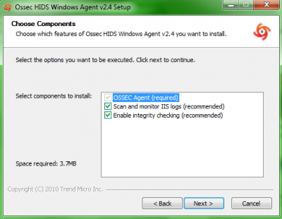
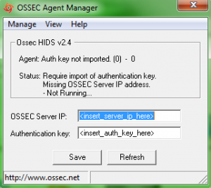

Tutoriel rédigé pour une version Ubuntu 8.04 LTS et Ossec-HIDS
2.1/Ossec-WUI 0.3.

Ce tutoriel a été réalisé par :

  **Rôle**        **Nom**
  --------------- ------------------
  **Rédacteur**   Ludovic VALENTIN

Pré-requis {#pre-requis .sectionedit3}
----------

Avant de passer à l’installation d’Ossec, il faut au préalable installer
certains paquets, à adapter selon vos besoins.

~~~
$ sudo apt-get update
$ sudo apt-get upgrade
$ sudo apt-get install wget man ssh build-essential libgnutls-dev checkinstall
~~~

Ossec-HIDS {#ossec-hids .sectionedit4}
----------

### Téléchargement {#telechargement .sectionedit5}

Pour installer Ossec, il faut tout d’abord télécharger la dernière
version
([http://www.ossec.net/main/downloads](http://www.ossec.net/main/downloads "http://www.ossec.net/main/downloads")).

~~~
$ sudo wget http://www.ossec.net/files/ossec-hids-latest.tar.gz
~~~

Décompresser l’archive.

~~~
$ sudo tar –zxf ossec-hids-latest.tar.gz
~~~

Un seul paquet est nécessaire pour l’installation sur un poste Linux. En
effet ce dernier sert aussi bien pour l’installation d’un serveur que
d’un agent.

### Serveur Ossec {#serveur-ossec .sectionedit6}

#### Libprelude

**L’installation de libprelude est à utiliser que dans le cadre d’une
architecture réseau, dans laquelle Ossec génère des alertes vers un
serveur Prelude**

L’installation de Libprelude est obligatoire pour pouvoir enregistrer le
serveur Ossec auprès du serveur Prelude. Ainsi, Ossec est considéré
comme une sonde de Prelude et peut alors échanger avec ce dernier de
manière sécurisé.

Pour installer la librairie de Prelude, voir cette page :

**[Libprelude](../prelude/prelude-ubuntu-install.html#libprelude "securite:prelude:prelude-ubuntu-install")**

#### Installation

La procédure d’installation d’Ossec est des plus simples :

~~~
$ cd ossec-hids-2.1
~~~

Afin qu’Ossec prenne en charge Prelude (optionnel), c’est-à-dire,
l’envoi des alertes au format IDMEF vers Prelude-Manager, il faut
activer le service **avant de lancer l’installation**, sous peine, en
cas d’oubli, de devoir réinstaller complétement Ossec afin de réussir à
l’intégrer correctement à Prelude.

~~~
$ cd src
$ sudo make setprelude
$ cd ..
~~~

Puis lancement de l’installation.

~~~
$ sudo ./install.sh
~~~

Ensuite, il ne reste plus qu’à suivre les instructions comme le choix de
langue, le type d’installation (serveur/agent…), le répertoire
d’installation, …etc.

Ici, ces paramètres d’installation sont :

Répertoire : /etc/ossec

Fichier de configuration : /etc/ossec/etc/ossec.conf

L’installation du serveur est terminée.

#### Configuration

Pour configurer Ossec, il faut éditer le fichier **ossec.conf**.

~~~
$ sudo vim /etc/ossec/etc/ossec.conf
~~~

##### Configuration de base

Dans **ossec.conf**, il faut ajouter les adresses ip autorisées à
interagir avec Ossec, c’est-à-dire les postes informatiques ne pouvant
être bloqués par le système de réponses-actives d’Ossec-HIDS, ces
derniers étant considérés comme sûrs. Pour cela, ces adresses ip doivent
être entrées dans la liste blanche.

~~~
<ossec_config>
...
  <global>
    <white_list>127.0.0.1</white_list>
    <white_list>^localhost.localdomain$</white_list>
    <white_list>192.168.1.100</white_list>
    <white_list>192.168.1.200</white_list>
  </global>
...
~~~

##### Libprelude {#libprelude1}

A faire que dans le cadre d’une intégration d’Ossec à
**[Prelude-IDS](../prelude/start.html "securite:prelude:start")**.

Afin qu’un **serveur** Ossec et Prelude communiquent correctement entre
eux, il faut préciser l’adresse du serveur Prelude dans le fichier
client.conf dans le repertoire /usr/local/etc/prelude/default.

~~~
$ sudo vim /usr/local/etc/prelude/default/client.conf
~~~

~~~
server-addr = 192.168.1.200
~~~

Ensuite dans le fichier de configuration **ossec.conf**, il faut ajouter
des paramètres Prelude.

~~~
<ossec_config>
  <global>
    ...
    <prelude_output>yes</prelude_output>
    <prelude_profile>ossec</prelude_profile>
    <prelude_log_level>6</prelude_log_level>
  </global>
...
~~~

Le paramètre **prelude\_output** permet d’activer l’envoi d’alerte vers
Prelude, quant au paramètre **prelude\_profile**, il sert à indiquer le
profile (certificat d’inscription utilisé pour Prelude) à utiliser au
démarrage d’Ossec-HIDS. Pour **prelude\_log\_level**, c’est en quelque
sorte un filtre des alertes à envoyer à Prelude avec un niveau de log
minimum.

##### Optimisation

**Notification par e-mail**

Afin d’activer la notification par e-mail, il faut éditer le fichier
**ossec.conf** :

~~~
<ossec_config>
  <global>
    <email_notification>yes</email_notification>
    <email_to>[email protected]
/*  */!function(){try{var t="currentScript"in document?document.currentScript:function(){for(var t=document.getElementsByTagName("script"),e=t.length;e--;)if(t[e].getAttribute("cf-hash"))return t[e]}();if(t&&t.previousSibling){var e,r,n,i,c=t.previousSibling,a=c.getAttribute("data-cfemail");if(a){for(e="",r=parseInt(a.substr(0,2),16),n=2;a.length-n;n+=2)i=parseInt(a.substr(n,2),16)^r,e+=String.fromCharCode(i);e=document.createTextNode(e),c.parentNode.replaceChild(e,c)}}}catch(u){}}();/*  */</email_to>
    <email_to>[email protected]
/*  */!function(){try{var t="currentScript"in document?document.currentScript:function(){for(var t=document.getElementsByTagName("script"),e=t.length;e--;)if(t[e].getAttribute("cf-hash"))return t[e]}();if(t&&t.previousSibling){var e,r,n,i,c=t.previousSibling,a=c.getAttribute("data-cfemail");if(a){for(e="",r=parseInt(a.substr(0,2),16),n=2;a.length-n;n+=2)i=parseInt(a.substr(n,2),16)^r,e+=String.fromCharCode(i);e=document.createTextNode(e),c.parentNode.replaceChild(e,c)}}}catch(u){}}();/*  */</email_to>
    <smtp_server>mail.monitoring-fr.org</smtp_server>
    <email_from>[email protected]
/*  */!function(){try{var t="currentScript"in document?document.currentScript:function(){for(var t=document.getElementsByTagName("script"),e=t.length;e--;)if(t[e].getAttribute("cf-hash"))return t[e]}();if(t&&t.previousSibling){var e,r,n,i,c=t.previousSibling,a=c.getAttribute("data-cfemail");if(a){for(e="",r=parseInt(a.substr(0,2),16),n=2;a.length-n;n+=2)i=parseInt(a.substr(n,2),16)^r,e+=String.fromCharCode(i);e=document.createTextNode(e),c.parentNode.replaceChild(e,c)}}}catch(u){}}();/*  */</email_from>
...
~~~

Bien sûr, ne pas oublier de déclarer si besoin est (serveur distant,
donc différent de 127.0.0.1), le serveur de mail dans la liste blanche :

~~~
<ossec_config>
  <global>
    <white_list>127.0.0.1</white_list>
    <white_list>mail.monitoring-fr.org</white_list>
...
~~~

Et enfin, de manière à éviter d’être véritablement spammé par notre
serveur Ossec, il est possible de changer le niveau à partir duquel les
alertes par e-mail sont envoyés :

~~~
<ossec_config>
  <alerts>
    <email_alert_level>10</email_alert_level>   
    ...
  </alerts>
...
~~~

Les différents niveaux d’alertes vont d’une échelle de 1 (pas de menace
…) à 16 (critique …), par défaut la valeur d’alerte par mail est de 7.

**Règles**

Il est également possible d’activer ou de désactiver les règles d’Ossec
présentes dans le répertoire **/etc/ossec/rules**. Toujours dans
**ossec.conf**.

~~~
...
  <rules>
    <!-- <include>policy_rules.xml</include> -->
    <include>zeus_rules.xml</include>
...
~~~

Pour désactiver une règle, il suffit d’utiliser la syntaxe de
commentaire xml, à savoir **\<!–** et **–\>**.

### Agent Ossec {#agent-ossec .sectionedit7}

#### Ubuntu

##### Installation {#installation1}

Pour le client Ubuntu, la procédure est similaire au serveur, à la seule
différence qu’il faut choisir le type Agent lors de l’installation.

##### Configuration {#configuration1}

Sur les agents, il faut comme pour la version serveur, éditer le fichier
**ossec.conf** afin de configurer les répertoires et les fichiers vers
lesquels Ossec doit pointer et surveiller.

Mais le point le plus important, est d’indiquer l’adresse du serveur
Ossec :

~~~
<ossec_config>
  <client>
    <server-ip>192.168.1.100</server-ip>
  </client>
...
~~~

#### Windows

##### Installation {#installation2}

Quant à l’installation sur Windows, seul l’agent est disponible. Il faut
pour cela le télécharger à cette adresse :

[http://www.ossec.net/files/ossec-agent-win32-latest.exe](http://www.ossec.net/files/ossec-agent-win32-latest.exe "http://www.ossec.net/files/ossec-agent-win32-latest.exe")

Puis lancer l’installation sur le serveur Windows à superviser par
Ossec.

Une fois le programme installé, Ossec est lancé automatiquement en
service Windows.

Mais pour qu’il soit opérationnel, il doit être enregistré auprès du
serveur Ossec. C’est pourquoi le programme demande une clé à son
lancement, ainsi que l’adresse du serveur.

##### Configuration {#configuration2}

Pour le client Windows, la configuration est modifiable depuis
l’interface de la console Ossec. Il faut pour cela éditer le fichier
(View/View Config).

Ossec-WUI {#ossec-wui .sectionedit8}
---------

Ossec-WUI est l’interface web d’Ossec-HIDS. Elle permet de visualiser
les alertes reçues par le serveur. Cette installation n’est pas
obligatoire.

### Pré-requis {#pre-requis1 .sectionedit9}

Pour installer Ossec-WUI, il faut au préalable installer certains
paquets.

~~~
$ sudo apt-get install apache2 php5
~~~

### Téléchargement {#telechargement1 .sectionedit10}

Le paquet Ossec-WUI est à télécharger sur le site d’Ossec
([http://www.ossec.net/main/downloads](http://www.ossec.net/main/downloads "http://www.ossec.net/main/downloads")).

~~~
$ sudo wget http://www.ossec.net/files/ui/ossec-wui-0.3.tar.gz
~~~

Décompresser l’archive.

~~~
$ sudo tar –zxf ossec-wui-0.3.tar.gz
~~~

### Installation {#installation3 .sectionedit11}

Une fois le paquet téléchargé et décompressé, il faut le déplacer dans
le dossier utilisé par votre serveur web (Apache). A adapter selon votre
configuration (VirtualHost, …).

~~~
$ sudo mv ossec-wui-0.3 /var/www/htdocs/ossec-wui
~~~

Ensuite, on peut lancer l’installation.

~~~
$ sudo cd /var/www/htdocs/ossec-wui
$ sudo ./setup.sh
~~~

Au cours de l’installation, le script demande d’entrer un utilisateur et
son mot-de-passe, à utiliser pour administrer l’interface (”?” aucune
véritable information sur cet utilisateur, sur son utilité, …etc, dans
la procédure d’installation officielle d’Ossec-WUI).

Une fois le script d’installation terminé, il reste à gérer les
permissions pour le bon fonctionnement de l’interface.

Tout d’abord, il faut ajouter l’utilisateur web (Apache) dans le groupe
d’utilisateur ossec.

~~~
$ sudo vim /etc/group
~~~

Dans le fichier édité, la ligne **ossec:x:1002:** devient alors
**ossec:x:1002:www-data**. Bien sûr, les données peuvent différer selon
vos paramètres (l’utilisateur web d’Apache dans cet exemple est
www-data, mais sous certaines installations c’est www).

Ensuite, il reste à s’assurer des bons droits sur le répertoire tmp
d’Ossec-WUI.

~~~
$ sudo cd /var/www/htdocs/ossec-wui
$ sudo chmod 770 tmp
$ sudo chgrp www-data tmp
~~~

### Configuration {#configuration3 .sectionedit12}

La configuration de l’interface Ossec-WUI est très succincte, Il suffit
en effet d’éditer un fichier ne contenant que quelques lignes.

~~~
$ sudo vim /var/www/htdocs/ossec-wui/ossec_conf.php
~~~

Dans ce fichier, le paramètre le plus important à vérifier, voir à
modifier selon votre installation d’Ossec, est le chemin vers le
répertoire où Ossec a été installé (par défaut **/var/ossec**, mais dans
notre procédure d’installation, Ossec est installé dans **/etc/ossec**).

Une fois cette vérification terminée. Ossec-WUI est prêt à fonctionner.

Dans ce même fichier de configuration, il est possible de préciser
certains paramètres tels que par exemple, le nombre maximum d’affichage
d’alertes par page, ou bien encore le critère de recherche d’alertes
dans les logs d’Ossec (par défaut niveau 7).