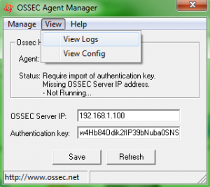
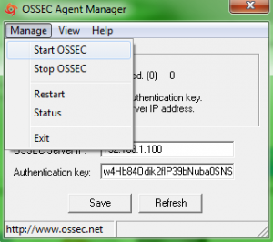

[[[Prise en main d'Ossec](ossec-use@do=backlink.html)]]

[wiki monitoring-fr.org](../../start.html "[ALT+H]")

-   [Accueil](../../index.html "Cliquez pour revenir |  l'accueil")
-   [Blog](http://www.monitoring-fr.org "Blog & News")
-   [Forums](http://forums.monitoring-fr.org "Forums")
-   [Doc](http://doc.monitoring-fr.org "Doc")
-   [Forge](https://github.com/monitoring-fr "Forge")

Vous êtes ici: [Accueil](../../start.html "start") »
[Sécurité](../start.html "securite:start") »
[Ossec](start.html "securite:ossec:start") » [Prise en main
d'Ossec](ossec-use.html "securite:ossec:ossec-use")

### Table des matières {.toggle}

-   [Prise en main d'Ossec](ossec-use.html#prise-en-main-d-ossec)
    -   [Administration d'Ossec](ossec-use.html#administration-d-ossec)
        -   [Ossec-HIDS](ossec-use.html#ossec-hids)
        -   [Ossec-WUI](ossec-use.html#ossec-wui)
    -   [Inscription des agents](ossec-use.html#inscription-des-agents)
        -   [Ossec Serveur](ossec-use.html#ossec-serveur)
        -   [Ossec Agent](ossec-use.html#ossec-agent)
    -   [Démarrage d'Ossec](ossec-use.html#demarrage-d-ossec)
        -   [Ossec-HIDS](ossec-use.html#ossec-hids1)
        -   [Ossec-WUI](ossec-use.html#ossec-wui1)

Prise en main d'Ossec {#prise-en-main-d-ossec .sectionedit1}
=====================

Tutoriel rédigé pour une version Ubuntu 8.04 LTS et Ossec-HIDS
2.1/Ossec-WUI 0.3.

Ce tutoriel a été réalisé par :

  **Rôle**        **Nom**
  --------------- ------------------
  **Rédacteur**   Ludovic VALENTIN

Administration d'Ossec {#administration-d-ossec .sectionedit3}
----------------------

### Ossec-HIDS {#ossec-hids .sectionedit4}

#### Rappel

Ossec-HIDS est l’application permettant de surveiller les fichiers de
logs (sous Linux et Windows pour les agents). Il fonctionne aussi bien
en local qu’en architecture client/serveur.

#### Utilisation

##### Linux

**agent\_control**

Cette commande permet de contrôler les Ossec agents. Ainsi, il est
possible de les lister, de les redémarrer, ou bien encore, par exemple
de les bloquer, … le tout depuis le serveur.

Voici un exemple d’utilisation, ici la commande liste les agents
connectés ou non :

~~~
$ sudo /etc/ossec/bin/agent_control -l
~~~

Afin d’obtenir plus d’informations sur l’usage et les options de cette
commande:

~~~
$ sudo /etc/ossec/bin/agent_control -h
~~~

**clear\_stats**

clear\_stats efface les différentes statistiques (moyennes) des
évènements d’Ossec.

~~~
$ sudo /etc/ossec/bin/clear_stats -h
~~~

**list\_agents**

Un peu similaire à la commande agent\_control, list\_agents sert
uniquement à lister les agents comme l’indique son nom.

~~~
$ sudo /etc/ossec/bin/list_agents -h
~~~

**manage\_agents**

Commande très importante, elle permet de manager les agents et plus
particulièrement les profils. manage\_agents est utilisée pour ajouter,
supprimer, lister les profils d’agents et surtout pour générer une clé
d’enregistrement, lors d’une inscription auprès du serveur. Egalement
disponible sur les agents Ossec, pour importer la clé.

La commande n’a aucune option, une fois entrée, un menu s’affiche
listant les actions disponibles.

~~~
$ sudo /etc/ossec/bin/manage_agents
~~~

**rootcheck\_control**

Cette commande contrôle et manage les bases de données de stratégies et
d’audits d’Ossec.

~~~
$ sudo /etc/ossec/bin/rootcheck_control -h
~~~

**syscheck\_control**

Comme pour la commande rootcheck\_control, syscheck\_control manage une
base de données, à savoir celle contenant les vérifications d’intégrité.

~~~
$ sudo /etc/ossec/bin/syscheck_control -h
~~~

**syscheck\_update**

syscheck\_update met à jour la base de données de vérifications
d’intégrité en local, ou sur les agents.

~~~
$ sudo /etc/ossec/bin/syscheck_update -h
~~~

##### Windows

L’ensemble de l’administration de l’agent Windows d’Ossec se fait par
l’intermédiaire de l’interface de l’application. Il est possible de
démarrer/stopper l’agent, de voir les fichiers de logs, le fichier de
configuration, et également d’indiquer l’adresse ip du serveur Ossec,
ainsi que la clé d’authentification.

La visualisation des logs se fait en cliquant sur View (View/View Logs).
De la même manière, il est possible d’éditer le fichier de
configuration.

### Ossec-WUI {#ossec-wui .sectionedit5}

#### Rappel {#rappel1}

Ossec-WUI est l’interface web d’Ossec-HIDS, elle permet de visualiser
graphiquement les alertes, ce qui est beaucoup plus esthétique et
pratique que de lire un simple fichier de logs.

#### Utilisation {#utilisation1}

Aucune commande spécifique à Ossec-WUI. Seul le serveur web, apache doit
être démarré.

Inscription des agents {#inscription-des-agents .sectionedit6}
----------------------

### Ossec Serveur {#ossec-serveur .sectionedit7}

Pour l’inscription des agents auprès du serveur Ossec, il existe une
commande intégrée.

~~~
$ sudo /etc/ossec/bin/manage_agents
~~~

Une fois lancée, cette commande permet de créer (ou également de
supprimer) des profils d’agents sur le serveur, puis ensuite de générer
une clé propre à chaque agent pour leur inscription.

### Ossec Agent {#ossec-agent .sectionedit8}

#### Linux {#linux1}

Pour enregistrer un agent sous Linux, il suffit d’utiliser la même
commande que pour le serveur, c’est-à-dire **manage\_agents**, en
important la clé générée sur le serveur, puis en redémarrant l’agent
(après le démarrage du serveur Ossec).

#### Windows {#windows1}

Sous Windows, l’inscription de l’agent se fait dans l’interface du
logiciel Ossec Agent Manager, en important directement la clé
(copier/coller) obtenue auprès du serveur.

Ensuite, si le serveur Ossec est déjà en service, il reste à démarrer
(ou redémarrer) l’agent.

Démarrage d'Ossec {#demarrage-d-ossec .sectionedit9}
-----------------

### Ossec-HIDS {#ossec-hids1 .sectionedit10}

#### Ossec Serveur {#ossec-serveur1}

Pour démarrer le serveur Ossec :

~~~
$ sudo /etc/ossec/bin/ossec-control start
~~~

Ensuite il reste à lancer les client Ossec (agents). La commande est la
même que pour le serveur sur Linux. Pour les agents Windows, il suffit
de lancer l’application Ossec, soit Ossec Agent Manager, et de démarrer
le service (Manage/Start Ossec).

Si les agents ne sont pas authentifiés (clé d’inscription), il est fort
probable que l’erreur provienne d’une mauvaise inscription, c’est-à-dire
une erreur d’importation de la clé.

#### Ossec Agent {#ossec-agent1}

##### Linux {#linux2}

Même demarche que le serveur pour démarrer l’agent:

~~~
$ sudo /etc/ossec/bin/ossec-control start/stop/restart
~~~

Pour visualiser les logs d’Ossec:

~~~
$ sudo vim /etc/ossec/logs/…
~~~

##### Windows {#windows2}

Sur Windows, il suffit de lancer l’application Ossec, soit Ossec Agent
Manager, et de démarrer le service (Manage/Start Ossec). Par défaut le
service est en mode démarrage automatique (voir Services Windows).

Attention : lorsqu’un agent inscrit, est arrêté, il peut causer certains
problèmes de communication avec le serveur lors d’un redémarrage.

### Ossec-WUI {#ossec-wui1 .sectionedit11}

Pour utiliser l’interface web d’Ossec, il faut d’abord commencer par
démarrer le serveur Apache.

~~~
$ sudo /etc/init.d/apache2 start
~~~

Ensuite, dans le navigateur web, il n’y a plus qu’à entrer l’adresse de
serveur (VirtualHost dans Apache), à adapter selon votre propre
configuration.

[http://adresse-ip/ossec-wui](http://adresse-ip/ossec-wui "http://adresse-ip/ossec-wui")

Une fois l’adresse entrée correctement, il est alors possible de
visualiser dans l’interface les alertes.

SOMMAIRE {#sommaire .sectionedit1}
--------

**[Accueil](../../start.html "start")**

**[Supervision](../../supervision/start.html "supervision:start")**

-   [Nagios](../../nagios/start.html "nagios:start")
-   [Centreon](../../centreon/start.html "centreon:start")
-   [Shinken](../../shinken/start.html "shinken:start")
-   [Zabbix](../../zabbix/start.html "zabbix:start")
-   [OpenNMS](../../opennms/start.html "opennms:start")
-   [EyesOfNetwork](../../eyesofnetwork/start.html "eyesofnetwork:start")
-   [Groundwork](../../groundwork/start.html "groundwork:start")
-   [Zenoss](../../zenoss/start.html "zenoss:start")
-   [Vigilo](../../vigilo/start.html "vigilo:start")
-   [Icinga](../../icinga/start.html "icinga:start")
-   [Cacti](../../cacti/start.html "cacti:start")
-   [Ressenti
    utilisateur](../../supervision/eue/start.html "supervision:eue:start")
-   [Ressenti utilisateur avec
    sikuli](../../sikuli/eue/start.html "sikuli:eue:start")

**[Hypervision](../../hypervision/start.html "hypervision:start")**

-   [Canopsis](../../canopsis/start.html "canopsis:start")

**[Sécurité](../start.html "securite:start")**

**[Infrastructure](../../infra/start.html "infra:start")**

**[Développement](../../dev/start.html "dev:start")**

Sécurité {#securite .sectionedit1}
--------

-   [Architecture d'une solution Sécurité
    OSS](../architecture-oss/start.html "securite:architecture-oss:start")
-   [Ossec](start.html "securite:ossec:start")
    -   [Installation d'Ossec sur
        Ubuntu](ossec-ubuntu-install.html "securite:ossec:ossec-ubuntu-install")
    -   [Prise en main
        d'Ossec](ossec-use.html "securite:ossec:ossec-use")
-   [Prelude-IDS](../prelude/start.html "securite:prelude:start")
    -   [Installation de Prelude-IDS sur
        Ubuntu](../prelude/prelude-ubuntu-install.html "securite:prelude:prelude-ubuntu-install")
    -   [Prise en main de
        Prelude-IDS](../prelude/prelude-use.html "securite:prelude:prelude-use")
-   [Snort](../snort/start.html "securite:snort:start")
    -   [Installation de Oinkmaster sur
        Ubuntu](../snort/oinkmaster-ubuntu-install.html "securite:snort:oinkmaster-ubuntu-install")
    -   [Installation de Snort sur
        Ubuntu](../snort/snort-ubuntu-install.html "securite:snort:snort-ubuntu-install")

-   [Afficher le texte
    source](ossec-use@do=edit&rev=0.html "Afficher le texte source [V]")
-   [Anciennes
    révisions](ossec-use@do=revisions.html "Anciennes révisions [O]")
-   [Derniers
    changements](ossec-use@do=recent.html "Derniers changements [R]")
-   [Liens vers cette
    page](ossec-use@do=backlink.html "Liens vers cette page")
-   [Gestionnaire de
    médias](ossec-use@do=media.html "Gestionnaire de médias")
-   [Index](ossec-use@do=index.html "Index [X]")
-   [Connexion](ossec-use@do=login&sectok=6bca6bdf16f8880de3d6d3649db89a26.html "Connexion")
-   [Haut de page](ossec-use.html#dokuwiki__top "Haut de page [T]")

securite/ossec/ossec-use.txt · Dernière modification: 2013/03/29 09:39
(modification externe)

