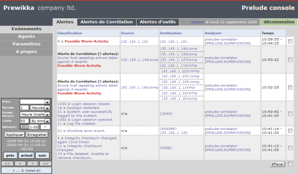
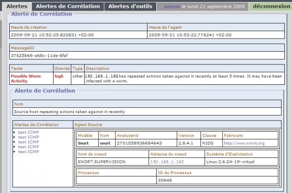
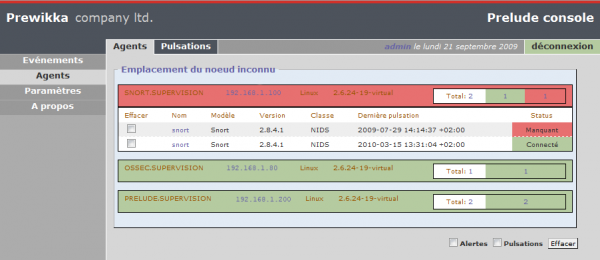
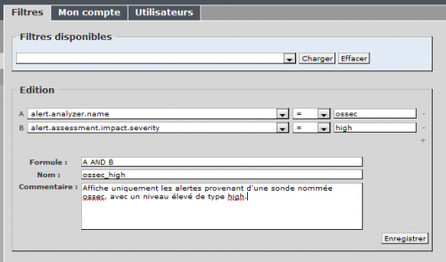
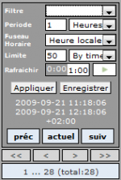
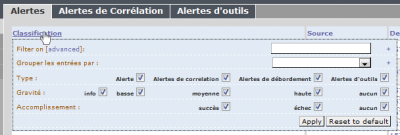

[[[Prise en main de Prelude-IDS](prelude-use@do=backlink.html)]]

[wiki monitoring-fr.org](../../start.html "[ALT+H]")

-   [Accueil](../../index.html "Cliquez pour revenir |  l'accueil")
-   [Blog](http://www.monitoring-fr.org "Blog & News")
-   [Forums](http://forums.monitoring-fr.org "Forums")
-   [Doc](http://doc.monitoring-fr.org "Doc")
-   [Forge](https://github.com/monitoring-fr "Forge")

Vous êtes ici: [Accueil](../../start.html "start") »
[Sécurité](../start.html "securite:start") »
[Prelude-IDS](start.html "securite:prelude:start") » [Prise en main de
Prelude-IDS](prelude-use.html "securite:prelude:prelude-use")

### Table des matières {.toggle}

-   [Prise en main de
    Prelude-IDS](prelude-use.html#prise-en-main-de-prelude-ids)
    -   [Administration des composants
        Prelude](prelude-use.html#administration-des-composants-prelude)
        -   [Libprelude](prelude-use.html#libprelude)
        -   [LibpreludeDB](prelude-use.html#libpreludedb)
        -   [Prelude-Manager](prelude-use.html#prelude-manager)
        -   [Prelude-Correlator](prelude-use.html#prelude-correlator)
        -   [Prelude-LML](prelude-use.html#prelude-lml)
        -   [Prewikka](prelude-use.html#prewikka)
    -   [Inscriptions des composants Prelude et des
        sondes](prelude-use.html#inscriptions-des-composants-prelude-et-des-sondes)
        -   [Prelude-Manager](prelude-use.html#prelude-manager2)
        -   [Prelude-Correlator](prelude-use.html#prelude-correlator2)
        -   [Prelude-LML](prelude-use.html#prelude-lml1)
        -   [Exemples d'enregistrement de sondes NIDS et
            HIDS](prelude-use.html#exemples-d-enregistrement-de-sondes-nids-et-hids)
    -   [Démarrage de Prelude](prelude-use.html#demarrage-de-prelude)

Prise en main de Prelude-IDS {#prise-en-main-de-prelude-ids .sectionedit1}
============================

Tutoriel rédigé pour une version Ubuntu 8.04 LTS et Prelude-IDS 0.9.

Ce tutoriel a été réalisé par :

  **Rôle**        **Nom**
  --------------- ---------------------------------------------------------------------------------------------------------------------------------------------------------
  **Rédacteur**   [Ludovic VALENTIN](http://www.monitoring-fr.org/community/members/ludovic-valentin/ "http://www.monitoring-fr.org/community/members/ludovic-valentin/")

Administration des composants Prelude {#administration-des-composants-prelude .sectionedit3}
-------------------------------------

### Libprelude {#libprelude .sectionedit4}

#### Rappel

Libprelude est la librairie de Prelude. Elle permet les inscriptions des
sondes, la génération des certificats des composants et leur
communication avec un serveur Prelude. De plus la librairie contient les
données nécessaire pour la gestion du format IDMEF (génération des
alertes en IDMEF par les sondes).

#### Utilisation

##### libprelude-config

Commande permettant de préciser des paramètres de base (répertoire
d’installation, …etc).

##### prelude-admin

Cette commande est utilisée pour réaliser les inscriptions des sondes.
**prelude-admin** génère les certificats d’enregistrement selon les
profils (ajout,suppression, …etc), puis en mode écoute sur le serveur,
elle accepte ou non les certificats envoyées par les sondes.

Voici un exemple d’utilisation pour lister les certificats utilisés:

~~~
$ sudo prelude-admin list
~~~

Afin d’obtenir plus d’informations sur l’usage et les options de cette
commande:

~~~
$ sudo prelude-admin --help
~~~

##### prelude-adduser

**prelude-adduser** a le même rôle que **prelude-admin**, elle est en
quelque sorte, l’ancienne commande utilisée pour les inscriptions des
sondes. D’ailleurs à l’avenir, cette commande sera normalement
supprimée.

### LibpreludeDB {#libpreludedb .sectionedit5}

#### Rappel {#rappel1}

La librairie LibpreludeDB permet d’ajouter l’utilisation d’une base de
données dans une architecture Prelude.

#### Utilisation {#utilisation1}

##### libpreludedb-config

Cette commande permet de préciser des paramètres tel que le chemin où se
trouve l’installation de Prelude.

##### preludedb-admin

Afin de pouvoir agir, modifier la base de données de Prelude, à savoir «
prelude » (nommée lors de l’installation), il existe une commande
permettant de supprimer des alertes, de les copier sur une autre base de
données, …etc. Pour cela, il suffit d’utiliser la commande
**preludedb-admin**.

Voici un exemple d’utilisation pour supprimer des alertes antérieures à
une date :

~~~
# preludedb-admin delete alert --criteria "alert.create_time < "2009-09-24"" "type=mysql name=prelude user=prelude pass=password"
~~~

Pour d’obtenir plus d’informations sur l’usage et les options de cette
commande:

~~~
$ sudo preludedb-admin --help
~~~

### Prelude-Manager {#prelude-manager .sectionedit6}

#### Rappel {#rappel2}

Prelude-Manager est le module principal de Prelude-IDS. En effet, c’est
lui qui reçoit et traite les alertes (stockage dans une base de données,
dans un fichier, …etc). Il gère également les certificats des
différentes sondes (inscriptions des sondes).

#### Utilisation {#utilisation2}

##### prelude-manager {#prelude-manager1}

Il s’agit de la commande d’administration de Prelude-Manager. Elle
permet dans un premier temps de démarrer le serveur Prelude, et ainsi
recevoir les alertes provenant des sondes enregistrées. Dans un second
temps, elle peut servir dans de multiples usages pour par exemple,
relayer les alertes reçues vers un autre Prelude-Manager (centralisant
les alertes provenant de plusieurs serveurs Prelude), ou encore
appliquer des filtres sur les critères des alertes IDMEF.

Voici un exemple d’utilisation, démarrant Prelude-manager en mode
daemon, et précisant un fichier de configuration:

~~~
$ sudo prelude-manager -d --config=/usr/local/etc/prelude-manager/prelude-manager.conf
~~~

Afin d’obtenir plus d’informations sur l’usage et les options de cette
commande:

~~~
$ sudo prelude-manager --help
~~~

### Prelude-Correlator {#prelude-correlator .sectionedit7}

#### Rappel {#rappel3}

Prelude-Correlator est le module (optionnel) de Prelude permettant de
gérer la corrélation des alertes reçues par Prelude-Manager. Pour cela,
il utilise des règles développées en Python. par défaut, le paquet ne
contient qu’une dizaine de règles. Donc il faudra en écrire des
supplémentaire en fonction de vos besoins.

#### Utilisation {#utilisation3}

##### prelude-correlator {#prelude-correlator1}

Il n’y a qu’une seule commande à utiliser pour gérer le corrélateur de
Prelude, c’est **prelude-correlator**. Celle-ci permet de démarrer le
module, et tout comme une sonde, ce dernier s’authentifie au démarrage
auprès du Prelude-Manager avec un certificat (préalablement enregistré).

Voici un exemple d’utilisation, avec démarrage du corrélateur en mode
deamon, et écriture des alertes IDMEF traitées (par Prelude-Correlator)
en entrée et en sortie dans des fichiers de logs:

~~~
$ sudo prelude-correlator -d --print-input=/etc/prelude-correlator/logs/input.log --print-output=/etc/prelude-correlator/logs/output.log
~~~

Plus d’informations sur l’usage et les options de cette commande:

~~~
$ sudo prelude-correlator --help
~~~

### Prelude-LML {#prelude-lml .sectionedit8}

En cours.

### Prewikka {#prewikka .sectionedit9}

#### Rappel {#rappel4}

Prewikka est l’interface Web de Prelude. Elle permet d’afficher les
alertes reçues par Prelude-Manager.

##### Interactions

**Prelude-Manager**

Lorsque Prelude, plus précisément Prelude-Manager, reçoit une alerte
IDS, il l’ajoute dans la base de données de Prelude. Ainsi, Prewikka,
lorsqu’il va réactualiser sa page d’affichage d’alertes, relancera un
SELECT sur les tables de la base de données et affichera alors cette
nouvelle alerte.

**Prelude-Correlator**

Arpès la réception et l’ajout d’une nouvelle alerte par Prelude-Manager,
le corrélateur, à savoir Prelude-Correlator va en fonction de ses
règles, intercepter certaines alertes pour en générer une nouvelle,
corrélée. Cette dernière sera renvoyée au Prelude-Manager, qui la verra
comme une nouvelle alerte, mais corrélée. En aucun cas, le corrélateur
ne supprime les alertes à partir desquelles il a généré sa corrélation.
Ainsi, dans Prewikka, il sera possible de voir les nouvelles alertes
reçues directement par le Prelude-Manager, avec aussi la nouvelle alerte
corrélée, en général à un niveau de gravité plus élevé.

#### Description et utilisation de l'interface {#description-et-utilisation-de-l-interface}

##### Lancement de l'interface {#lancement-de-l-interface}

Etant une interface graphique web, Prewikka se lance donc dans un
navigateur internet. Pour cela, il suffit d’entrer dans la barre
d’adresse url du navigateur (Firefox, IE, Opera, …), cette adresse :

<http://adresse_ip/prewikka>

Ici, “adresse\_ip” étant à remplacer par l’adresse réel ou le nom du
serveur où est installé Prelude (et Prewikka en toute logique). Selon la
configuration du « virtual host » dans Apache, il n’est pas
indispensable d’ajouter « prewikka » à la fin de l’adresse web.

En cas de problèmes pour afficher l’interface, ne pas hésiter pas à
vérifier, pour commencer les connexions réseaux, puis ensuite à revoir
la configuration d’Apache pour Prewikka, ou bien encore en contrôlant le
fichier de configuration de Prewikka (/etc/prewikka/prewikka.conf).

Si tout va bien, une interface graphique apparaît dans le navigateur
avec un formulaire d’authentification. Il faut entrer le login et le
password en fonction de la configuration de Prewikka (définition de
l’administrateur par défaut dans le fichier de configuration
/etc/prewikka/prewikka.conf, avec les champs initial\_admin\_user et
initial\_admin\_pass). Si vous n’avez rien changé, par défaut, le login
est « admin » et le password « admin ». Il est possible de supprimer
cette phase d’authentification dans le fichier de configuration.

Une fois authentifié (ou non), s’affiche alors la page principale de
Prewikka, à savoir la visualisation des alertes.

##### Description de l'interface {#description-de-l-interface}

L’interface de Prewikka est composée d’une fenêtre principale, centrale
où sont affichées les alertes transmises par les sondes de Prelude.

Sur la gauche, on peut trouver le menu avec les différentes parties :
Evénements, Agents, Paramètres et A propos.

La partie Evénements correspond donc à la visualisation des alertes IDS.
C’est la page principale (par défaut) de Prewikka. Sur cette page, il y
a 3 onglets disponibles pour spécifier, voir plutôt filtrer l’affichage
des alertes. On a donc le choix entre Alertes, Alertes de Corrélation et
Alertes d’outils. Le premier onglet Alertes (par défaut), affiche la
totalité des alertes (corrélées, …), le second, comme l’indique son nom,
sert à visualiser que les alertes corrélées par Prelude-Correlator.
Quant au troisième, il affiche les alertes concernant les outils
(sondes).

Quelque soit l’onglet choisi, il est possible (en général) de voir en
détail les alertes en cliquant dessus, sur le titre de l’alerte ou bien,
en cliquant sur le nombre à côté du titre dans le cas où il y en aurait
plusieurs.

Après avoir cliqué sur une alerte, Prewikka affiche alors le contenu de
l’alerte, à savoir le format IDMEF avec une mise en forme HTML, plus
sympathique à lire que dans un fichier de logs.

Pour revenir sur l’affichage des alertes, elles utilisent des couleurs
pour pouvoir en faciliter la recherche sur les niveaux de gravités, de
danger de chacune d’entre elles. Ainsi, le code des couleurs est :

-   Bleu → niveau d’information « info »
-   Vert → niveau le plus faible « low »
-   Orange → niveau intermédiaire « medium »
-   Rouge → niveau d’alerte maximum « high »

Les alertes sont affichées sous la forme d’un tableau, avec comme
colonnes, la classification (nom de l’alerte, …), la source ayant
provoquée l’alerte, puis la destination de l’événement, ensuite le nom
de la sonde ayant fait remontée cette alerte à Prelude, et enfin le
temps (heure) sur lequel l’alerte à été reçue par le Prelude-Manager.
Pour chacun des ses onglets (Evénements), un bouton se trouvant en bas
de page (Effacer), permet après sélection des alertes (globale, ou
ciblée), de les supprimer.

Sur le menu, à gauche il y a aussi un autre choix, le bouton Agents. Ce
dernier permet de visualiser l’ensemble des agents constituant
l’architecture réseau de notre projet, à savoir les différentes sondes
connectées au serveur Prelude, ainsi que ses composants, comme le
Prelude-Manager, le Prelude-Correlator. Il est possible donc de voir
l’état des sondes et des composants de Prelude en temps réel,
c’est-à-dire si ils sont connectées ou pas (démarrées).

A partir de cette fenêtre, les alertes et les pulsations (2ème onglet)
peuvent être supprimées, afin de nettoyer Prewikka, pour repartir avec
une interface à neuf.

Lorsqu’une sonde est déconnectée, il est également possible de supprimer
son profil à partir de l’interface.

Comme pour le bouton Evénements, la partie Agents contient deux onglets,
le premier nommé aussi Agents correspond donc à l’affichage des statuts
des sondes comme énoncé précédemment. Pour le deuxième onglet
Pulsations, il permet de voir les différentes vérifications de
connexions entre les sondes, avec l’heure exacte de chaque test de
statuts des agents.

Troisième bouton du menu (à gauche de l’interface), les Paramètres de
Prewikka. C’est ici, que l’on peut créer ou éditer des filtres pour
l’affichage des alertes, en précisant par exemple de n’afficher que les
alertes provenant d’une sonde en particulier, … etc. Principal avantage
de cet éditeur de filtre, c’est qu’il repose sur le format IDMEF, ce qui
donne une multitude de possibilités, à condition bien sûr de maîtriser
un minimum la norme IDMEF, pour pouvoir utiliser les différents champs
d’une alerte IDS.

Pour appliquer un filtre, il suffit lorsque l’on est sur la page
d’affichage des alertes d’utiliser l’outil disponible tout en bas à
gauche (sous le menu), puis de choisir l’un des filtres préalablement
créés et l’appliquer.

Cet outil (sorte de menu) dispose en plus de pouvoir appliquer des
filtres, des boutons pour faire défiler les pages des alertes classées
par période d’une heure. Permettant ainsi de voir un historique des
alertes reçues. Il est aussi possible d’appliquer des filtres
spécifiques sur chaque colonne d’affichage d’alertes, en cliquant sur le
nom d’une des colonnes.

Par rapport au deuxième onglet des Paramètres, c’est-à-dire Mon compte,
ainsi que pour le dernier onglet Utilisateurs, ici, peut être créé ou
modifié des utilisateurs autorisés à se connecter à Prewikka, en
indiquant les droits de chaque utilisateur, et la langue de l’interface.

Et enfin, le dernier bouton du menu A propos donne des informations
générales sur la solution Prelude-IDS, la version utilisée de Prewikka,
et les différentes adresses pour contacter la société, éditrice de
Prelude.

Inscriptions des composants Prelude et des sondes {#inscriptions-des-composants-prelude-et-des-sondes .sectionedit10}
-------------------------------------------------

Prelude pouvant utiliser des sondes et des plugins (composants) répartis
sur tout un réseau, doit pour plus de sécurité, mettre en place des
échanges cryptés. Ainsi, pour l’ajout d’un plugin comme
Prelude-Correlator par exemple, en local comme sur un autre serveur, ce
dernier doit être enregistré et authentifié auprès du Prelude-Manager.

### Prelude-Manager {#prelude-manager2 .sectionedit11}

Pour cela, Prelude intègre un outil prelude-admin, c’est avec cette
commande qu’il va être possible d’enregistrer les composants
supplémentaires.

#### Création du profil Prelude-Manager {#creation-du-profil-prelude-manager}

Tout d’abord, il faut commencer par créer le profil du Prelude-Manager.

~~~
$ sudo prelude-admin add "prelude-manager" --uid 0 --gid 0
~~~

Cette commande génère une clé pour le Prelude-Manager afin qu’il puisse
mettre en place ses échanges cryptés.

Attention : le temps de création de la clé peut être très long, mais
vraiment très long ! Pour réduire le délai de génération, il est
conseillé de faire travailler le système. Il existe par exemple
l’entropie :

~~~
$ sudo cat /dev/urandom > /dev/null
~~~

Mais cette méthode n’est pas la plus rapide car cela peut prendre tout
de même plusieurs heures (maximum 24h en général). Heureusement, il y a
une autre solution, qu’est l’installation d’un paquet assez lourd.
Exemple :

~~~
$ sudo apt-get install gimp
~~~

Avec cette méthode le temps de création passe à une vingtaine de minutes
(1h maximum). Bien entendu, un autre paquet peut faire l’affaire, à
vérifier tout de même selon les paquets. Ensuite, ce paquet téléchargé
et installé n’est plus nécessaire, donc désinstallation :

~~~
$ sudo apt-get autoremove gimp
~~~

#### Enregistrement

Une fois la clé générée, il faut démarrer le Prelude-Manager :

~~~
$ sudo prelude-manager
~~~

Et taper cette commande dans un autre terminal pour mettre le serveur
Prelude en mode écoute pour enregistrer une sonde ou un plugin :

~~~
$ sudo prelude-admin registration-server prelude-manager
~~~

La commande génère alors un mot-de-passe à usage unique et reste en
écoute. Il ne reste plus qu’à enregistrer un composant.

Attention : ce mot-de-passe est à usage unique. C’est-à-dire qu’il ne
peut servir que pour l’enregistrement d’un seul composant. Pour
l’inscription d’un autre plugin ou d’une sonde, il faudra tout
simplement la relancer à chaque fois, pour obtenir un nouveau
mot-de-passe et mettre le serveur en écoute.

### Prelude-Correlator {#prelude-correlator2 .sectionedit12}

En local tout comme sur un serveur différent du Prelude-Manager, il faut
effectuer l’enregistrement du Prelude-Correlator avec une commande qui
génère également une clé pour le plugin :

~~~
$ sudo prelude-admin register prelude-correlator "idmef:rw" localhost --uid 0 --gid 0
~~~

Si le plugin n’est pas installé sur le même poste, modifier localhost
par l’adresse ip du serveur hébergeant le Prelude-Manager.

Tout comme la génération de la clé du Prelude-Manager, le temps de
création est très long, donc il faut également faire travailler le
système (voir précédemment).

Lorsque la clé est créée, il est demandé d’entrer un mot-de-passe. Ce
dernier est tout simplement celui générer par le Prelude-Manager
auparavant.

Rappel : ce mot-de-passe est à usage unique. Prelude-Manager doit être
en écoute (voir la section au-dessus).

Une fois le mot-de-passe entré, l’enregistrement est en attente d’une
réponse du Prelude-Manager. Donc il faut se rendre sur le terminal de ce
dernier, où est lancé la commande prelude-admin registration-server
prelude-manager, et accepter (ou pas) la connexion et donc l’inscription
du Prelude-Correlator. L’enregistrement du plugin est alors terminé.

### Prelude-LML {#prelude-lml1 .sectionedit13}

La démarche est la même que pour le Prelude-Correlator, il y a juste à
adapter la commande :

~~~
$ sudo prelude-admin register prelude-lml "idmef:w admin:r" localhost --uid 0 --gid 0
~~~

Dans le cas où Prelude-LML n’est pas installé sur le même serveur que
Prelude-Manager, il faut alors remplacer “localhost” par l’adresse ip du
manager. Prelude-LML étant considéré comme une sonde.

### Exemples d'enregistrement de sondes NIDS et HIDS {#exemples-d-enregistrement-de-sondes-nids-et-hids .sectionedit14}

La commande de base :

~~~
$ prelude-admin register <profile_name> <requested_permission> <prelude_manager_address> --uid <uid> --gid <gid>
~~~

#### Snort

Pour la sonde Snort, la commande est :

~~~
$ sudo prelude-admin register snort "idmef:w admin:r" 192.168.100 --uid 0 --gid 0
~~~

#### Ossec

La commande d’Ossec est similaire à celle de Snort :

~~~
$ sudo prelude-admin register ossec "idmef:w admin:r" 192.168.1.100 --uid 0 --gid 0
~~~

Démarrage de Prelude {#demarrage-de-prelude .sectionedit15}
--------------------

Pour lancer le serveur Prelude, il faut démarrer dans un premier temps
Prelude-Manager :

~~~
$ sudo prelude-manager
~~~

Ensuite Prelude-Correlator, Prelude-LML, et enfin les sondes (Snort et
Ossec) :

~~~
$ sudo prelude-correlator
$ sudo prelude-lml
~~~

(Voir les procédures Snort et Ossec pour démarrer les sondes)

Pour visualiser les évènements et les sondes du Prelude-Manager, il faut
utiliser le navigateur web avec l’url <http://adresse_ip/prewikka>. Ce
dernier permet ainsi d’afficher l’état des sondes et les informations
sur les alertes.

Rappel : Prewikka n’est qu’un outil de visualisation des alertes.

SOMMAIRE {#sommaire .sectionedit1}
--------

**[Accueil](../../start.html "start")**

**[Supervision](../../supervision/start.html "supervision:start")**

-   [Nagios](../../nagios/start.html "nagios:start")
-   [Centreon](../../centreon/start.html "centreon:start")
-   [Shinken](../../shinken/start.html "shinken:start")
-   [Zabbix](../../zabbix/start.html "zabbix:start")
-   [OpenNMS](../../opennms/start.html "opennms:start")
-   [EyesOfNetwork](../../eyesofnetwork/start.html "eyesofnetwork:start")
-   [Groundwork](../../groundwork/start.html "groundwork:start")
-   [Zenoss](../../zenoss/start.html "zenoss:start")
-   [Vigilo](../../vigilo/start.html "vigilo:start")
-   [Icinga](../../icinga/start.html "icinga:start")
-   [Cacti](../../cacti/start.html "cacti:start")
-   [Ressenti
    utilisateur](../../supervision/eue/start.html "supervision:eue:start")
-   [Ressenti utilisateur avec
    sikuli](../../sikuli/eue/start.html "sikuli:eue:start")

**[Hypervision](../../hypervision/start.html "hypervision:start")**

-   [Canopsis](../../canopsis/start.html "canopsis:start")

**[Sécurité](../start.html "securite:start")**

**[Infrastructure](../../infra/start.html "infra:start")**

**[Développement](../../dev/start.html "dev:start")**

Sécurité {#securite .sectionedit1}
--------

-   [Architecture d'une solution Sécurité
    OSS](../architecture-oss/start.html "securite:architecture-oss:start")
-   [Ossec](../ossec/start.html "securite:ossec:start")
    -   [Installation d'Ossec sur
        Ubuntu](../ossec/ossec-ubuntu-install.html "securite:ossec:ossec-ubuntu-install")
    -   [Prise en main
        d'Ossec](../ossec/ossec-use.html "securite:ossec:ossec-use")
-   [Prelude-IDS](start.html "securite:prelude:start")
    -   [Installation de Prelude-IDS sur
        Ubuntu](prelude-ubuntu-install.html "securite:prelude:prelude-ubuntu-install")
    -   [Prise en main de
        Prelude-IDS](prelude-use.html "securite:prelude:prelude-use")
-   [Snort](../snort/start.html "securite:snort:start")
    -   [Installation de Oinkmaster sur
        Ubuntu](../snort/oinkmaster-ubuntu-install.html "securite:snort:oinkmaster-ubuntu-install")
    -   [Installation de Snort sur
        Ubuntu](../snort/snort-ubuntu-install.html "securite:snort:snort-ubuntu-install")

-   [Afficher le texte
    source](prelude-use@do=edit&rev=0.html "Afficher le texte source [V]")
-   [Anciennes
    révisions](prelude-use@do=revisions.html "Anciennes révisions [O]")
-   [Derniers
    changements](prelude-use@do=recent.html "Derniers changements [R]")
-   [Liens vers cette
    page](prelude-use@do=backlink.html "Liens vers cette page")
-   [Gestionnaire de
    médias](prelude-use@do=media.html "Gestionnaire de médias")
-   [Index](prelude-use@do=index.html "Index [X]")
-   [Connexion](prelude-use@do=login&sectok=6bca6bdf16f8880de3d6d3649db89a26.html "Connexion")
-   [Haut de page](prelude-use.html#dokuwiki__top "Haut de page [T]")

securite/prelude/prelude-use.txt · Dernière modification: 2013/03/29
09:39 (modification externe)

