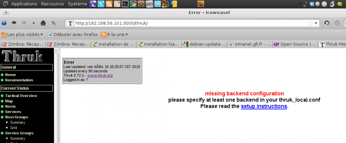

[[[Installation de Shinken sur Debian
Lenny](shinken-debian-install@do=backlink.html)]]

[wiki monitoring-fr.org](../start.html "[ALT+H]")

-   [Accueil](../index.html "Cliquez pour revenir |  l'accueil")
-   [Blog](http://www.monitoring-fr.org "Blog & News")
-   [Forums](http://forums.monitoring-fr.org "Forums")
-   [Doc](http://doc.monitoring-fr.org "Doc")
-   [Forge](https://github.com/monitoring-fr "Forge")

Vous êtes ici: [Accueil](../start.html "start") »
[Shinken](start.html "shinken:start") » [Installation de Shinken sur
Debian
Lenny](shinken-debian-install.html "shinken:shinken-debian-install")

### Table des matières {.toggle}

-   [Installation de Shinken sur Debian
    Lenny](shinken-debian-install.html#installation-de-shinken-sur-debian-lenny)
    -   [Pré Requis](shinken-debian-install.html#pre-requis)
        -   [Création du compte
            utilisateur](shinken-debian-install.html#creation-du-compte-utilisateur)
    -   [Installation](shinken-debian-install.html#installation)
        -   [Installation par
            script](shinken-debian-install.html#installation-par-script)
        -   [Test de bon
            fonctionnement](shinken-debian-install.html#test-de-bon-fonctionnement)
    -   [Installation des Nagios
        Plugins](shinken-debian-install.html#installation-des-nagios-plugins)
        -   [Pré-requis](shinken-debian-install.html#pre-requis1)
    -   [Installation de l'interface
        Web](shinken-debian-install.html#installation-de-l-interface-web)
        -   [Configuration de
            Thruk](shinken-debian-install.html#configuration-de-thruk)

Installation de Shinken sur Debian Lenny {#installation-de-shinken-sur-debian-lenny .sectionedit1}
========================================

en cours de rédaction

L’installation suivante a été réalisé à partir d’une installation de
Debian Lenny from scratch (avec option serveur Web et désactivation de
l’environnement Bureau). Cette installation vous présente un Shinken se
trouvant sur un mono-serveur (car mon portable est limité ;)). Bien sûr
vous pouvez décider le(s) rôle(s) (quel(s) démon(s)) que votre machine
incarne(nt).

Pré Requis {#pre-requis .sectionedit2}
----------

Pour la bonne installation de Shinken, nous allons d’abord mettre à jour
notre Debian.

~~~
apt-get update
apt-get install ssh
~~~

il va falloir installer les packets suivants :

~~~
apt-get install python python-dev python-setuptools build-essential pyro git-core python-mysqldb python-json python-sqlite
~~~

Vu que sur Debian Lenny la version de python est en 2.5, il va falloir
installer la librairie
[Multiprocessing](http://pypi.python.org/packages/source/m/multiprocessing/multiprocessing-2.6.2.1.tar.gz "http://pypi.python.org/packages/source/m/multiprocessing/multiprocessing-2.6.2.1.tar.gz")

~~~
mkdir shinken-install

cd shinken-install

wget http://pypi.python.org/packages/source/m/multiprocessing/multiprocessing-2.6.2.1.tar.gz

tar -xvzf multiprocessing-2.6.2.1.tar.gz

cd multiprocessing-2.6.2.1/

python setup.py install
~~~

### Création du compte utilisateur {#creation-du-compte-utilisateur .sectionedit3}

Pour que Shinken s’exécute, nous allons créer un utilisateur système
dédié.

~~~
useradd -m shinken
passwd shinken
~~~

Ensuite, nous allons lié l’utilisateur shinken au groupe shinken

~~~
groupadd shinken
usermod -G shinken shinken
~~~

L’utilisateur Shinken est aussi membre du groupe Apache www-data

~~~
usermod -G shinken www-data
~~~

Installation {#installation .sectionedit4}
------------

Nous allons récupérer les sources de shinken

~~~
wget http://shinken-monitoring.org/pub/shinken-0.4.tar.gz

tar -xvzf shinken-0.4.tar.gz

cd shinken-0.4
~~~

Cette procédure se trouve divisé en deux car c’est selon la préférence
de chacun, certains voudront avoir l’installation de Shinken dans un
répertoire qu’ils auront choisit et d’autres avoir une installation
clean à la mode distribution GNU Linux.

### Installation par script {#installation-par-script .sectionedit5}

En utilisation le script d’installation de Shinken, par défaut celui-ci
copiera Shinken dans plusieurs filesystems à la mode distribution. Mais
vous pouvez modifier le comportement de ce script en modifiant le
fichier setup\_parameters.cfg

~~~
vi setup_parameters.cfg

[etc]
path=/opt/shinken/etc
owner=shinken
group=shinken

[var]
path=/opt/shinken/var
owner=shinken
group=shinken

[libexec]
path=/opt/shinken/libexec
owner=shinken
group=shinken
~~~

Une fois la modification réalisée, lancez le script d’installation avec
la commande suivante :

~~~
python setup.py install --install-scripts=/opt/shinken/bin
~~~

Normalement, l’installation passe toute seule ;)

Une fois votre installation de shinken terminée, il faut vérifier
qu’elle fonctionne.

Nous allons démarrer tous les démons afin de vérifier le bon
fonctionnement de Shinken. Démarrez les démons dans l’ordre suivant (il
est préférable de lancer l’arbiter en dernier).

~~~
/etc/init.d/shinken-scheduler start
/etc/init.d/shinken-poller start
/etc/init.d/shinken-broker start
/etc/init.d/shinken-reactionner start
/etc/init.d/shinken-arbiter start
~~~

Pour que vos démons démarrent au lancement de la machine. Pour mon cas,
vu que je n’ai qu’une machine, elle incarnera tous les rôles de Shinken.
Bien sûr, en fonction de votre architecture, lancez les commandes
suivants selon ce que vous désirez :

~~~
update-rc.d shinken-scheduler defaults
update-rc.d shinken-poller defaults
update-rc.d shinken-broker defaults
update-rc.d shinken-reactionner defaults
update-rc.d shinken-arbiter defaults
~~~

### Test de bon fonctionnement {#test-de-bon-fonctionnement .sectionedit6}

Vous allez pouvoir maintenant vérifier le bon fonctionnement de Shinken

~~~
ps -fu shinken

UID        PID  PPID  C STIME TTY          TIME CMD
shinken   6575     1  1 20:30 ?        00:00:05 /usr/bin/python /opt/shinken/bin/shinken-broker.py -d -r -c /opt/shinken/etc/brokerd.ini
shinken   6608     1  0 20:31 ?        00:00:02 /usr/bin/python /opt/shinken/bin/shinken-poller.py -d -r -c /opt/shinken/etc/pollerd.ini
shinken   6609  6608  0 20:31 ?        00:00:01 /usr/bin/python /opt/shinken/bin/shinken-poller.py -d -r -c /opt/shinken/etc/pollerd.ini
shinken   6621     1  2 20:31 ?        00:00:07 /usr/bin/python /opt/shinken/bin/shinken-scheduler.py -d -r -c /opt/shinken/etc/schedulerd.ini
shinken   6639     1  0 20:31 ?        00:00:00 /usr/bin/python /opt/shinken/bin/shinken-reactionner.py -d -r -c /opt/shinken/etc/reactionnerd.ini
shinken   6640  6639  0 20:31 ?        00:00:00 /usr/bin/python /opt/shinken/bin/shinken-reactionner.py -d -r -c /opt/shinken/etc/reactionnerd.ini
shinken   6652     1  0 20:32 ?        00:00:01 /usr/bin/python /opt/shinken/bin/shinken-arbiter.py -d -r -c /opt/shinken/etc/nagios.cfg -c /opt/shinken/etc/
shinken   6653  6575  3 20:32 ?        00:00:08 /usr/bin/python /opt/shinken/bin/shinken-broker.py -d -r -c /opt/shinken/etc/brokerd.ini
shinken   6654  6575  0 20:32 ?        00:00:01 /usr/bin/python /opt/shinken/bin/shinken-broker.py -d -r -c /opt/shinken/etc/brokerd.ini
shinken   6655  6608  0 20:32 ?        00:00:01 /usr/bin/python /opt/shinken/bin/shinken-poller.py -d -r -c /opt/shinken/etc/pollerd.ini
shinken   6657  6608  0 20:32 ?        00:00:01 /usr/bin/python /opt/shinken/bin/shinken-poller.py -d -r -c /opt/shinken/etc/pollerd.ini
shinken   6659  6608  0 20:32 ?        00:00:02 /usr/bin/python /opt/shinken/bin/shinken-poller.py -d -r -c /opt/shinken/etc/pollerd.ini
shinken   6664  6639  0 20:32 ?        00:00:00 /usr/bin/python /opt/shinken/bin/shinken-reactionner.py -d -r -c /opt/shinken/etc/reactionnerd.ini
shinken   6667  6608  0 20:32 ?        00:00:01 /usr/bin/python /opt/shinken/bin/shinken-poller.py -d -r -c /opt/shinken/etc/pollerd.ini
~~~

Nous allons aussi voir le fichier de log de nagios
/opt/shinken/var/nagios.log

~~~
tail -f /opt/shinken/var/nagios.log
~~~

Votre fichier nagios.log et status.dat doivent se mettre à jour
régulièrement. IL est possible que votre nagios.log vous alerte
concernant les plugins. C’est normal nous ne les avons pas encore
installé.

Maintenant que notre Shinken tourne, ça serait bien qu’il est une
panoplie de plugins pour pouvoir interroger nos hôtes ainsi qu’une
interface web pour voir le résultat.

Installation des Nagios Plugins {#installation-des-nagios-plugins .sectionedit7}
-------------------------------

### Pré-requis {#pre-requis1 .sectionedit8}

Pour que la compilation des plugins se passe correctement, il faut
quelques pré-requis

~~~
apt-get install libgnutls-dev libmysqlclient15-dev libssl-dev libsnmp-perl libkrb5-dev libldap2-dev libsnmp-dev libnet-snmp-perl gawk libwrap0-dev libmcrypt-dev fping snmp gettext smbclient dnsutils php5-gd postfix ntp nmap saidar traceroute php5-snmp curl syslog-ng
~~~

Récupérer les sources des Nagios Plugins et décompressez les

~~~
cd shinken-install

wget http://netcologne.dl.sourceforge.net/project/nagiosplug/nagiosplug/1.4.15/nagios-plugins-1.4.15.tar.gz

tar -xvzf nagios-plugins-1.4.15.tar.gz

cd nagios-plugins-1.4.15

./configure --prefix=/opt/shinken/ --with-nagios-user=shinken --with-nagios-group=shinken --enable-libtap --enable-extra-opts --enable-perl-modules

make

sudo make install
~~~

Une fois vos plugins installés, il ne reste plus que l’interface pour
voir notre Shinken tourner.

Installation de l'interface Web {#installation-de-l-interface-web .sectionedit9}
-------------------------------

Dans ce tutoriel, nous allons choisir l’interface Thruk pour tourner
avec Shinken.

Pour installer Thruk via les paquets, il faut s’assurer que libgd et
libxpm sont bien installés.

Ensuite, récupérer le paquet debian de Thruk (celui que j’ai pris est
pour la version 32 bits)

~~~
cd shinken-install

wget http://www.thruk.org/files/Thruk-0.72.2-i486-linux-gnu-thread-multi-5.10.0.tar.gz

mv Thruk-0.72.2 Thruk

cp -R Thruk /opt/shinken
~~~

Une fois votre Interface Thruk copiée dans le répertoire de Shinken,
nous allons lancé le script de démarrage du serveur de Thruk pour
vérifier si nous accédons bien à notre interface

Dans un terminal, lancez le script suivant :

~~~
/opt/shinken/Thruk/script/thruk_server.pl
~~~

Maintenant vous pouvez vous connecter à <http://IP_SERVEUR_SHINKEN:3000>

J’ai obtenu une erreur et c’est normal car je n’ai défini aucun backend
par défaut pour Thruk. Vu que Thruk s’appuie sur Livestatus, nous allons
devoir installer livestatus.

### Configuration de Thruk {#configuration-de-thruk .sectionedit10}

Le module Livestatus de shinken écoutant sur le port 50000, il faut
modifier Thruk en conséquence.

Pour Thruk, allez dans /opt/shinken/Thruk/thruk.conf, et modifier comme
ci-dessous dans la balise **\<Component Thruk::Backend\>**

~~~
# Backend Configuration, enter your backends here
<Component Thruk::Backend>
        name   = deb-shinken
        type   = livestatus
        <options>
            peer    = 127.0.0.1:50000
       </options>
    </peer>
#    <peer>
#        name   = External Icinga
#        type   = livestatus
#        <options>
#            peer    = 172.16.0.2:9999
#       </options>
#    </peer>
</Component>
~~~

Lancez le serveur de Thruk

~~~
/opt/shinken/Thruk/script/thruk_server.pl
~~~

SOMMAIRE {#sommaire .sectionedit1}
--------

**[Accueil](../start.html "start")**

**[Supervision](../supervision/start.html "supervision:start")**

-   [Nagios](../nagios/start.html "nagios:start")
-   [Centreon](../centreon/start.html "centreon:start")
-   [Shinken](start.html "shinken:start")
-   [Zabbix](../zabbix/start.html "zabbix:start")
-   [OpenNMS](../opennms/start.html "opennms:start")
-   [EyesOfNetwork](../eyesofnetwork/start.html "eyesofnetwork:start")
-   [Groundwork](../groundwork/start.html "groundwork:start")
-   [Zenoss](../zenoss/start.html "zenoss:start")
-   [Vigilo](../vigilo/start.html "vigilo:start")
-   [Icinga](../icinga/start.html "icinga:start")
-   [Cacti](../cacti/start.html "cacti:start")
-   [Ressenti
    utilisateur](../supervision/eue/start.html "supervision:eue:start")
-   [Ressenti utilisateur avec
    sikuli](../sikuli/eue/start.html "sikuli:eue:start")

**[Hypervision](../hypervision/start.html "hypervision:start")**

-   [Canopsis](../canopsis/start.html "canopsis:start")

**[Sécurité](../securite/start.html "securite:start")**

**[Infrastructure](../infra/start.html "infra:start")**

**[Développement](../dev/start.html "dev:start")**

Shinken {#shinken .sectionedit1}
-------

-   [Comment activer et utiliser le module
    livestatus](enable_livestatus_module.html "shinken:enable_livestatus_module")
-   [Configuration et
    lancement](shinken-architecture-config.html "shinken:shinken-architecture-config")
-   [Fonctionnement de
    Shinken](shinken-work.html "shinken:shinken-work")
-   [Instalation de shinken les yeux
    fermés](shinken-10min-start.html "shinken:shinken-10min-start")
-   [Installation Shinken 0.8 sur Debian
    Squeeze](shinken-debian-squeeze-install.html "shinken:shinken-debian-squeeze-install")
-   [Installation de Shinken par
    script](install-script.html "shinken:install-script")
-   [Installation de Shinken sur
    CentOS](shinken-centos-install.html "shinken:shinken-centos-install")
-   [Installation de Shinken sur Debian
    Lenny](shinken-debian-install.html "shinken:shinken-debian-install")
-   [Installation de Shinken sur Ubuntu
    server](shinken-ubuntu-install-with-nagios.html "shinken:shinken-ubuntu-install-with-nagios")
-   [Installation de Shinken sur Ubuntu server 10.04
    LTS](shinken-ubuntu-install.html "shinken:shinken-ubuntu-install")
-   [Interface Shinken](shinken-use-ui.html "shinken:shinken-use-ui")
-   [Introduction à
    Shinken](shinken-introduction.html "shinken:shinken-introduction")
-   [Les architectures avancées de
    Shinken](shinken-advanced-architecture.html "shinken:shinken-advanced-architecture")
-   [Ressources et Performances de
    Shinken](shinken-ressources.html "shinken:shinken-ressources")
-   [Shinken en haute disponiblité sur 2
    noeuds](shinken-ha-2noeuds.html "shinken:shinken-ha-2noeuds")

-   [Afficher le texte
    source](shinken-debian-install@do=edit&rev=0.html "Afficher le texte source [V]")
-   [Anciennes
    révisions](shinken-debian-install@do=revisions.html "Anciennes révisions [O]")
-   [Derniers
    changements](shinken-debian-install@do=recent.html "Derniers changements [R]")
-   [Liens vers cette
    page](shinken-debian-install@do=backlink.html "Liens vers cette page")
-   [Gestionnaire de
    médias](shinken-debian-install@do=media.html "Gestionnaire de médias")
-   [Index](shinken-debian-install@do=index.html "Index [X]")
-   [Connexion](shinken-debian-install@do=login&sectok=6bca6bdf16f8880de3d6d3649db89a26.html "Connexion")
-   [Haut de
    page](shinken-debian-install.html#dokuwiki__top "Haut de page [T]")

shinken/shinken-debian-install.txt · Dernière modification: 2013/03/29
09:39 (modification externe)

