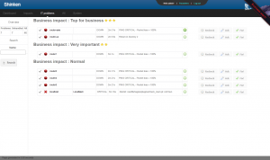

[[[Interface Shinken](shinken-use-ui@do=backlink.html)]]

[wiki monitoring-fr.org](../start.html "[ALT+H]")

-   [Accueil](../index.html "Cliquez pour revenir |  l'accueil")
-   [Blog](http://www.monitoring-fr.org "Blog & News")
-   [Forums](http://forums.monitoring-fr.org "Forums")
-   [Doc](http://doc.monitoring-fr.org "Doc")
-   [Forge](https://github.com/monitoring-fr "Forge")

Vous êtes ici: [Accueil](../start.html "start") »
[Shinken](start.html "shinken:start") » [Interface
Shinken](shinken-use-ui.html "shinken:shinken-use-ui")

### Table des matières {.toggle}

-   [Interface Shinken](shinken-use-ui.html#interface-shinken)
    -   [Interface basée sur un accès Direct à la
        mémoire](shinken-use-ui.html#interface-basee-sur-un-acces-direct-a-la-memoire)
    -   [Interfaces basée sur le livestatus (réseau
        API)](shinken-use-ui.html#interfaces-basee-sur-le-livestatus-reseau-api)
    -   [Interfaces basées sur le backend
        SQL](shinken-use-ui.html#interfaces-basees-sur-le-backend-sql)
    -   [Modules basée sur l'exportation de données
        (réseau)](shinken-use-ui.html#modules-basee-sur-l-exportation-de-donnees-reseau)
    -   [Autre](shinken-use-ui.html#autre)
    -   [L'exportation de fichiers plats:
        Obsolète](shinken-use-ui.html#l-exportation-de-fichiers-platsobsolete)
    -   [Lequel est le bon pour
        moi?](shinken-use-ui.html#lequel-est-le-bon-pour-moi)

Interface Shinken {#interface-shinken .sectionedit1}
=================

Les administrateurs ont besoin d’un moyen pour afficher les données
d’état et d’interagir avec le système.

Si vous installez Shinken en utilisant l’[installation en 10
minutes](shinken-10min-start.html "shinken:shinken-10min-start")
(méthode recommandée), vous aurez l’interface Web Shinken installé.

Mais il n’est pas obligatoire de l’utiliser, et vous préférerez
peut-être une autre interface.

Il y a des frontaux web open source et commerciaux utilisant le
livestatus API ou un SQL backend disponibles pour répondre à tous les
besoins.

Interface basée sur un accès Direct à la mémoire {#interface-basee-sur-un-acces-direct-a-la-memoire .sectionedit2}
------------------------------------------------

-   [Shinken
    WebUI](shinken-use-ui/use_with_webui.html "shinken:shinken-use-ui:use_with_webui")
    , inclus dans l’installation de Shinken.

Interfaces basée sur le livestatus (réseau API) {#interfaces-basee-sur-le-livestatus-reseau-api .sectionedit3}
-----------------------------------------------

-   [Thruk](shinken-use-ui/use_with_thruk.html "shinken:shinken-use-ui:use_with_thruk")

-   [Multisite](http://wiki.monitoring-fr.org/shinken/shinken-use-ui/use_with_multisite "shinken:shinken-use-ui:use_with_multisite")

-   Module gratuit:
    [NagVis](http://wiki.monitoring-fr.org/shinken/shinken-use-ui/use_with_nagvis "shinken:shinken-use-ui:use_with_nagvis")
    (représentation graphique)

Interfaces basées sur le backend SQL {#interfaces-basees-sur-le-backend-sql .sectionedit4}
------------------------------------

-   [Centreon](http://wiki.monitoring-fr.org/shinken/shinken-use-ui/use_with_centreon "shinken:shinken-use-ui:use_with_centreon")

Modules basée sur l'exportation de données (réseau) {#modules-basee-sur-l-exportation-de-donnees-reseau .sectionedit5}
---------------------------------------------------

-   Module gratuit:
    [Graphite](http://wiki.monitoring-fr.org/shinken/shinken-use-ui/use_with_graphite "shinken:shinken-use-ui:use_with_graphite")
-   Remarque: Intégré out-of-the-box dans Shinken WebUI

Autre {#autre .sectionedit6}
-----

-   Module gratuit:
    [PNP4Nagios](http://wiki.monitoring-fr.org/shinken/shinken-use-ui/use_with_pnp4nagios "shinken:shinken-use-ui:use_with_pnp4nagios")
    (graphique interface)

L'exportation de fichiers plats: Obsolète {#l-exportation-de-fichiers-platsobsolete .sectionedit7}
-----------------------------------------

-   [Vieux CGI &
    VShell](http://wiki.monitoring-fr.org/shinken/shinken-use-ui/use_with_old_cgi_and_vshell "shinken:shinken-use-ui:use_with_old_cgi_and_vshell")
    Remarque: Le Nagios CGI interface web est obsolète.

Lequel est le bon pour moi? {#lequel-est-le-bon-pour-moi .sectionedit8}
---------------------------

Essayez-les et voyez lequel vous convient le mieux.

C’est particulièrement facile avec l’interface utilisateur Web Shinken
et les interfaces livestatus base.

-   Pour les utilisateurs qui débutent avec les petites et moyennes
    installations, Thruk , multisite ou WebUI Shinken sont de bons
    choix;
-   Pour les petites et moyennes entreprises qui ont besoin de
    déploiements tout l’éventail d’outils de Centreon est un bon choix;
-   Pour une évolutivité maximale et un ensemble de fonctionnalités
    solides multisite est recommandé. Thruk est également une interface
    caractéristique très complète qui fournit également une certaine
    évolutivité.

SOMMAIRE {#sommaire .sectionedit1}
--------

**[Accueil](../start.html "start")**

**[Supervision](../supervision/start.html "supervision:start")**

-   [Nagios](../nagios/start.html "nagios:start")
-   [Centreon](../centreon/start.html "centreon:start")
-   [Shinken](start.html "shinken:start")
-   [Zabbix](../zabbix/start.html "zabbix:start")
-   [OpenNMS](../opennms/start.html "opennms:start")
-   [EyesOfNetwork](../eyesofnetwork/start.html "eyesofnetwork:start")
-   [Groundwork](../groundwork/start.html "groundwork:start")
-   [Zenoss](../zenoss/start.html "zenoss:start")
-   [Vigilo](../vigilo/start.html "vigilo:start")
-   [Icinga](../icinga/start.html "icinga:start")
-   [Cacti](../cacti/start.html "cacti:start")
-   [Ressenti
    utilisateur](../supervision/eue/start.html "supervision:eue:start")
-   [Ressenti utilisateur avec
    sikuli](../sikuli/eue/start.html "sikuli:eue:start")

**[Hypervision](../hypervision/start.html "hypervision:start")**

-   [Canopsis](../canopsis/start.html "canopsis:start")

**[Sécurité](../securite/start.html "securite:start")**

**[Infrastructure](../infra/start.html "infra:start")**

**[Développement](../dev/start.html "dev:start")**

Shinken {#shinken .sectionedit1}
-------

-   [Comment activer et utiliser le module
    livestatus](enable_livestatus_module.html "shinken:enable_livestatus_module")
-   [Configuration et
    lancement](shinken-architecture-config.html "shinken:shinken-architecture-config")
-   [Fonctionnement de
    Shinken](shinken-work.html "shinken:shinken-work")
-   [Instalation de shinken les yeux
    fermés](shinken-10min-start.html "shinken:shinken-10min-start")
-   [Installation Shinken 0.8 sur Debian
    Squeeze](shinken-debian-squeeze-install.html "shinken:shinken-debian-squeeze-install")
-   [Installation de Shinken par
    script](install-script.html "shinken:install-script")
-   [Installation de Shinken sur
    CentOS](shinken-centos-install.html "shinken:shinken-centos-install")
-   [Installation de Shinken sur Debian
    Lenny](shinken-debian-install.html "shinken:shinken-debian-install")
-   [Installation de Shinken sur Ubuntu
    server](shinken-ubuntu-install-with-nagios.html "shinken:shinken-ubuntu-install-with-nagios")
-   [Installation de Shinken sur Ubuntu server 10.04
    LTS](shinken-ubuntu-install.html "shinken:shinken-ubuntu-install")
-   [Interface Shinken](shinken-use-ui.html "shinken:shinken-use-ui")
-   [Introduction à
    Shinken](shinken-introduction.html "shinken:shinken-introduction")
-   [Les architectures avancées de
    Shinken](shinken-advanced-architecture.html "shinken:shinken-advanced-architecture")
-   [Ressources et Performances de
    Shinken](shinken-ressources.html "shinken:shinken-ressources")
-   [Shinken en haute disponiblité sur 2
    noeuds](shinken-ha-2noeuds.html "shinken:shinken-ha-2noeuds")

-   [Afficher le texte
    source](shinken-use-ui@do=edit&rev=0.html "Afficher le texte source [V]")
-   [Anciennes
    révisions](shinken-use-ui@do=revisions.html "Anciennes révisions [O]")
-   [Derniers
    changements](shinken-use-ui@do=recent.html "Derniers changements [R]")
-   [Liens vers cette
    page](shinken-use-ui@do=backlink.html "Liens vers cette page")
-   [Gestionnaire de
    médias](shinken-use-ui@do=media.html "Gestionnaire de médias")
-   [Index](shinken-use-ui@do=index.html "Index [X]")
-   [Connexion](shinken-use-ui@do=login&sectok=6bca6bdf16f8880de3d6d3649db89a26.html "Connexion")
-   [Haut de page](shinken-use-ui.html#dokuwiki__top "Haut de page [T]")

shinken/shinken-use-ui.txt · Dernière modification: 2013/03/29 09:39
(modification externe)

