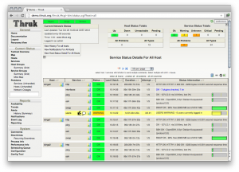

[[[Thruk](use_with_thruk@do=backlink.html)]]

[wiki monitoring-fr.org](../../start.html "[ALT+H]")

-   [Accueil](../../index.html "Cliquez pour revenir |  l'accueil")
-   [Blog](http://www.monitoring-fr.org "Blog & News")
-   [Forums](http://forums.monitoring-fr.org "Forums")
-   [Doc](http://doc.monitoring-fr.org "Doc")
-   [Forge](https://github.com/monitoring-fr "Forge")

Vous êtes ici: [Accueil](../../start.html "start") »
[Shinken](../start.html "shinken:start") » [Interface
Shinken](../shinken-use-ui.html "shinken:shinken-use-ui") »
[Thruk](use_with_thruk.html "shinken:shinken-use-ui:use_with_thruk")

### Table des matières {.toggle}

-   [Thruk](use_with_thruk.html#thruk)
    -   [Installez Thruk](use_with_thruk.html#installez-thruk)
    -   [Utilisation Shinken avec
        Thruk](use_with_thruk.html#utilisation-shinken-avec-thruk)
    -   [Activer le module
        livestatus](use_with_thruk.html#activer-le-module-livestatus)
    -   [Déclarer les pairs Shinken dans
        Thruk](use_with_thruk.html#declarer-les-pairs-shinken-dans-thruk)
    -   [Utilisation pnp4nagios avec
        Thruk](use_with_thruk.html#utilisation-pnp4nagios-avec-thruk)

Thruk {#thruk .sectionedit1}
=====

-   Page d’accueil:
    [http://www.thruk.org/](http://www.thruk.org/ "http://www.thruk.org/")
-   Captures d’écran:
    [http://www.thruk.org/images/screenshots/screenshots.html](http://www.thruk.org/images/screenshots/screenshots.html "http://www.thruk.org/images/screenshots/screenshots.html")
-   Description: “Thruk est une interface web multibackend indépendant
    de la surveillance qui prend actuellement en charge Nagios, Icinga
    et Shinken comme backend en utilisant l’addon livestatus. Il est
    conçu pour être une interface de remplacement. L’objectif est de
    couvrir 100% des fonctionnalités originales en plus d’améliorations
    supplémentaires pour les installations de grande taille. ”
-   Licence: GPL v2
-   forum dédié sur le site officiel de Shinken:
    [http://www.shinken-monitoring.org/forum/index.php/board](http://www.shinken-monitoring.org/forum/index.php/board "http://www.shinken-monitoring.org/forum/index.php/board"),
    7.0.html

Installez Thruk {#installez-thruk .sectionedit2}
---------------

Voir documentation [d'installation Thruk
officiel](http://www.thruk.org/documentation.html#_installation "http://www.thruk.org/documentation.html#_installation")
[EN].

Utilisation Shinken avec Thruk {#utilisation-shinken-avec-thruk .sectionedit3}
------------------------------

Thruk communique avec Shinken via le module livestatus.

Si vous avez utilisé l’exemple de configuration, tout devrait être déjà
prêt. :)

Vous pouvez consulter la configuration à l’aide des deux étapes
suivantes.

Activer le module livestatus {#activer-le-module-livestatus .sectionedit4}
----------------------------

Activer le module
[livestatus](../enable_livestatus_module.html "shinken:enable_livestatus_module").

Déclarer les pairs Shinken dans Thruk {#declarer-les-pairs-shinken-dans-thruk .sectionedit5}
-------------------------------------

Modifier le fichier `/etc/thruk/thruk_local.conf` et déclarer les pairs
Shinken:

~~~~ {.code}
<peer>
        name   = External Shinken
        type   = livestatus
        <options>
            peer    = 127.0.0.01:50000
       </options>
    </peer>
~~~~

Ou utiliser l’assistant backend qui démarre automatiquement lors de la
première installation. Ne pas oublier de changer le 127.0.0.1 par l’
IP/nom de votre broker si c’est installée sur un hôte différent, ou si
vous utilisez une architecture distribuée avec plusieurs broker!

Utilisation pnp4nagios avec Thruk {#utilisation-pnp4nagios-avec-thruk .sectionedit6}
---------------------------------

Voir
[pnp4nagios](http://wiki.monitoring-fr.org/shinken/shinken-use-ui/use_with_pnp4nagios "shinken:shinken-use-ui:use_with_pnp4nagios").

SOMMAIRE {#sommaire .sectionedit1}
--------

**[Accueil](../../start.html "start")**

**[Supervision](../../supervision/start.html "supervision:start")**

-   [Nagios](../../nagios/start.html "nagios:start")
-   [Centreon](../../centreon/start.html "centreon:start")
-   [Shinken](../start.html "shinken:start")
-   [Zabbix](../../zabbix/start.html "zabbix:start")
-   [OpenNMS](../../opennms/start.html "opennms:start")
-   [EyesOfNetwork](../../eyesofnetwork/start.html "eyesofnetwork:start")
-   [Groundwork](../../groundwork/start.html "groundwork:start")
-   [Zenoss](../../zenoss/start.html "zenoss:start")
-   [Vigilo](../../vigilo/start.html "vigilo:start")
-   [Icinga](../../icinga/start.html "icinga:start")
-   [Cacti](../../cacti/start.html "cacti:start")
-   [Ressenti
    utilisateur](../../supervision/eue/start.html "supervision:eue:start")
-   [Ressenti utilisateur avec
    sikuli](../../sikuli/eue/start.html "sikuli:eue:start")

**[Hypervision](../../hypervision/start.html "hypervision:start")**

-   [Canopsis](../../canopsis/start.html "canopsis:start")

**[Sécurité](../../securite/start.html "securite:start")**

**[Infrastructure](../../infra/start.html "infra:start")**

**[Développement](../../dev/start.html "dev:start")**

Shinken {#shinken .sectionedit1}
-------

-   [Comment activer et utiliser le module
    livestatus](../enable_livestatus_module.html "shinken:enable_livestatus_module")
-   [Configuration et
    lancement](../shinken-architecture-config.html "shinken:shinken-architecture-config")
-   [Fonctionnement de
    Shinken](../shinken-work.html "shinken:shinken-work")
-   [Instalation de shinken les yeux
    fermés](../shinken-10min-start.html "shinken:shinken-10min-start")
-   [Installation Shinken 0.8 sur Debian
    Squeeze](../shinken-debian-squeeze-install.html "shinken:shinken-debian-squeeze-install")
-   [Installation de Shinken par
    script](../install-script.html "shinken:install-script")
-   [Installation de Shinken sur
    CentOS](../shinken-centos-install.html "shinken:shinken-centos-install")
-   [Installation de Shinken sur Debian
    Lenny](../shinken-debian-install.html "shinken:shinken-debian-install")
-   [Installation de Shinken sur Ubuntu
    server](../shinken-ubuntu-install-with-nagios.html "shinken:shinken-ubuntu-install-with-nagios")
-   [Installation de Shinken sur Ubuntu server 10.04
    LTS](../shinken-ubuntu-install.html "shinken:shinken-ubuntu-install")
-   [Interface Shinken](../shinken-use-ui.html "shinken:shinken-use-ui")
-   [Introduction à
    Shinken](../shinken-introduction.html "shinken:shinken-introduction")
-   [Les architectures avancées de
    Shinken](../shinken-advanced-architecture.html "shinken:shinken-advanced-architecture")
-   [Ressources et Performances de
    Shinken](../shinken-ressources.html "shinken:shinken-ressources")
-   [Shinken en haute disponiblité sur 2
    noeuds](../shinken-ha-2noeuds.html "shinken:shinken-ha-2noeuds")

-   [Afficher le texte
    source](use_with_thruk@do=edit&rev=0.html "Afficher le texte source [V]")
-   [Anciennes
    révisions](use_with_thruk@do=revisions.html "Anciennes révisions [O]")
-   [Derniers
    changements](use_with_thruk@do=recent.html "Derniers changements [R]")
-   [Liens vers cette
    page](use_with_thruk@do=backlink.html "Liens vers cette page")
-   [Gestionnaire de
    médias](use_with_thruk@do=media.html "Gestionnaire de médias")
-   [Index](use_with_thruk@do=index.html "Index [X]")
-   [Connexion](use_with_thruk@do=login&sectok=6bca6bdf16f8880de3d6d3649db89a26.html "Connexion")
-   [Haut de page](use_with_thruk.html#dokuwiki__top "Haut de page [T]")

shinken/shinken-use-ui/use\_with\_thruk.txt · Dernière modification:
2013/03/29 09:39 (modification externe)

