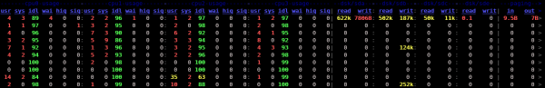

Utiliser la versatilité de [Dstat](http://dag.wieers.com/home-made/dstat/ "http://dag.wieers.com/home-made/dstat/") pour alimenter en continu un fichier qui sera traité pour mettre à jour des bases rrdtool. Il reste à remonter ses bases rrd vers un serveur Nagios où elles serviront à la fois aux données de performance mais aussi au monitoring grâce à Simple Event Correlator.

Obtenir à terme le meilleur et le plus ouvert possible des clients unix Nagios en remontant des alertes via NSCA. Peut-être que [Collectd](../nagios/integration/collectd.html "nagios:integration:collectd") qui injecte directement les données dans des RRD et qui possède un modèle client serveur semble plus indiqué dans ce rôle ?

## Présentation

Dstat est un utilitaire écrit en python qui fournit statistiques et données sur l’utilisation d’un système et peut remplace avantageusement à lui seul vmstat, iostat, netstat, nfsstat et ifstat. En effet, Dstat dépasse les limitations de ces outils et ajoute quelques fonctions supplémentaires, plus de compteurs et de flexibilité. Dstat est donc très utile pour monitorer des systèmes ou les débugger, qu’ils soient de tests, de production ou de qualification (benchmarking).

Dstat est prévu au départ pour fournir une sortie human-readable en standard et en temps réel. Il est désormais complété d’une sortie CSV qui permet de fournir des fichiers d’entrée à analyser dans votre tableur favori et de générer des graphiques.

### Fonctionnalités

-   Combinaison des informations de vmstat, iostat, ifstat, netstat et
    plus
-   Montre les stats avec un timeframe toujours précis
-   Enable/order counters as they make most sense during
    analysis/troubleshooting
-   Design modulaire
-   Permet de faire des résumés et totaux sur les périphériques de type
    block/network
-   Permet de voir les interrupts par périphériques
-   Timeframe ultra-précis, pas de dérive même sur un système chargé
-   Montre les valeurs exactes et permet donc de limiter les erreurs de
    conversions de mesure
-   Différentes unités de valeur représentées par différentes couleurs
-   Show intermediate results when delay \> 1
-   Export CSV possible

### Extensions

De plus, les possibilités de Dstat peuvent être étendues par l’emploi de
plugs-in parmi lesquels on trouve déjà :

-   dstat\_app - les processes les plus gourmands du système
-   dstat\_battery - pourcentage de charge de la batterie (requiert
    ACPI)
-   dstat\_cpufreq - fréquence de la CPU (requiert ACPI)
-   dstat\_dbus - le nombre de connexions dbus (requiert python-dbus)
-   dstat\_freespace - see the disk usage per partition
-   dstat\_gpfs - the GPFS read/write IO
-   dstat\_gpfsop - the GPFS filesystem operations
-   dstat\_nfs3 - the NFS v3 client operations
-   dstat\_nfs3op - the extended NFS v3 client operations
-   dstat\_nfsd3 - the NFS v3 server operations
-   dstat\_nfsd3op - the extended NFS v3 server operations
-   dstat\_postfix - counters of the differnt queues (needs postfix)
-   dstat\_rpc - RPC client calls
-   dstat\_rpcd - RPC server calls
-   dstat\_sendmail - counters of the queue (needs sendmail)
-   dstat\_thermal - CPU temperature
-   dstat\_utmp - number of utmp sessions (needs python-utmp)
-   dstat\_wifi - wireless link quality and signal/noise ratio (needs
    python-wifi)

## Utilisation

### En console

La commande pour avoir l’ensemble des statistiques que peut générer dstat en standard

	dstat@ubuntu:~$ ./dstat -afv

ce qui nous donne la jolie sortie colorée suivante :

et le fichier csv prêt à être traité suivant :

[dstat-dev-import.csv.zip](../assets/media/dstat-dev-import.csv.zip "dstat-dev-import.csv.zip")

Liste des options disponibles

~~~
Dstat options:
  -c, --cpu              enable cpu stats
     -C 0,3,total           include cpu0, cpu3 and total
  -d, --disk             enable disk stats
     -D total,hda           include hda and total
  -g, --page             enable page stats
  -i, --int              enable interrupt stats
     -I 5,eth2              include int5 and interrupt used by eth2
  -l, --load             enable load stats
  -m, --mem              enable memory stats
  -n, --net              enable network stats
     -N eth1,total          include eth1 and total
  -p, --proc             enable process stats
  -s, --swap             enable swap stats
     -S swap1,total         include swap1 and total
  -t, --time             enable time/date output
  -T, --epoch            enable time counter (seconds since epoch)
  -y, --sys              enable system stats
  --ipc                  enable ipc stats
  --lock                 enable lock stats
  --raw                  enable raw stats
  --tcp                  enable tcp stats
  --udp                  enable udp stats
  --unix                 enable unix stats

  -M stat1,stat2         enable external stats
     --mods stat1,stat2

  -a, --all              equals -cdngy (default)
  -f, --full             expand -C, -D, -I, -N and -S discovery lists
  -v, --vmstat           equals -pmgdsc -D total

  --integer              show integer values
  --nocolor              disable colors (implies --noupdate)
  --noheaders            disable repetitive headers
  --noupdate             disable intermediate updates
  --output file          write CSV output to file
~~~

### En supervision

	dstat@ubuntu:~$ ./dstat --noheaders -T --output dstat-ubuntu.csv -afv