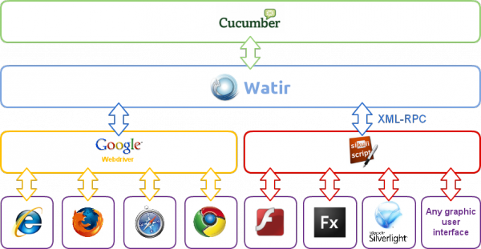
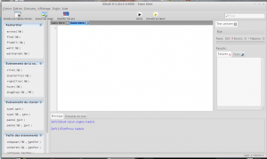
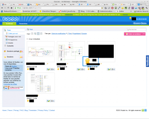
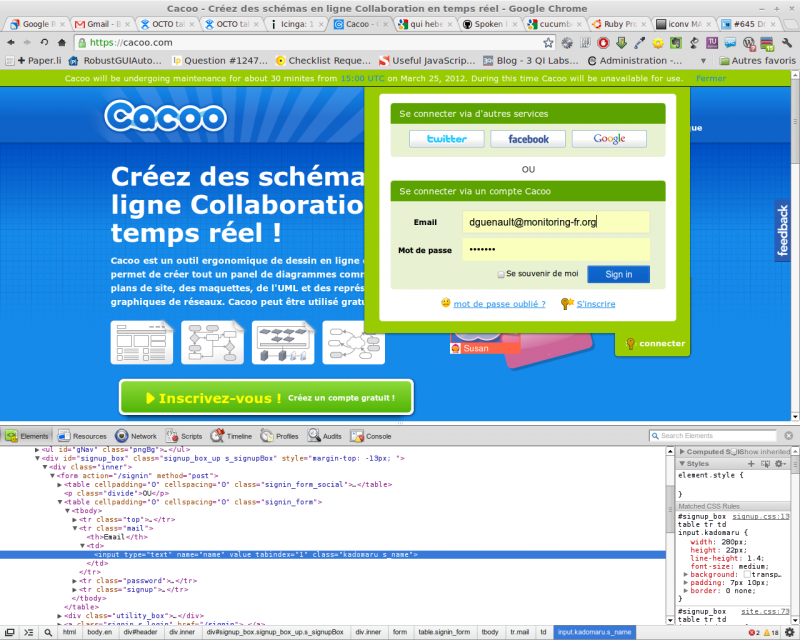
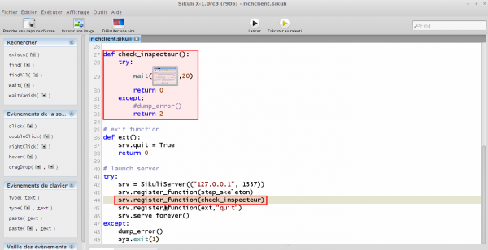

  **Rôle**       **Nom**
  -------------- ----------------
  **Créateur**   David GUENAULT

## Introduction

Généralement la supervision adresse les besoins de supervision technique. Cette approche limite et cantonne les solutions de supervision à des outils de techniciens et ne permet pas d’obtenir de la part de ces outils une visibilité de la part des responsables fonctionnels (qui sont alors obligés de se tourner vers des solutions dédiées).

Les besoins en terme de supervision (au sens large), ne sont pas du tout les mêmes selon les cibles :

-   Les exploitants on besoin de connaître l’état de chaque indicateur technique à un instant t et d’être alerté en cas de défaillance afin de corriger le problème au plus vite (Gestion de la disponibilité).
-   Les responsables fonctionnels, on besoin de savoir si les applications dont ils ont la charge fonctionnent et cela avec des temps de réponse acceptables du point de vue des utilisateurs (Gestion de la performance).

On ressent bien la différence du concept de supervision du point de vue de ces deux publics. Pour l’un on reste au niveau technique : L’ensemble des briques techniques fonctionnent ou pas. Pour l’autre il faut que cela fonctionne ET que les temps de réponse soient acceptable (on risque de perdre des utilisateurs si l’application met 3 minutes a afficher une page).

## Définition et mode opératoire

 La supervision du ressenti utilisateur commence la ou s’arrête la supervision technique et adresse de nouveaux besoins de supervision. Votre application peut parfaitement fonctionner du point de vue technique (disponibilité), mais être totalement inutilisable à cause de temps de réponse très longs (ressenti utilisateur). La supervision du ressenti utilisateur permet de se mettre à la place de l’utilisateur en exécutant des scénarios d’utilisation d’applications et en plaçant des points de vérification et de mesure des temps de réponse à chaque étape du scénario applicatif. On parle aussi de supervision de bout en bout ou de End User Experience.

Les fonctionnalités et la manière de les tester (scénarios) sont décrites puis exécutées à intervalle régulier ou selon un calendrier. Chaque scénario fais l’objet d’une mesure qui est ensuite stockée afin d’être retranscrites par la suite. Si un des scénario échoue ou met plus de temps que prévu à s’exécuter, une alerte est levée.

## Limite de l’expérience utilisateur

La supervision du ressenti utilisateur est la dernière étape des projets de supervision. Il serait facile de limiter un projet de supervision a ce seul point, mais il serais alors difficile de diagnostiquer l’origine d’un problème. Si un site e-commerce tombe, le scénario va le détecter, mais il sera bien incapable de dire d’où vient le problème (serveur web, serveur d’application, SGBDR ….). A contrario, se limiter à la seule expérience utilisateur est également une erreur car celle ci ne permet pas de détecter facilement des temps de réponse inacceptables. En définitive la supervision technique et du ressenti utilisateur sont deux éléments complémentaires.

## Fonctionnalités et scénarios

 Les responsables fonctionnels sont les personnes les mieux placées pour définir les conformités fonctionnelles et les niveaux de performance attendus. Il est donc logique de leur confier cette tâche. Généralement ces acteurs ne sont pas des experts techniques, il faut alors définir un cadre entre les définitions fonctionnelles et la technique de supervision. Afin de gommer la partie technique il est nécessaire que les scénarios soient définit dans un langage simple à maîtriser : le langage naturel. La glue technique ne doit pas apparaître aux responsables fonctionnels.

## Mode de fonctionnement

On peut distinguer deux modes de fonctionnement pour deux cas d’utilisation différents. D’une par la supervision des applications type site internet ou site extranet et d’autre part les applications internes.

Pour les sites internet et les sites extranet, le poste utilisateur n’est pas maîtrisé et il est impossible de définir une implémentation de référence (Système d’exploitation, matériel, navigateur, version ….). Dans ce cas seul la disponibilité de l’application peut être mesurée. Les temps de réponse dépendant des différents matériels et logiciels utilisés ne sont pas pertinents.

Pour les sites intranet, le parc informatique étant maîtrisé (en théorie), on peut définir un poste de travail de référence et superviser à la fois la disponibilité et la performance des applications. Les métriques de performance étant pertinents car mesurés sur un environnement au plus proche de l’environnement utilisateur final.

## Implémentation

L’implémentation de la supervision du ressenti utilisateur doit se baser sur les solutions de supervision techniques existantes. L’ordonnanceur de supervision (Nagios ou Shinken) devra être à même de planifier et d’exécuter les scénarios.

Les outils permettant de remplir la fonction de supervision du ressenti utilisateur sont les suivants :

-   **Cucumber :** Cucumber permet aux responsables fonctionnels de décrire en langage naturel comment le logiciel doit se comporter.
-   **Watir :** Watir est une librairie permettant d’automatiser l’exécution d’actions dans un navigateur. Watir permet de contrôler le navigateur de la même manière qu’un utilisateur. Il clique des liens, remplis des formulaires ou appui sur des boutons. Il est à même de vérifier des résultats comme la présence d’un texte sur une page. Il est également utilisé dans ce cadre pour piloter sikuli afin de couvrir les tests pour les clients lourds et les client riches.
-   **Webdriver:** constitue la couche technique entre Watir et le navigateur. Il permet selon une API unifiée de piloter virtuellement n’importe quel navigateur (IE, Firefox, Chrome ….).
-   **Sikuli:** est le pendant du couple watir/webdriver pour les applications client lourd et les client riches (comme flash, flex, silverlight ….). Il permet d’exécuter des scénarios de test basés sur une reconnaissance de pattern graphiques à l’aide de la librairie opencv.
-   **Cucumber-Nagios :** c’est un plugin Nagios qui permet d’exécuter les tests cucumber.

### Cucumber

Derrière
ce nom plutôt amusant, se trouve une solution très sérieuse de définition de tests fonctionnels en langage naturel. Mais pourquoi rajouter une couche supplémentaire ? N’oublions pas que les tests sont/doivent être rédigés par les fonctionnels. Après tout ils savent ce qu’il veulent et comment doit fonctionner l’application. Si un fonctionnels doit rajouter une couche technique pour définir les tests, cela va se faire dans la douleur.

Cucumber permet de définir les tests en langage naturel mais également selon plusieurs langues ! Il suffit de le spécifier en début de scénario par **\# language: fr** en début de scénario.

Analysons l’anatomie d’un test Cucumber en prenant pour exemple l’authentification sur le wiki de monitoring-fr :

~~~
# language: fr
Fonctionnalité: authentification wiki
  Afin d'écrire plus de contenu dans le wiki
  J'ai besoin d'être capable de m'authentifier dans le wiki
  
  Scénario: authentification wiki
    Etant donné que je suis sur la page de connexion du wiki
    Quand je m'identifie en tant que "cucumber" avec le mot de passe "lepassquivabien"
    Alors je devrais voir "Déconnexion"
~~~

Le test est découpé en trois parties :

-   **Fonctionalité** : ce que vous voulez tester, l’authentification sur le wiki. La fonctionnalité est toujours accompagné d’une définition des objectifs.
-   **Scénario** : le moyens d’aboutir à la réalisation de la fonctionnalité. Notez qu’il peut y avoir un ensemble de moyens nécessaires à la réalisation du test de la fonctionnalité. A ce moment la on définira plusieurs scénarios pour la même fonctionnalité.
-   **Étapes** : Un ensemble **contexte, action, assertion** permettant de vérifier la validité du scénario.

On constate également que la documentation de la fonctionnalité de test est auto-générée. C’est un avantage de taille par rapport à la rédaction purement technique. Imaginez vous revenir 6 mois plus tard sur un ensemble de fonctionnalités, avec une rédaction purement technique il vaut mieux ne pas avoir oublié de rédiger la documentation ! Avec Cucumber ce sont les fonctionnels qui documentent pour vous !

### Watir/Webdriver

**Watir** est une solution de tests technique pour les applications basées sur le protocole HTTP (les applications web donc ….). Watir est l’acronyme de : **W**eb **A**pplication **T**esting in **R**uby. En tant qu’environnement de test d’applications web, il permet de lancer un navigateur, saisir des données dans des formulaires, cliquer sur des boutons … etc …

~~~
require 'watir-webdriver'
b = Watir::Browser.new
b.goto 'bit.ly/watir-webdriver-demo'
b.text_field(:id => 'entry_0').set 'your name'
b.select_list(:id => 'entry_1').select 'Ruby'
b.select_list(:id => 'entry_1').selected? 'Ruby'
b.div(:class => 'ss-form-entry').button.click
b.text.include? 'Thank you'
~~~

Webdriver pour sa part est la glue technique permettant de piloter le navigateur. Si le driver existe vous pouvez faire vos tests. En effet Webdriver se base sur le meilleur moyen existant permettant de piloter le navigateur (COM, Chrome debuger ….)

### Sikuli

Sikuli est ou outil permettant de dérouler des tests basés sur la reconnaissance de motifs graphiques à l’aide de la librairie opencv. Il se présente sous la forme d’un Environnement de développement intégré (IDE) très simple à prendre en main. Sikuli est développé en java. Il fonctionne donc sur toutes les plateformes pouvant utiliser une machine virtuelle java.

Le principe de fonctionnement de Sikuli est simple, un certain nombre d’actions pouvant être effectuées par l’utilisateur (click, saisie au clavier, attendre un évènement …. sont rassemblées sur le coté gauche de l’interface). La sélection d’une de ces action déclenche une capture d’écran correspondant au pattern graphique devant être pris en compte, le pattern est ensuite représenté dans la zone de scénario.

En plus de permettre de faire des scripts simples, Sikuli permet de rédiger des tests unitaires. Les tests unitaires permettent de vérifier la conformité aux spécifications d’une application. Ils se basent sur des actions sur l’interface graphiques et des assertions sur le résultat attendu.

Cela est la partie basique de création d’un scénario. Mais Sikuli permet bien plus car les scripts sont développés en python (en fait jython qui est l’implémentation java de python). A ce titre toutes les possibilités offertes par python (ou presque) sont disponibles dans les scripts Sikuli.

Les scripts Sikuli peuvent être lancés directement à partir de la ligne de commande. La problématique étant qu’à ce moment la nous sommes confrontés à une boite noire avec en entrée une demande d’exécution du script et en sortie un résultat global. Ce mode de fonctionnement ne permet pas de décomposer les étapes du scénario et de récupérer unitairement les informations d’exécution. On ne peut donc pas l’intégrer tel quel dans un scénario géré avec Watir et par extension Cucumber.

C’est exactement la que l’utilisation de python prend tout sons sens. Comment faire pour commander unitairement les étapes d’un scénario ? La réponse se résume à : XMLRPC. XML-RPC permet d’appeler une fonction sur un serveur distant à partir de n’importe quel système (Windows, Mac OS X, GNU/Linux) et avec n’importe quel langage de programmation. Le serveur est lui même sur n’importe quel système et est programmé dans n’importe quel langage. En clair nous allons lancer le script en “mode serveur XMLRPC” et chaque étape du scénario sera déclenchée à distance via ce protocole (tournant au dessus de HTTP). La création d’un serveur XMLRPC en python ne prend que quelques lignes de code python. Chaque étape du scénario sera une fonction qui sera exposée à l’extérieur par le serveur XMLRPC. Le squelette suivant donne une bonne idée de la simplicité de création. La seule différence avec un scénario Sikuli classique se situe dans l’encapsulation des étapes dans des fonctions.

~~~
from SimpleXMLRPCServer import SimpleXMLRPCServer as Server
import sys
# server class
class SikuliServer(Server):
    # server loop   
    def serve_forever(self):
        self.quit = 0
        while not self.quit:
            self.handle_request()
 
def etape1():
    try:
        click(Pattern("toto.png").similar(0.83).targetOffset(-22,11))
        return 0
    except:
        return 2
 
def etape2():
    ...
 
def etape3():
    ...
 
# exit function
def ext():
    srv.quit = True
    return 0
 
# launch server
try:
    srv = SikuliServer(("127.0.0.1", 1337))
    srv.register_function(etape1)
    srv.register_function(etape2)    
    srv.register_function(etape3)        
    srv.register_function(ext,"quit")    
    srv.serve_forever()
except:
    sys.exit(1)
~~~

### Cucumber-nagios

cucumber-nagios est un plugin nagios permettant de lancer les tests cucumber et de récupérer un code de sortie et un message compatible avec nagios.

~~~
$ bin/cucumber-nagios features/ebay.com.au/bidding.feature
CUCUMBER OK - Critical: 0, Warning: 0, 4 okay
~~~

La problématique avec cucumber-nagios étant qu’il ne remontent pas de données de performance pour les différents scénarios d’une fonctionnalité cucumber. En analysant un peu le code de cucumber-nagios on peut très facilement rajouté cela. cucumber-nagios se base sur les formatter de cucumber pour définir le format de sortie. Le fichier formatter est nagios.rb (dans lib/cucumber/formatter/).

le patch suivant permet de rajouter les support des données de performance par scénario d’une feature.

~~~
--- /usr/lib/ruby/gems/1.8/gems/cucumber-nagios-0.9.2/lib/cucumber/formatter/nagios.rb.orig   2012-03-14 16:03:01.775860075 +0100
+++ /usr/lib/ruby/gems/1.8/gems/cucumber-nagios-0.9.2/lib/cucumber/formatter/nagios.rb  2012-03-14 16:20:18.115818900 +0100
@@ -47,6 +47,11 @@
         performance_data = [ "passed=#{@passed.size}", "failed=#{@failed.size}",
                              "nosteps=#{@warning.size}", "total=#{@total}",
                              "time=#{@run_time}" ]
+        MEASURES.each do |hash|
+            hash.each_pair do |key,value|
+                performance_data.push("'#{key}'=#{value.to_s}")
+            end
+        end
         @message << "#{service_output.join(', ')} | #{performance_data.join('; ')}"
 
         @failed.each do |keyword, step_match, scenario_file_colon_line|
~~~

pour l’appliquer il suffit de copier le contenu du patch dans un fichier cucumber-nagios-performance.patch puis d’exécuter la commande suivante :

~~~
patch -p0 < /chemin/vers/cucumber-nagios-performance.patch
~~~

Un cas réel
-----------

Bien, maintenant que nous avons passé en revu l’ensemble des fonctionnalités de la pile de supervision du ressenti utilisateur, prenons un cas de test réel qui combine à la fois application web et client riche. Les applications ne manquent pas, et nous allons utiliser le service Cacoo ([http://cacoo.com](http://cacoo.com "http://cacoo.com")). L’inscription est gratuite et il présente un mix idéal entre client web (du html) et client riche (du flash).

L’exemple complet est disponible sur Github [https://github.com/david-guenault/eue](https://github.com/david-guenault/eue "https://github.com/david-guenault/eue")

### Installation de la pile logicielle

#### watir, cucumber et cucumber-nagios

##### Debian 6 / Ubuntu 11.04 {#debian-6ubuntu-1104}

~~~
apt-get install ruby rubygems ruby-dev libxml2-dev libxslt-dev libssl-dev build-essential libruby-extras xvfb ffmpeg apache2
gem update
gem install rubygems-update
update_rubygems
gem install cucumber cucumber-nagios watir-webdriver 
gem install inifile headless orderedhash
~~~

##### Ubuntu 12.04 {#ubuntu-1204}

~~~
apt-get install ruby rubygems ruby-dev libxml2-dev libxslt-dev libssl-dev build-essential xvfb ffmpeg apache2
gem update
gem install rubygems-update
update_rubygems
gem install cucumber cucumber-nagios watir-webdriver 
gem install inifile headless orderedhash
~~~

##### RedHat/Centos

Experimental

*Version 5.x*

~~~
yum install libxml2-devel libxslt-devel openssl-devel xorg-x11-server-Xvfb gcc gcc-c++ automake autoconf libtool m4 make
wget http://ftp.ruby-lang.org/pub/ruby/1.8/ruby-1.8.7-p358.tar.gz
tar zxvf ruby-1.8.7-p358.tar.gz
cd ruby-1.8.7-p358
./configure --enable-pthread
make
make install
cd ..
wget http://rubyforge.org/frs/download.php/76072/rubygems-1.8.24.zip
unzip rubygems-1.8.24.zip
cd rubygems-1.8.24
/usr/local/bin/ruby setup.rb
/usr/local/bin/gem install rubygems-update
update_rubygems
/usr/local/bin/gem install cucumber cucumber-nagios watir-webdriver 
/usr/local/bin/gem install inifile headless orderedhash
~~~

*Version 6.x*

~~~
yum install libxml2-devel libxslt-devel openssl-devel xorg-x11-server-Xvfb gcc gcc-c++ automake autoconf libtool m4 make rubygems ruby-devel
gem install rubygems-update
update_rubygems
gem install cucumber cucumber-nagios watir-webdriver 
gem install inifile headless orderedhash
~~~

#### Sikuli {#sikuli1}

Sikuli n’est pas donné comme compatible avec java 7. Seul java 6 est qualifié

##### Installation du Java Runtime Environment 6

*Debian 6 / Ubuntu 11.04 / Ubuntu 12.04*

Récupérer java runtime environment sur le site : [http://www.oracle.com/technetwork/java/javasebusiness/downloads/java-archive-downloads-javase6-419409.html\#jre-6u30-oth-JPR](http://www.oracle.com/technetwork/java/javasebusiness/downloads/java-archive-downloads-javase6-419409.html#jre-6u30-oth-JPR "http://www.oracle.com/technetwork/java/javasebusiness/downloads/java-archive-downloads-javase6-419409.html#jre-6u30-oth-JPR"). Une fois celui ci téléchargé (l’exemple est donné pour une jre 6 en 64 bits) :

~~~
tar zxvf jre-6u30-linux-x64.tar.gz
cp -a jre1.6u30 /opt/
update-alternatives --install /usr/bin/java java /opt/jre1.6u30/bin/java 1
update-alternatives --config java
~~~

*RedHat/Centos 6.x*

Experimental

Récupérer java runtime environment sur le site : [http://www.java.com/fr/download/manual\_v6.jsp](http://www.java.com/fr/download/manual_v6.jsp "http://www.java.com/fr/download/manual_v6.jsp"). Il faudra prendre la version “rpm.bin” afin que l’installation s’intègre avec l’OS. Une fois celui ci téléchargé (l’exemple est donné pour une jre 6 en 64 bits) :

~~~
chmod a+x jre-6u33-linux-i586-rpm.bin
./jre-6u33-linux-i586-rpm.bin
~~~

##### Installer les prérequis de Sikuli {#installer-les-prerequis-de-sikuli}

*Debian 6 / Ubuntu 11.04*

~~~
apt-get install libcvaux2.1 libhighgui2.1
~~~

*Ubuntu 12.04*

~~~
apt-get install libcvaux2.3 libhighgui2.3
~~~

*RHEL/CentOS 6.X*

~~~
yum install opencv opencv-devel
~~~

Télécharger ensuite Sikuli

~~~
wget http://launchpad.net/sikuli/sikuli-x/x1.0-rc3/+download/Sikuli-X-1.0rc3%20%28r905%29-linux-x86_64.zip
~~~

Extraire le contenu de l’archive. Vous pouvez alors lancer Sikuli avec la commande :

~~~
/path/to/Sikuli-IDE/sikuli-ide.sh
~~~

#### Firefox sur le poller

Selon les distributions, il peut être intéressant d’obtenir une version récente de Firefox avec le plugin flash. Voici comment faire :

-   Récupérer une version de firefox pour votre architecture : [http://www.mozilla.org/en-US/firefox/new/](http://www.mozilla.org/en-US/firefox/new/ "http://www.mozilla.org/en-US/firefox/new/")
-   extraire le contenu de l’archive et le placer dans /opt
-   Pour le plugin flash récupérez le sur le site de Adobe, extraire le contenu de l’archive et copier le plugin au bon endroit.

~~~
mkdir -p /home/userquilancelescript/.mozilla/plugins
cp libflashplayer.so /home/userquilancelescript/.mozilla/plugins
chmod 0755 /home/userquilancelescript/.mozilla/plugins/libflashplayer.so
~~~

- Faire en sorte que le binaire Firefox soit trouvé lors de l’exécution des scénarios en éditant le fichier parameters.ini et en modifiant la ligne suivante dans la section browser.

~~~
path=/opt/firefox/firefox
~~~

### Le scénario fonctionnel

Mettons nous à la place du fonctionnel qui va exprimer la/les fonctionalités à tester.

~~~
# language: fr 
Fonctionnalité: authentification cacoo 
    Afin d'être en mesure d'utiliser cacoo 
    je dois pouvoir m'authentifier 
 
Scénario: authentification cacoo 
    Etant donné Que je suis sur la page d'accueil du site "http://www.cacoo.com" 
    Quand Je clique sur le lien "Sign in" 
    Quand Je saisi "[email protected]
/*  */!function(){try{var t="currentScript"in document?document.currentScript:function(){for(var t=document.getElementsByTagName("script"),e=t.length;e--;)if(t[e].getAttribute("cf-hash"))return t[e]}();if(t&&t.previousSibling){var e,r,n,i,c=t.previousSibling,a=c.getAttribute("data-cfemail");if(a){for(e="",r=parseInt(a.substr(0,2),16),n=2;a.length-n;n+=2)i=parseInt(a.substr(n,2),16)^r,e+=String.fromCharCode(i);e=document.createTextNode(e),c.parentNode.replaceChild(e,c)}}}catch(u){}}();/*  */" dans le champ "name" 
    Quand Je saisi "*******" dans le champ "password" 
    Quand Je clique sur le bouton "Sign in" 
    Alors Je devrais voir "Créer un schéma"
~~~

### Préparation de l'environnement

La gestion des scénarios Cucumber nécessite un peu d’organisation. Pour cela nous allons créer une arborescence qui permettra de stocker notre scénario et les éléments d’environnement.

~~~
mkdir cacoo
mkdir cacoo/steps
mkdir cacoo/support
~~~

Le répertoire steps accueillera un fichier steps.rb permettant la retranscription technique de nos tests en fonction de la fonctionnalité devant être testée. Le répertoire support permettra de définir l’environnement d’exécution dans un fichier nommé env.rb. La racine accueillera le fichier de définition de la fonctionalité : cacoo.feature. Son contenu sera simplement la description vue précédemment.

Nous aurons besoin de définir un certain nombre d’éléments nécéssaire à l’execution de nos tests. La définition de l’environnement se fait dans le fichier support/env.rb. Vous pourrez le réutiliser pour l’ensemble de vos projets.

~~~
require 'rubygems'
begin require 'rspec/expectations'; rescue LoadError; require 'spec/expectations'; end
require 'date'
require 'watir-webdriver'
 
# Téléchargement des exemples sur github
 
# browser
Browser = Watir::Browser.new(:firefox)
browser = Browser
 
# global
Before do |scenario|
    @browser = browser
    @sc = scenario
end
 
# performance data for cucumber-nagios
After do
    if MEASURE["time"] > -1
        MEASURES.push({@sc.name.gsub("'","") => MEASURE["time"]})
    end
    MEASURE["start"] = 0
    MEASURE["end"] = 0
    MEASURE["time"] = -1   
end
 
MEASURES = []
 
MEASURE = {
    "start" => 0,
    "end" => 0,
    "time" => -1
}
 
def startmeasure()
    MEASURE["start"]=Time.now
end
 
def endmeasure()
    MEASURE["end"]=Time.now
    MEASURE["time"]=(MEASURE["end"] - MEASURE["start"]).to_f
end
 
# "after all"
at_exit do
    browser.close
end
~~~

Dans certain cas, l’interprétation de scénarios en langue française peut poser problème. Il peut être utile de spécifier que nous allons travailler en UTF-8. Pour cela ajouter un fichier support/\_.rb et coller le contenu suivant à l’intérieur.

~~~
$KCODE='utf-8' 
~~~

Au final nous aurons l’arborescence suivante :

~~~
  cacoo
    |_ cacoo.feature
    |_ steps
    |   |_ steps.rb
    |_ support
        |_ env.rb
        |_ _.rb
~~~

### Générer le squelette du code ruby

Il est temps de générer le squelette de notre test.

Cucumber à la capacité de remonter les retranscriptions manquantes dans le fichier steps.rb. Il suffit de lancer le test à vide.

~~~
cucumber cacoo_authentification.feature
# language: fr
Fonctionnalité: authentification cacoo
    Afin d'être en mesure d'utiliser cacoo
    je dois pouvoir m'authentifier
 
  Scénario: authentification cacoo                                               # cacoo.feature:6
    Etant donné que je suis sur la page d'accueil du site "http://www.cacoo.com" # cacoo.feature:7
    Quand je saisi "[email protected]
/*  */!function(){try{var t="currentScript"in document?document.currentScript:function(){for(var t=document.getElementsByTagName("script"),e=t.length;e--;)if(t[e].getAttribute("cf-hash"))return t[e]}();if(t&&t.previousSibling){var e,r,n,i,c=t.previousSibling,a=c.getAttribute("data-cfemail");if(a){for(e="",r=parseInt(a.substr(0,2),16),n=2;a.length-n;n+=2)i=parseInt(a.substr(n,2),16)^r,e+=String.fromCharCode(i);e=document.createTextNode(e),c.parentNode.replaceChild(e,c)}}}catch(u){}}();/*  */" dans le champ "Email"                    # cacoo.feature:8
    Quand je saisi "monmotdepasse" dans le champ "Mot de passe"                  # cacoo.feature:9
    Quand je clique sur le bouton "Sign in"                                      # cacoo.feature:10
    Alors je devrais voir "Créer un schéma"                                        # cacoo.feature:11
 
1 scenario (1 undefined)
5 steps (5 undefined)
0m0.008s
 
You can implement step definitions for undefined steps with these snippets:
 
Etantdonné /^que je suis sur la page d'accueil du site "([^"]*)"$/ do |arg1|
  pending # express the regexp above with the code you wish you had
end
 
Quand /^je saisi "([^"]*)" dans le champ "([^"]*)"$/ do |arg1, arg2|
  pending # express the regexp above with the code you wish you had
end
 
Quand /^je clique sur le bouton "([^"]*)"$/ do |arg1|
  pending # express the regexp above with the code you wish you had
end
 
Alors /^je devrais voir "([^"]*)"$/ do |arg1|
  pending # express the regexp above with the code you wish you had
end
~~~

Le squelette en question est situé après la ligne : You can implement
step definitions for undefined steps with these snippets. Nous allons
donc placé les lignes du squelette dans le fichier steps/steps.rb

~~~
Etantdonné /^que je suis sur la page d'accueil du site "([^"]*)"$/ do |arg1|
  pending # express the regexp above with the code you wish you had
end

Quand /^je saisi "([^"]*)" dans le champ "([^"]*)"$/ do |arg1, arg2|
  pending # express the regexp above with the code you wish you had
end

Quand /^je clique sur le bouton "([^"]*)"$/ do |arg1|
  pending # express the regexp above with the code you wish you had
end

Alors /^je devrais voir "([^"]*)"$/ do |arg1|
  pending # express the regexp above with the code you wish you had
end
~~~

Vous aurez remarqué l’utilisation de double quotes dans les étapes du scénario. Elles servent simplement à définir des variables qui seront réutilisées dans le code des étapes (fichier steps.rb). Cela permet également de factoriser des étapes et ainsi d’économiser du code pour des étapes similaires qui ne diffère que par une valeur.

En relançant le test, nous obtiendrons un message différent :

~~~
# encoding: utf-8
# language: fr
Fonctionnalité: authentification cacoo
    Afin d'être en mesure d'utiliser cacoo
    je dois pouvoir m'authentifier

  Scénario: authentification cacoo                                               # cacoo.feature:7
    Etant donné Que je suis sur la page d'accueil du site "http://www.cacoo.com" # steps/steps.rb:1
      TODO (Cucumber::Pending)
      ./steps/steps.rb:2:in `/^Que je suis sur la page d'accueil du site "([^"]*)"$/'
      cacoo.feature:8:in `Etant donné Que je suis sur la page d'accueil du site "http://www.cacoo.com"'
    Quand Je saisi "[email protected]
/*  */!function(){try{var t="currentScript"in document?document.currentScript:function(){for(var t=document.getElementsByTagName("script"),e=t.length;e--;)if(t[e].getAttribute("cf-hash"))return t[e]}();if(t&&t.previousSibling){var e,r,n,i,c=t.previousSibling,a=c.getAttribute("data-cfemail");if(a){for(e="",r=parseInt(a.substr(0,2),16),n=2;a.length-n;n+=2)i=parseInt(a.substr(n,2),16)^r,e+=String.fromCharCode(i);e=document.createTextNode(e),c.parentNode.replaceChild(e,c)}}}catch(u){}}();/*  */" dans le champ "Email"                    # steps/steps.rb:5
    Quand Je saisi "monmotdepasse" dans le champ "Mot de passe"                  # steps/steps.rb:5
    Quand Je clique sur le bouton "Sign in"                                      # steps/steps.rb:9
    Alors Je devrais voir "Créer un schéma"                                        # steps/steps.rb:13

1 scenario (1 pending)
5 steps (4 skipped, 1 pending)
0m0.005s
~~~

Le contexte n’étant pas vérifié les tests suivants ne sont pas exécutés.

### Création des étapes

Afin de vérifier le contexte (Etant donné Que je suis sur la page d’accueil du site
“[http://www.cacoo.com](http://www.cacoo.com "http://www.cacoo.com")”),
il faut faire pointer le navigateur vers l’url
“[http://www.cacoo.com](http://www.cacoo.com "http://www.cacoo.com")”.
Cela se fait avec watir de la manière suivante :

~~~
@browser.goto("http://www.cacoo.com")
~~~

Mais attention dans notre contexte nous avons encadré l’adresse par des doubles quotes, ce qui veut dire que celle ci sera afféctée dans une variable dans les étapes définie dans le fichier steps.rb. La variable est nommé par défaut arg1. Notre fichier steps.rb va donc être modifié comme suit :

~~~
Etantdonné /^que je suis sur la page d'accueil du site "([^"]*)"$/ do |arg1|
  @browser.goto(arg1)
end
~~~

Nous allons utiliser chrome et son analyseur pour trouver les éléments devant être remplis. Allez sur la page d’accueil de cacoo et déroulez le menu “connecter” puis effectuez un click droit sur le champ email et sélectionnez “Procéder à l’inspection de l’élément” dans le menu contextuel.

On constate que le nom du champ est **name**. watir permet de localiser les champs avec lesquels il doit intéragir en spécifiant un attribut de recherche (dans ce cas le champ texte dont l’attribut name est name). Cela se traduit de la manière suivante :

~~~
@browser.text_field(:name => 'name').set arg1
~~~

Nous pouvons faire de même avec le champ mot de passe :

~~~
@browser.text_field(:name => 'password').set arg1
~~~

Ainsi que pour le lien de connexion (qui par défaut apparaît en anglais sur mon poste de travail). Dans ce cas nous devons cliquer sur le lien contenant le texte Sign in.

~~~
@browser.link(:text => arg1).click
~~~

Selon la manière dont sont construits les liens (en particulier les liens contenant des balises html comme le span), Watir peut ne pas avoir la capacité à trouver un lien par le texte contenu à l’intérieur. A ce moment la il faudra faire une localisation du lien par son attribut id ou name.

~~~
@browser.link(:id => arg1).click
~~~

L’étape d’action du scénario pourra donc être :

~~~
Quand je clique sur le lien dont l'identifiant est "identifiant_du_lien"
~~~

et serait traduite dans le fichier steps.rb par

~~~
Quand /^Je clique sur le lien dont l'identifiant est "([^"]*)"$/ do |arg1|
    @browser.a(:id=>arg1).click
end
~~~

Il ne nous reste plus qu’à vérifier l’assertion validant que tout s’est bien passé (Alors je devrais voir “Créer un schéma”). Ce qui reviens a dire que quelque part dans la page se trouve le texte “Créer un schéma”. Watir permet de le vérifier de la manière suivante :

~~~
@browser.text.include?(arg1).should == true
~~~

Tout cela se traduira au final par le fichier steps/steps.rb suivant :

~~~
Etantdonné /^Que je suis sur la page d'accueil du site "([^"]*)"$/ do |arg1|
    @browser.goto(arg1)
end
 
Quand /^Je saisi "([^"]*)" dans le champ "([^"]*)"$/ do |arg1, arg2|
    @browser.text_field(:name => arg2).set(arg1)
end
 
Quand /^Je clique sur le bouton "([^"]*)"$/ do |arg1|
    @browser.button(:value => arg1).click
end
 
Alors /^Je devrais voir "([^"]*)"$/ do |arg1|
    @browser.text.include?(arg1).should == true
end
~~~

Vérifions que le scénario fonctionne correctement

~~~
$ cucumber cacoo.feature
# language: fr
Fonctionnalité: authentification cacoo
    Afin d'être en mesure d'utiliser cacoo
    je dois pouvoir m'authentifier

  Scénario: authentification cacoo                                               # cacoo.feature:6
    Etant donné Que je suis sur la page d'accueil du site "http://www.cacoo.com" # steps/steps.rb:1
    Quand Je clique sur le lien "Sign in"                                        # steps/steps.rb:5
    Quand Je saisi "[email protected]
/*  */!function(){try{var t="currentScript"in document?document.currentScript:function(){for(var t=document.getElementsByTagName("script"),e=t.length;e--;)if(t[e].getAttribute("cf-hash"))return t[e]}();if(t&&t.previousSibling){var e,r,n,i,c=t.previousSibling,a=c.getAttribute("data-cfemail");if(a){for(e="",r=parseInt(a.substr(0,2),16),n=2;a.length-n;n+=2)i=parseInt(a.substr(n,2),16)^r,e+=String.fromCharCode(i);e=document.createTextNode(e),c.parentNode.replaceChild(e,c)}}}catch(u){}}();/*  */" dans le champ "name"            # steps/steps.rb:9
    Quand Je saisi "*****" dans le champ "password"                           # steps/steps.rb:9
    Quand Je clique sur le bouton "Sign in"                                      # steps/steps.rb:13
    Alors Je devrais voir "Créer un schéma"                                      # steps/steps.rb:17

1 scenario (1 passed)
6 steps (6 passed)
0m10.538s
~~~

Les 3 dernières lignes donnent l’état des tests et l’on constate que tous les scénarios et toutes les étapes se sont correctement déroulées.

### Plugin cucumber-nagios et données de performance

Voyons maintenant avec le plugin nagios

~~~
$ cucumber-nagios cacoo.feature 
CUCUMBER OK - Critical: 0, Warning: 0, 6 okay | passed=6; failed=0; nosteps=0; total=6; time=10
~~~

C’est sympa mais je n’ai pas de données de performance pour les temps de chargement. Nous allons voir maintenant comment rajouter ces données de performances et bénéficier du patch vue précédemment.

Comprenons bien une chose, les données de performance sont mesurées sur la base du scénario et pas des étapes, il faudra bien faire attention à ne pas multiplier les mesures à l’intérieur d’un scénario sous peine de résultats erronés. En clair une mesure = un scénario. Si vous avez besoins de plus de mesures il faudra découper votre scénarios en plusieurs scénarios.

La prise de mesure fonctionne comme un chronomètre, vous déclenchez le chronomètre avec startmeasure et vous l’arrêtez avec stopmeasure.

Voyons comment mesurer le temps entre le moment ou nous cliquons sur le lien “Sign in” et le moment ou la page est chargée. Cela se fait bien entendu dans le fichier steps/steps.rb :

~~~
Quand /^Je clique sur le bouton "([^"]*)"$/ do |arg1|
    startmeasure
    @browser.button(:value => arg1).click
end
 
Alors /^Je devrais voir "([^"]*)"$/ do |arg1|
    endmeasure
    @browser.text.include?(arg1).should == true
end
~~~

Et maintenant relançons les tests avec cucumber-nagios

~~~
$ cucumber-nagios cacoo.feature 
CUCUMBER OK - Critical: 0, Warning: 0, 6 okay | passed=6; failed=0; nosteps=0; total=6; time=10; 'authentification cacoo'=2.260906
~~~

On constate que la donnée de performance prend automatiquement le nom du scénario.

Maintenant il faudrait avoir le temps de chargement de la page d’accueil. Nous allons donc devoir scinder le scénario original en deux car il ne peut y avoir qu’une seule mesure par scénario. Nous allons éditer la fonctionnalité et la modifier comme suit :

~~~
# language: fr
Fonctionnalité: authentification cacoo
    Afin d'être en mesure d'utiliser cacoo
    je dois pouvoir m'authentifier

Scénario: Page d'accueil 
    Etant donné Que mon navigateur est lancé
    Quand Je saisi l'addresse "http://www.cacoo.com"
    Alors Je devrais voir "Sign in"

Scénario: authentification cacoo
    Etant donné Que je suis sur la page d'accueil du site "http://www.cacoo.com"
    Quand Je clique sur le lien "Sign in"
    Quand Je saisi "[email protected]
/*  */!function(){try{var t="currentScript"in document?document.currentScript:function(){for(var t=document.getElementsByTagName("script"),e=t.length;e--;)if(t[e].getAttribute("cf-hash"))return t[e]}();if(t&&t.previousSibling){var e,r,n,i,c=t.previousSibling,a=c.getAttribute("data-cfemail");if(a){for(e="",r=parseInt(a.substr(0,2),16),n=2;a.length-n;n+=2)i=parseInt(a.substr(n,2),16)^r,e+=String.fromCharCode(i);e=document.createTextNode(e),c.parentNode.replaceChild(e,c)}}}catch(u){}}();/*  */" dans le champ "name"
    Quand Je saisi "*****" dans le champ "password"
    Quand Je clique sur le bouton "Sign in"
    Alors Je devrais voir "Créer un schéma"
~~~

Relançons les tests

~~~
$ cucumber cacoo.feature
# language: fr
Fonctionnalité: authentification cacoo
    Afin d'être en mesure d'utiliser cacoo
    je dois pouvoir m'authentifier

  Scénario: Page d'accueil                           # cacoo.feature:6
    Etant donné Que mon navigateur est lancé         # cacoo.feature:7
    Quand Je saisi l'addresse "http://www.cacoo.com" # cacoo.feature:8
    Alors Je devrais voir "Sign in"                  # steps/steps.rb:18

  Scénario: authentification cacoo                                               # cacoo.feature:11
    Etant donné Que je suis sur la page d'accueil du site "http://www.cacoo.com" # steps/steps.rb:1
    Quand Je clique sur le lien "Sign in"                                        # steps/steps.rb:5
    Quand Je saisi "[email protected]
/*  */!function(){try{var t="currentScript"in document?document.currentScript:function(){for(var t=document.getElementsByTagName("script"),e=t.length;e--;)if(t[e].getAttribute("cf-hash"))return t[e]}();if(t&&t.previousSibling){var e,r,n,i,c=t.previousSibling,a=c.getAttribute("data-cfemail");if(a){for(e="",r=parseInt(a.substr(0,2),16),n=2;a.length-n;n+=2)i=parseInt(a.substr(n,2),16)^r,e+=String.fromCharCode(i);e=document.createTextNode(e),c.parentNode.replaceChild(e,c)}}}catch(u){}}();/*  */" dans le champ "name"            # steps/steps.rb:9
    Quand Je saisi "*******" dans le champ "password"                           # steps/steps.rb:9
    Quand Je clique sur le bouton "Sign in"                                      # steps/steps.rb:13
    Alors Je devrais voir "Créer un schéma"                                      # steps/steps.rb:18

2 scenarios (1 undefined, 1 passed)
9 steps (1 skipped, 2 undefined, 6 passed)
0m10.333s

You can implement step definitions for undefined steps with these snippets:

Etantdonné /^Que mon navigateur est lancé$/ do
  pending # express the regexp above with the code you wish you had
end

Quand /^Je saisi l'addresse "([^"]*)"$/ do |arg1|
  pending # express the regexp above with the code you wish you had
end
~~~

On constate que nos deux nouvelles étapes ne sont pas présentent dans le fichier steps/steps.rb. Nous allons donc modifier celui ci.

~~~
Etantdonné /^Que mon navigateur est lancé$/ do
end
 
Quand /^Je saisi l'addresse "([^"]*)"$/ do |arg1|
    startmeasure
    @browser.goto(arg1)
end
 
Etantdonné /^Que je suis sur la page d'accueil du site "([^"]*)"$/ do |arg1|
end
 
Quand /^Je clique sur le lien "([^"]*)"$/ do |arg1|
    @browser.link(:text => arg1).click
end
 
Quand /^Je saisi "([^"]*)" dans le champ "([^"]*)"$/ do |arg1, arg2|
    @browser.text_field(:name => arg2).set(arg1)
end
 
Quand /^Je clique sur le bouton "([^"]*)"$/ do |arg1|
    startmeasure
    @browser.button(:value => arg1).click
end
 
Alors /^Je devrais voir "([^"]*)"$/ do |arg1|
    endmeasure
    @browser.text.include?(arg1).should == true
end
~~~

Vous remarquerez que les contextes (Etant donné que) sont vides. En effet, il n’y a pas dans ce cas d’action à effectuer pour se positionner dans le contexte car il découle soit de l’environnement (le navigateur est lancé) soit d’un précédent scénario (navigation vers la page d’accueil).

Relançons nos tests :

~~~
$ cucumber-nagios cacoo.feature
CUCUMBER OK - Critical: 0, Warning: 0, 9 okay | passed=9; failed=0; nosteps=0; total=9; time=10; 'Page daccueil'=6.811215; 'authentification cacoo'=2.479209
~~~

Nous avons bien notre nouvelle donnée de performance.

### Scénario de la partie client riche

Lorsque vous créez un nouveau schéma avec cacoo celui ci ouvre un nouvel onglet et affiche une application flash. Watir étant dédié au pilotage d’application web (du html et du javascript), nous allons nous baser sur Sikuli pour la supervision de la partie flash. Cucumber nous servant toujours pour sa part à rédiger le fonctionnel des tests. Nous allons dans un premier temps rajouter le scénario suivant au fichier cacoo.feature.

~~~
Scénario: Création d'un schéma
  Etant donné Que je suis authentifié sur le service cacoo
  Quand Je clique sur le lien dont l'identifiant est "create_new_illust"
  Alors Je devrais voir la fenêtre inspecteur
~~~

Ce scénario est un peu hybride. Les 2 premières étapes seront gérée par webdriver, alors que l’assertion sera vérifiée par Sikuli.

Comme d’habitude nous allons faire en sorte de laisser cucumber générer le squelette des étapes supplémentaires pour nous

~~~
$ cucumber --dry-run cacoo.feature

# language: fr
Fonctionnalité: authentification cacoo
    Afin d'être en mesure d'utiliser cacoo
    je dois pouvoir m'authentifier

  Scénario: Page d'accueil                           # cacoo.feature.secret:6
    Etant donné Que mon navigateur est lancé         # steps/steps.rb:1
    Quand Je saisi l'addresse "http://www.cacoo.com" # steps/steps.rb:4
    Alors Je devrais voir "Sign in"                  # steps/steps.rb:30

  Scénario: authentification cacoo                                               # cacoo.feature.secret:11
    Etant donné Que je suis sur la page d'accueil du site "http://www.cacoo.com" # steps/steps.rb:9
    Quand Je clique sur le lien "Sign in"                                        # steps/steps.rb:13
    Quand Je saisi "[email protected]
/*  */!function(){try{var t="currentScript"in document?document.currentScript:function(){for(var t=document.getElementsByTagName("script"),e=t.length;e--;)if(t[e].getAttribute("cf-hash"))return t[e]}();if(t&&t.previousSibling){var e,r,n,i,c=t.previousSibling,a=c.getAttribute("data-cfemail");if(a){for(e="",r=parseInt(a.substr(0,2),16),n=2;a.length-n;n+=2)i=parseInt(a.substr(n,2),16)^r,e+=String.fromCharCode(i);e=document.createTextNode(e),c.parentNode.replaceChild(e,c)}}}catch(u){}}();/*  */" dans le champ "name"            # steps/steps.rb:21
    Quand Je saisi "************" dans le champ "password"                    # steps/steps.rb:21
    Quand Je clique sur le bouton "Sign in"                                      # steps/steps.rb:25
    Alors Je devrais voir "Créer un schéma"                                      # steps/steps.rb:30

  Scénario: Création d'un schéma                                           # cacoo.feature.secret:19
    Etant donné Que je suis authentifié sur le service cacoo               # cacoo.feature.secret:20
    Quand Je clique sur le lien dont l'identifiant est "create_new_illust" # cacoo.feature.secret:21
    Alors Je devrais voir la fenêtre inspecteur                            # cacoo.feature.secret:22

3 scenarios (2 skipped, 1 undefined)
12 steps (9 skipped, 3 undefined)
0m0.005s

You can implement step definitions for undefined steps with these snippets:

Etantdonné /^Que je suis authentifié sur le service cacoo$/ do
  pending # express the regexp above with the code you wish you had
end

Quand /^Je clique sur le lien dont l'identifiant est "([^"]*)"$/ do |arg1|
  pending # express the regexp above with the code you wish you had
end

Alors /^Je devrais voir la fenêtre inspecteur$/ do
  pending # express the regexp above with the code you wish you had
end
~~~

Nous avons changé la méthode de click sur un lien, car celui ci n’est pas “construit correctement”. En effet il intègre des balises html de type span. La localisation par le texte devient donc difficile. La balise de lien possédant un identifiant nous allons effectuer la recherche de lien par celui ci.

l’étape de contexte (Etant donné Que je suis authentifié sur le service cacoo) étant déjà vérifiée, elle ne nécessite pas de définition technique. Nous allons donc la conserver vide.

Editez le fichier steps/steps.rb et rajoutez les définitions

~~~
Etantdonné /^Que je suis authentifié sur le service cacoo$/ do
  # contexte déjà vérifié donc pas d'action
end
 
Quand /^Je clique sur le lien dont l'identifiant est "([^"]*)"$/ do |arg1|
    @browser.a(:id=>arg1).click
end
 
Alors /^Je devrais voir la fenêtre inspecteur$/ do
  # assertion qui sera vérifiée via sikuli au travers de xmlrpc
end
~~~

Passons maintenant à la partie Sikuli. Comme nous l’avons déjà présenté l’interfaçage entre watir et sikuli se fait en exécutant ce dernier en mode serveur XML-RPC. Les vérifications se faisant par invocation des méthodes du serveur à distance depuis watir. Lancez l’éditeur Sikuli et authentifiez vous sur Cacoo.

Nous allons commencer par écrire le squelette du “serveur sikuli”. Coller le code suivant dans la fenêtre d’édition de Sikuli IDE.

Sikuli tire partie des éléments graphiques (et donc du système de décoration des fenêtres. Il est déconseillé de développer ses scripts Sikuli sur en environnement différents de l’environnement d’exécution. Pour développer un script Sikuli dans de bonne conditions, lancer un serveur Xvfb puis connecter un serveur VNC à Xvfb et lancer un client VNC. Vous serez alors dans un environnement strictement identique à l’environnement d’exécution.

~~~
# sur votre poste de développement
$ export DISPLAY=:999
$ Xvfb -screen 0 1280x1024x24 $DISPLAY &
$ x11vnc -display $DISPLAY &
$ firefox
~~~

Lancer ensuite votre client VNC (en précisant la profondeur de couleur maximale) sur l’adresse : localhost:5900.

~~~
from SimpleXMLRPCServer import SimpleXMLRPCServer as Server
import inspect
import sys
# server class
class SikuliServer(Server):
    # server loop   
    def serve_forever(self):
        self.quit = 0
        while not self.quit:
            self.handle_request()
 
def dump_error():
    print inspect.stack()
    print sys.exc_info()[0]
    print sys.exc_info()[1]
    print sys.exc_info()[2]
 
# scenario steps
def step_skeleton():
    try:
        result = wait("image.png",20)
        return 0
    except:
        #dump_error()        
        return 2
 
# exit function
def ext():
    srv.quit = True
    return 0
 
# launch server
try:
    srv = SikuliServer(("127.0.0.1", 1337))
    srv.register_function(step_skeleton)
    srv.register_function(ext,"quit")    
    srv.serve_forever()
except:
    dump_error()
    sys.exit(1)
~~~

Nous n’allons pas faire un cours sur python, mais il y a certaines choses à comprendre. chaque étape du scénario doit être inclue dans une fonction. La définition de fonction est toujours la même. Voici un squelette de fonction que vous pourrez réutiliser :

~~~
def step_skeleton():
    try:
        result = wait("image.png",20)
        return 0
    except:
        #dump_error()        
        return 2
~~~

La fonction est définie par un nom, ici step\_skeleton et une action, ici wait(“image.png,20) qui signifie que l’on attend l’apparition d’un motif graphique au maximum pendant 20 secondes. Au delà des 20 secondes, le test n’est pas validé. Le reste de la définition de fonction ne change pas quelque soit l’action que l’on veut effectuer.

Sauvegardez le projet sous le nom richclient à la racine du répertoire de nos test (cacoo). L’arborescence du projet devient alors la suivante :

~~~
cacoo
├── cacoo.feature
├── cacoo.feature.secret
├── richclient.sikuli
│   ├── ElnspecteurT.png
│   ├── lnspecteurET.png
│   ├── richclient.html
│   └── richclient.py
├── steps
│   └── steps.rb
└── support
    ├── env.rb
    └── _.rb
~~~

Exécuter le scénario avec cucumber en ayant pris soint de commenter la fermeture du navigateur dans le fichier support/env.rb. Le commentaire se place en début de ligne et est symbolisé par le caractère \#

~~~
at_exit do
    #browser.close
end
~~~

Le navigateur affiche la page suivante :

Notre assertion sera vérifiée si nous pouvons voir la fenêtre inspecteur. Pour cela nous allons basculer sur l’IDE Sikuli et créer une nouvelle fonction check\_inspecteur. Dans cette fonction nous allons utiliser la fonctionnalité wait qui va attendre l’apparition d’un motif graphique.

~~~
def check_inspecteur():
    try:
        wait(,20)
        return 0
    except:
        #dump_error()        
        return 2
~~~

Placez le curseur entre la parenthèse et la virgule sur la ligne “wait(,20) et cliquez sur le bouton “Prendre une capture d’écran” dans la barre d’outil. Sélectionnez la fenêtre inspecteur et appuyez sur la touche ENTREE. La capture apparais en miniature dans la fonction wait. Ajouter ensuite la ligne suivantes dans les fonctions exposées au travers de XMLRPC.

~~~
srv.register_function(check_inspecteur)
~~~

Nous allons devoir modifier un peu notre projet afin d’être capable d’exécuter la partie client riche avec sikuli à l’intérieur de notre projet cucumber. En premier lieu, nous avons besoin de lancer le serveur Sikuli, puis il faut donner au projet la capacité à appeler les fonctions Sikuli au travers de XMLRPC. Nous allons donc modifier le ficher support/env.rb.

Concernant le serveur Sikuli, il faut pouvoir spécifier le port d’écoute de celui ci (plusieurs scénarios pouvant être lancés simultanément, il faut avoir la possibilité de les différencier). Le port est défini dans le projet Sikuli dans la ligne suivante :

~~~
srv = SikuliServer(("127.0.0.1", 1337))
~~~

### Exécution en mode headless

## Intégration avec icinga et mod\_gearman

## Comment faire ?

### Watir

Voici un ensemble d’exemples pour Watir permettant d’effectuer l’essentiel des actions des scénarios.

+--------------------------------------+--------------------------------------+
| Action                               | code runby                           |
+======================================+======================================+
| cliquer un bouton                    | ~~~                                  |
|                                      | @browser.button(:name => 'submit').c |
|                                      | lick                                 |
|                                      | ~~~                                  |
+--------------------------------------+--------------------------------------+
| Assertion de présence d’un texte     | ~~~                                  |
| dans la page                         | @browser.text.include?("texte recher |
|                                      | ché").should == true                 |
|                                      | ~~~                                  |
+--------------------------------------+--------------------------------------+
| Cocher une case                      | ~~~                                  |
|                                      | @browser.checkbox(:value => "contenu |
|                                      | ").set                               |
|                                      | ~~~                                  |
+--------------------------------------+--------------------------------------+
| Décocher une case                    | ~~~                                  |
|                                      | @browser.checkbox(:value => "contenu |
|                                      | ").clear                             |
|                                      | ~~~                                  |
+--------------------------------------+--------------------------------------+
| Cocher un bouton radio               | ~~~                                  |
|                                      | @browser.radio(:value => "valeurradi |
|                                      | o").set                              |
|                                      | ~~~                                  |
+--------------------------------------+--------------------------------------+
| Décocher un bouton radio             | ~~~                                  |
|                                      | @browser.radio(:value => "valeurradi |
|                                      | o").clear                            |
|                                      | ~~~                                  |
+--------------------------------------+--------------------------------------+
| Remplir un champ texte               | ~~~                                  |
|                                      | @browser.text_field(:name => "nomcha |
|                                      | mptexte").set('contenu')             |
|                                      | ~~~                                  |
+--------------------------------------+--------------------------------------+
| Remplir une zone de texte            | ~~~                                  |
|                                      | @browser.text_field(:name => "nomzon |
|                                      | edetexte").set('contenu\ncontenu')   |
|                                      | ~~~                                  |
+--------------------------------------+--------------------------------------+
| Sélection d’un élément dans une      | ~~~                                  |
| liste                                | @browser.select_list(:name => "nomli |
|                                      | ste").select('valeuroptions)         |
|                                      | ~~~                                  |
+--------------------------------------+--------------------------------------+
| Dé-sélection d’un élément dans une   | ~~~                                  |
| liste                                | @browser.select_list(:name => "nomli |
|                                      | ste").clear                          |
|                                      | ~~~                                  |
+--------------------------------------+--------------------------------------+

## Références

-   [http://watir.com/examples/](http://watir.com/examples/ "http://watir.com/examples/")
-   [http://sikuli.org/docx/](http://sikuli.org/docx/ "http://sikuli.org/docx/")
-   [https://github.com/cucumber/cucumber/wiki/](https://github.com/cucumber/cucumber/wiki/ "https://github.com/cucumber/cucumber/wiki/")
-   [http://labs.consol.de/lang/de/nagios/mod-gearman/](http://labs.consol.de/lang/de/nagios/mod-gearman/ "http://labs.consol.de/lang/de/nagios/mod-gearman/")
-   [https://wiki.icinga.org/dashboard.action](https://wiki.icinga.org/dashboard.action "https://wiki.icinga.org/dashboard.action")
-   [http://www.shinken-monitoring.org/wiki/](http://www.shinken-monitoring.org/wiki/ "http://www.shinken-monitoring.org/wiki/")
-   [https://github.com/capensis/canopsis](https://github.com/capensis/canopsis "https://github.com/capensis/canopsis")
-   [http://blog.octo.com/cucumber-pour-lamoa/](http://blog.octo.com/cucumber-pour-lamoa/ "http://blog.octo.com/cucumber-pour-lamoa/")
-   [http://www.monitoring-fr.org/2011/05/cucumber-watir-webdriver-eue/](http://www.monitoring-fr.org/2011/05/cucumber-watir-webdriver-eue/ "http://www.monitoring-fr.org/2011/05/cucumber-watir-webdriver-eue/")
-   [http://www.monitoring-fr.org/2011/03/behaviour-driven-monitoring/](http://www.monitoring-fr.org/2011/03/behaviour-driven-monitoring/ "http://www.monitoring-fr.org/2011/03/behaviour-driven-monitoring/")
-   [http://tldp.org/HOWTO/XML-RPC-HOWTO/](http://tldp.org/HOWTO/XML-RPC-HOWTO/ "http://tldp.org/HOWTO/XML-RPC-HOWTO/")