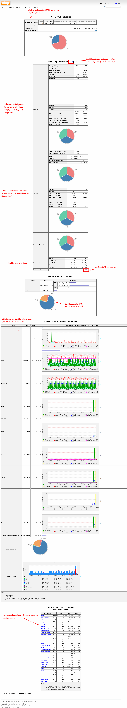

[[[Interface Web de Ntop 3.3.10](ntop-interface-web@do=backlink.html)]]

[wiki monitoring-fr.org](../../start.html "[ALT+H]")

-   [Accueil](../../index.html "Cliquez pour revenir |  l'accueil")
-   [Blog](http://www.monitoring-fr.org "Blog & News")
-   [Forums](http://forums.monitoring-fr.org "Forums")
-   [Doc](http://doc.monitoring-fr.org "Doc")
-   [Forge](https://github.com/monitoring-fr "Forge")

Vous êtes ici: [Accueil](../../start.html "start") »
[Supervision](../start.html "supervision:start") »
[Ntop](start.html "supervision:ntop:start") » [Interface Web de Ntop
3.3.10](ntop-interface-web.html "supervision:ntop:ntop-interface-web")

### Table des matières {.toggle}

-   [Interface Web de Ntop
    3.3.10](ntop-interface-web.html#interface-web-de-ntop-3310)

Interface Web de Ntop 3.3.10 {#interface-web-de-ntop-3310 .sectionedit1}
============================

NTop propose une interface Web permettant d’exploiter les collecte qu’il
réalise sous forme de tableau, graphique (camembert, en baton, RRD
Graph).

En vous connectant directement sur l’interface Web, vous arrivez sur une
page résumant l’état Global de votre réseau comme ci-dessous :

SOMMAIRE {#sommaire .sectionedit1}
--------

**[Accueil](../../start.html "start")**

**[Supervision](../start.html "supervision:start")**

-   [Nagios](../../nagios/start.html "nagios:start")
-   [Centreon](../../centreon/start.html "centreon:start")
-   [Shinken](../../shinken/start.html "shinken:start")
-   [Zabbix](../../zabbix/start.html "zabbix:start")
-   [OpenNMS](../../opennms/start.html "opennms:start")
-   [EyesOfNetwork](../../eyesofnetwork/start.html "eyesofnetwork:start")
-   [Groundwork](../../groundwork/start.html "groundwork:start")
-   [Zenoss](../../zenoss/start.html "zenoss:start")
-   [Vigilo](../../vigilo/start.html "vigilo:start")
-   [Icinga](../../icinga/start.html "icinga:start")
-   [Cacti](../../cacti/start.html "cacti:start")
-   [Ressenti utilisateur](../eue/start.html "supervision:eue:start")
-   [Ressenti utilisateur avec
    sikuli](../../sikuli/eue/start.html "sikuli:eue:start")

**[Hypervision](../../hypervision/start.html "hypervision:start")**

-   [Canopsis](../../canopsis/start.html "canopsis:start")

**[Sécurité](../../securite/start.html "securite:start")**

**[Infrastructure](../../infra/start.html "infra:start")**

**[Développement](../../dev/start.html "dev:start")**

Supervision {#supervision .sectionedit1}
-----------

-   [Commandes pour la
    supervision](../commands.html "supervision:commands")
-   [Dstat](../dstat.html "supervision:dstat")
-   [Installer ou activer
    SNMP](../snmp-install.html "supervision:snmp-install")
-   [Mode actif](../actif.html "supervision:actif")
-   [Mode passif](../passif.html "supervision:passif")
-   [Ntop](start.html "supervision:ntop:start")
-   [Panorama](../links.html "supervision:links")
-   [RRDTool](../rrdtool.html "supervision:rrdtool")
-   [SNMP](../snmp.html "supervision:snmp")
-   [Supervision Hardware IPMI](../ipmi.html "supervision:ipmi")
-   [Supervision du ressenti
    utilisateur](../eue/start.html "supervision:eue:start")
-   [Tableaux récapitulatifs des différents fichiers
    importants](../important-files.html "supervision:important-files")

-   [Afficher le texte
    source](ntop-interface-web@do=edit&rev=0.html "Afficher le texte source [V]")
-   [Anciennes
    révisions](ntop-interface-web@do=revisions.html "Anciennes révisions [O]")
-   [Derniers
    changements](ntop-interface-web@do=recent.html "Derniers changements [R]")
-   [Liens vers cette
    page](ntop-interface-web@do=backlink.html "Liens vers cette page")
-   [Gestionnaire de
    médias](ntop-interface-web@do=media.html "Gestionnaire de médias")
-   [Index](ntop-interface-web@do=index.html "Index [X]")
-   [Connexion](ntop-interface-web@do=login&sectok=6bca6bdf16f8880de3d6d3649db89a26.html "Connexion")
-   [Haut de
    page](ntop-interface-web.html#dokuwiki__top "Haut de page [T]")

supervision/ntop/ntop-interface-web.txt · Dernière modification:
2013/03/29 09:39 (modification externe)

