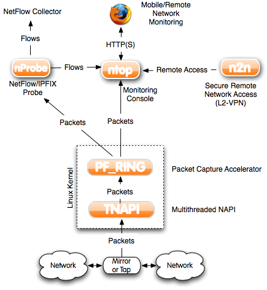

[[[Ntop](start@do=backlink.html)]]

[wiki monitoring-fr.org](../../start.html "[ALT+H]")

-   [Accueil](../../index.html "Cliquez pour revenir |  l'accueil")
-   [Blog](http://www.monitoring-fr.org "Blog & News")
-   [Forums](http://forums.monitoring-fr.org "Forums")
-   [Doc](http://doc.monitoring-fr.org "Doc")
-   [Forge](https://github.com/monitoring-fr "Forge")

Vous êtes ici: [Accueil](../../start.html "start") »
[Supervision](../start.html "supervision:start") »
[Ntop](start.html "supervision:ntop:start")

### Table des matières {.toggle}

-   [Ntop](start.html#ntop)
    -   [Introduction](start.html#introduction)
        -   [Schéma Fonctionnel](start.html#schema-fonctionnel)
    -   [Documentation](start.html#documentation)

Ntop {#ntop .sectionedit1}
====

Cette page a été réalisé avec l’aide de :

  **Rôle**        **Nom**
  --------------- ------------------
  **Rédacteur**   Romuald FRONTEAU

Introduction {#introduction .sectionedit3}
------------

[Ntop](http://www.ntop.org "http://www.ntop.org") (Network TOP) est un
outil libre de supervision réseau. C’est une application qui produit des
informations sur le trafic d’un réseau en temps réel (comme pourrait le
faire la commande top avec les processus).

Il capture et analyse les trames d’une interface donnée, et permet
d’observer une majeure partie des caractéristiques du trafic (entrant et
sortant) et accepte pour cela, notamment deux modes de fonctionnement:
Une interface web et un mode interactif.

Ntop est développé par Luca Deri. La version courante est la 3.3.x.
C’est une application portable sur la plupart des plates-formes Unix :
Linux (Debian, RedHat, Slackware, SuSe), IRIX, Solaris (i386 et SPARC),
HP-UX 11.X, FreeBSD 3.X, AIX 4.1, et Windows 95/98/NT (Luca Deri a
développé une libpcap pour Win32).

Il s’appuie sur la bibliothèque nommée “libpcap” pour effectuer le
capture des trames (bibliothèque de capture portable du domaine public
pour les systèmes Unix).

Quelques fonctionnalités de Ntop :

-   Tableau des hosts connus
-   Utilisation des protocoles réseaux
-   Charge bande passante par host
-   Graphes journaliers, hebdomadaire, mensuels, annuels
-   Et bien plus encore …

### Schéma Fonctionnel {#schema-fonctionnel .sectionedit4}

Sources [Site Officiel de
Ntop](http://www.ntop.org "http://www.ntop.org")

Documentation {#documentation .sectionedit5}
-------------

**[Chapitre 1 - Installation de Ntop 3.3.10 sur
RedHat](ntop-install-redhat.html "supervision:ntop:ntop-install-redhat")**

**[Chapitre 2 - Présentation de l'interface de Ntop
3.3.10](ntop-interface-web.html "supervision:ntop:ntop-interface-web")**

SOMMAIRE {#sommaire .sectionedit1}
--------

**[Accueil](../../start.html "start")**

**[Supervision](../start.html "supervision:start")**

-   [Nagios](../../nagios/start.html "nagios:start")
-   [Centreon](../../centreon/start.html "centreon:start")
-   [Shinken](../../shinken/start.html "shinken:start")
-   [Zabbix](../../zabbix/start.html "zabbix:start")
-   [OpenNMS](../../opennms/start.html "opennms:start")
-   [EyesOfNetwork](../../eyesofnetwork/start.html "eyesofnetwork:start")
-   [Groundwork](../../groundwork/start.html "groundwork:start")
-   [Zenoss](../../zenoss/start.html "zenoss:start")
-   [Vigilo](../../vigilo/start.html "vigilo:start")
-   [Icinga](../../icinga/start.html "icinga:start")
-   [Cacti](../../cacti/start.html "cacti:start")
-   [Ressenti utilisateur](../eue/start.html "supervision:eue:start")
-   [Ressenti utilisateur avec
    sikuli](../../sikuli/eue/start.html "sikuli:eue:start")

**[Hypervision](../../hypervision/start.html "hypervision:start")**

-   [Canopsis](../../canopsis/start.html "canopsis:start")

**[Sécurité](../../securite/start.html "securite:start")**

**[Infrastructure](../../infra/start.html "infra:start")**

**[Développement](../../dev/start.html "dev:start")**

Supervision {#supervision .sectionedit1}
-----------

-   [Commandes pour la
    supervision](../commands.html "supervision:commands")
-   [Dstat](../dstat.html "supervision:dstat")
-   [Installer ou activer
    SNMP](../snmp-install.html "supervision:snmp-install")
-   [Mode actif](../actif.html "supervision:actif")
-   [Mode passif](../passif.html "supervision:passif")
-   [Ntop](start.html "supervision:ntop:start")
-   [Panorama](../links.html "supervision:links")
-   [RRDTool](../rrdtool.html "supervision:rrdtool")
-   [SNMP](../snmp.html "supervision:snmp")
-   [Supervision Hardware IPMI](../ipmi.html "supervision:ipmi")
-   [Supervision du ressenti
    utilisateur](../eue/start.html "supervision:eue:start")
-   [Tableaux récapitulatifs des différents fichiers
    importants](../important-files.html "supervision:important-files")

-   [Afficher le texte
    source](start@do=edit&rev=0.html "Afficher le texte source [V]")
-   [Anciennes
    révisions](start@do=revisions.html "Anciennes révisions [O]")
-   [Derniers
    changements](start@do=recent.html "Derniers changements [R]")
-   [Liens vers cette
    page](start@do=backlink.html "Liens vers cette page")
-   [Gestionnaire de
    médias](start@do=media.html "Gestionnaire de médias")
-   [Index](start@do=index.html "Index [X]")
-   [Connexion](start@do=login&sectok=6bca6bdf16f8880de3d6d3649db89a26.html "Connexion")
-   [Haut de page](start.html#dokuwiki__top "Haut de page [T]")

supervision/ntop/start.txt · Dernière modification: 2013/03/29 09:39
(modification externe)

