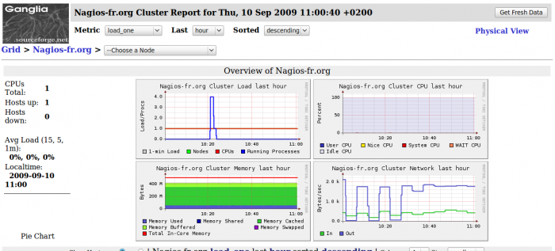

[[[Installation de Ganglia sur Ubuntu 8.0.4
LTS](ganglia-ubuntu-install@do=backlink.html)]]

[wiki monitoring-fr.org](../start.html "[ALT+H]")

-   [Accueil](../index.html "Cliquez pour revenir |  l'accueil")
-   [Blog](http://www.monitoring-fr.org "Blog & News")
-   [Forums](http://forums.monitoring-fr.org "Forums")
-   [Doc](http://doc.monitoring-fr.org "Doc")
-   [Forge](https://github.com/monitoring-fr "Forge")

Vous êtes ici: [Accueil](../start.html "start") » [Diverses solutions de
supervision](start.html "various:start") » [Installation de Ganglia sur
Ubuntu 8.0.4
LTS](ganglia-ubuntu-install.html "various:ganglia-ubuntu-install")

### Table des matières {.toggle}

-   [Installation de Ganglia sur Ubuntu 8.0.4
    LTS](ganglia-ubuntu-install.html#installation-de-ganglia-sur-ubuntu-804-lts)
    -   [Pré-requis de
        base](ganglia-ubuntu-install.html#pre-requis-de-base)
    -   [Installation](ganglia-ubuntu-install.html#installation)
        -   [Préparation de chaque
            machine](ganglia-ubuntu-install.html#preparation-de-chaque-machine)
        -   [Serveur Collecteur (seulement Gmond
            tourne)](ganglia-ubuntu-install.html#serveur-collecteur-seulement-gmond-tourne)
        -   [Serveur Moniteur (tournant avec Gmond, Gmetad et
            l'interface
            Web)](ganglia-ubuntu-install.html#serveur-moniteur-tournant-avec-gmond-gmetad-et-l-interface-web)
    -   [Démarrage de
        Gmond](ganglia-ubuntu-install.html#demarrage-de-gmond)
        -   [Script d'init
            Gmond](ganglia-ubuntu-install.html#script-d-init-gmond)
    -   [Démarrage de
        Gmetad](ganglia-ubuntu-install.html#demarrage-de-gmetad)
        -   [Script d'init
            Gmetad](ganglia-ubuntu-install.html#script-d-init-gmetad)
    -   [Erreur possible lors de la
        compilation](ganglia-ubuntu-install.html#erreur-possible-lors-de-la-compilation)
    -   [Ce qu'il faut
        savoir](ganglia-ubuntu-install.html#ce-qu-il-faut-savoir)

Installation de Ganglia sur Ubuntu 8.0.4 LTS {#installation-de-ganglia-sur-ubuntu-804-lts .sectionedit1}
============================================

Dans ce tutoriel, nous allons voir maintenant comment installer Ganglia
de 2 manières différentes :

-   Si notre hôte supervisé est juste un collecteur de données

-   Si notre hôte supervisé a le rôle du serveur Ganglia et est donc
    muni de l’interface Web PHP.

Ce tutoriel a été réalisé par :

  **Rôle**        **Nom**
  --------------- ------------------
  **Rédacteur**   Romuald FRONTEAU

**Remerciements à:**

**Mike Rhodes pour le tutorial en Anglais.**

Pré-requis de base {#pre-requis-de-base .sectionedit3}
------------------

Nous avons besoin des packages ci-dessous pour mener à bien notre
installation.

~~~
sudo apt-get install wget telnet
~~~

Installation {#installation .sectionedit4}
------------

### Préparation de chaque machine {#preparation-de-chaque-machine .sectionedit5}

Chaque serveur que vous allez superviser aura besoin d’une copie des
sources dans un répertoire. La méthode la plus simple est la
récupération via « wget ». Après avoir téléchargé la source,
décompressez-la :

~~~
wget http://freefr.dl.sourceforge.net/project/ganglia/ganglia%20monitoring%20core/3.1.2%20%28Langley%29/ganglia-3.1.2.tar.gz

tar xvzf ganglia-3.1.2.tar.gz
~~~

Chaque serveur Ubuntu aura besoin du packages build-essential. Nous
préciserons ci-dessous les packages pré-requis.

### Serveur Collecteur (seulement Gmond tourne) {#serveur-collecteur-seulement-gmond-tourne .sectionedit6}

Cette partie du tutorial concerne les machines qui n’auront de gmond.
Pour la configuration complète gmond, gmetad et l’interface, voir la
section suivante. Tout d’abord il vous faut quelques pré-requis avant
d’attaquer avec Ganglia.

~~~
sudo apt-get install build-essential libapr1-dev libconfuse-dev libexpat1-dev python-dev
~~~

Une fois ces dépendances installées, Nous pouvons compiler nos sources :

~~~
cd ganglia-3.1.2

./configure

make

sudo make install
~~~

### Serveur Moniteur (tournant avec Gmond, Gmetad et l'interface Web) {#serveur-moniteur-tournant-avec-gmond-gmetad-et-l-interface-web .sectionedit7}

L’installation va se faire en 2 étapes :

-   Installation de Gmond et Gmetad

-   Installation de l’interface Web

#### Installation de Gmond et Gmetad

Il nous faut tout d’abord installer les dépendances nécessaire pour la
suite.

~~~
sudo apt-get install build-essential librrd2-dev libapr1-dev libconfuse-dev libexpat1-dev python-dev
~~~

Pour la compilation, il faut ajouter l’option –with-gmetad.

~~~
cd ganglia-3.1.2

./configure --with-gmetad

make

sudo make install
~~~

La machine tourne maintenant avec Gmetad, il nous reste plus qu’à
installer l’interface Web.

#### Installation de l'interface Web {#installation-de-l-interface-web}

L’interface Web est réalisé en PHP. Vous aurez donc besoin d’apache et
du mod\_php.

RRDTool est aussi utilisé par l’interface pour dessiner les graphiques.
Sans l’installation de RRDTool, pas la peine d’aller plus loin, vous
n’aurez pas de graphiques :

~~~
sudo apt-get install rrdtool
~~~

Ensuite, installons Apache 2 et le module php5:

~~~
sudo apt-get install apache2 php5-mysql libapache2-mod-php5
~~~

Si l’installation d’Apache est un succès, votre hôte sera accessible via
un navigateur à l’URL suivante :

<http://IP_SERV_GANGLIA>

Vous verrez le message : “It’s Works!” apparaitre.

Ensuite, nous allons installer l’interface Ganglia dans le chemin de
notre choix et allons configurer apache pour faire un alias entre notre
répertoire et l’accès Web.

~~~
sudo cp -r ganglia-3.1.2/web /opt/ && sudo mv /opt/web /opt/ganglia
~~~

Ensuite; nous allons créer un fichier ganglia.conf dans
/etc/apache2/conf.d/ et y insérer ce qui suit :

~~~
sudo vi /etc/apache2/conf.d/ganglia.conf
~~~

~~~
Alias /ganglia "/opt/ganglia" 

<Directory "/opt/ganglia"> 
Options Indexes 
    AllowOverride AuthConfig Options 
    Order allow,deny 
    Allow from all 
</Directory>
~~~

Redémarrage d’Apache

~~~
sudo /etc/init.d/apache2 restart
~~~

On peut tester voir si nous accédons à notre interface via l’URL
suivante:

<http://IP_SERV_GANGLIA/ganglia/>

Nous arrivons sur une page avec une erreur PHP concernant une socket
exception. C’est normal car nous n’avons pas encore démarré Gmond ou
Gmetad sur notre hôte. Veuillez consulter ci-dessous la démarche à
suivre.

Démarrage de Gmond {#demarrage-de-gmond .sectionedit8}
------------------

**Le démon Gmond doit être démarré sur chaque machines supervisées.**

La première étape est de générer une configuration par défaut et de la
personnaliser ensuite.

~~~
sudo mkdir /etc/ganglia

chmod -R 777 /etc/ganglia

sudo gmond --default_config > /etc/ganglia/gmond.conf
~~~

Ouvrez /etc/ganglia/gmond.conf, et changez les lignes:

~~~
cluster {
  name = "NOM_DU CLUSTER"
  owner = "IP_SERV_GANGLIA"
  latlong = "unspecified"
  url = "unspecified"
}
~~~

Pour démarrer Gmond, il faut utiliser le sudo, il sera automatiquement
passé en démon à son démarrage.

~~~
sudo gmond
~~~

Vérifions s’il tourne:

~~~
ps aux | grep gmond 
nobody    1103  0.0  0.3   4620  1784 ?        Ss   16:18   0:00 gmond 
system    1106  0.0  0.1   3000   752 pts/0    R+   16:18   0:00 grep gmond
~~~

Testons voir si le port 8649 communique bien:

~~~
telnet localhost 8649
~~~

Nous devons avoir en retour du code XML s’affichant sur le terminal. Si
le démon ne démarre pas correctement, passez-lui l’option -d 1 au
démarrage, les messages d’erreurs apparaîtront en mode verbose.

### Script d'init Gmond {#script-d-init-gmond .sectionedit9}

Ce script a été récupéré après l’installation via apt-get install, C’est
un script orienté **Debian / Ubuntu**.

~~~
#! /bin/sh
### BEGIN INIT INFO
# Provides:          ganglia-monitor
# Required-Start:    $remote_fs $syslog
# Required-Stop:     $remote_fs $syslog
# Default-Start:     2 3 4 5
# Default-Stop:      0 1 6
### END INIT INFO

PATH=/usr/local/sbin:/usr/local/bin:/sbin:/bin:/usr/sbin:/usr/bin
DAEMON=/usr/sbin/gmond
NAME=gmond
DESC="Ganglia Monitor Daemon"

test -x $DAEMON || exit 0

set -e

case "$1" in
  start)
    echo -n "Starting $DESC: "
    start-stop-daemon --start --quiet -m --pidfile /var/run/$NAME.pid \
        --exec $DAEMON 
    echo "$NAME."
    ;;
  stop)
    echo -n "Stopping $DESC: "
        start-stop-daemon --stop  --quiet --oknodo --name $NAME \
                2>&1 > /dev/null
    echo "$NAME."
    ;;
  reload)
  ;;
  restart|force-reload)
    $0 stop
    $0 start
    ;;
  *)
    N=/etc/init.d/$NAME
    # echo "Usage: $N {start|stop|restart|reload|force-reload}" >&2
    echo "Usage: $N {start|stop|restart|force-reload}" >&2
    exit 1
    ;;
esac

exit 0
~~~

Démarrage de Gmetad {#demarrage-de-gmetad .sectionedit10}
-------------------

Créer l’utilisateur ganglia

~~~
sudo adduser ganglia
~~~

La première étape est de générer une configuration par défaut.

~~~
sudo cp ganglia-3.1.2/gmetad/gmetad.conf /etc/ganglia/gmetad.conf
~~~

Ouvrez /etc/ganglia/gmetad.conf et changer le user par “ganglia”.

~~~
setuid_username "ganglia"
~~~

Ensuite, créons pour Gmetad le réperoire accueillant les fichiers rrd.

~~~
sudo mkdir -p /var/lib/ganglia/rrds/

sudo chown -R ganglia:ganglia /var/lib/ganglia/rrds/
~~~

Démarrons Gmetad en mode debug pour voir comment il va se comporter.

~~~
sudo gmetad -d 1
~~~

Vérifions maintenant si notre interface web réagit correctement.

<http://IP_SERV_GANGLIA/ganglia>

Une page comme ci-dessous doit se présenter à vous.

Une fois que tout fonctionne comme il faut, tuez le process Gmetad en
cours et relancez-le comme ci-dessous:

sudo gmetad

### Script d'init Gmetad {#script-d-init-gmetad .sectionedit11}

Ce script a été récupéré après l’installation via apt-get install, C’est
un script orienté **Debian / Ubuntu**.

~~~
#! /bin/sh
### BEGIN INIT INFO
# Provides:          gmetad
# Required-Start:    $remote_fs $syslog
# Required-Stop:     $remote_fs $syslog
# Default-Start:     2 3 4 5
# Default-Stop:      0 1 6
### END INIT INFO

PATH=/usr/local/sbin:/usr/local/bin:/sbin:/bin:/usr/sbin:/usr/bin
DAEMON=/usr/sbin/gmetad
NAME=gmetad
DESC="Ganglia Monitor Meta-Daemon"

test -x $DAEMON || exit 0

set -e

case "$1" in
  start)
    echo -n "Starting $DESC: "
    start-stop-daemon --start --quiet --pidfile /var/run/$NAME.pid \
        --exec $DAEMON 
    echo "$NAME."
    ;;
  stop)
    echo -n "Stopping $DESC: "
        start-stop-daemon --stop  --quiet --oknodo \
                --exec $DAEMON  2>&1 > /dev/null 
    echo "$NAME."
    ;;
  reload)
  ;;
  restart|force-reload)
    $0 stop
    $0 start
    ;;
  *)
    N=/etc/init.d/$NAME
    # echo "Usage: $N {start|stop|restart|reload|force-reload}" >&2
    echo "Usage: $N {start|stop|restart|force-reload}" >&2
    exit 1
    ;;
esac

exit 0
~~~

Erreur possible lors de la compilation {#erreur-possible-lors-de-la-compilation .sectionedit12}
--------------------------------------

Voici une liste des erreurs les plus fréquentes lors de la compilation
de gmond ou gmetad.

-   **Manque Round Robin Database (librrd)**

Erreur dans ./configure: checking rrd.h usability… no checking rrd.h
presence… no checking for rrd.h… no checking for rrd\_create in -lrrd…
no Trying harder by including the X library path checking for
rrd\_create in -lrrd… no

*Solution:*

~~~
sudo apt-get install librrd2-dev
~~~

-   **Manque Apache Portable Runtime**

Erreur dans ./configure: Checking for apr checking for apr-1-config… no
configure: error: apr-1-config binary not found in path

*Solution:*

~~~
sudo apt-get install libapr1-dev
~~~

-   **Manque libConfuse**

Erreur dans ./configure: Checking for confuse checking for cfg\_parse in
-lconfuse… no Trying harder including gettext checking for cfg\_parse in
-lconfuse… no Trying harder including iconv checking for cfg\_parse in
-lconfuse… no libconfuse not found

*Solution:*

~~~
sudo apt-get install libconfuse-dev
~~~

-   **Manque Expat XML Parser**

Erreur dans ./configure: Checking for expat checking for
XML\_ParserCreate in -lexpat… no libexpat not found

*Solution:*

~~~
sudo apt-get install libexpat1-dev
~~~

-   **Manque le package Python Dev**

Il n’y a pas de contrôle lors du ./configure, cette erreur arrive lors
du make.

mod\_python.c:48:20: error: Python.h: No such file or directory

*Solution:*

~~~
sudo apt-get install python-dev
~~~

Ce qu'il faut savoir {#ce-qu-il-faut-savoir .sectionedit13}
--------------------

Je ne ferai pas une présentation d’interface de Ganglia car c’est une
interface très simple. La seule chose à retenir dans l’interface c’est :

**GRID –\>** Groupe de clusters

**Cluster –\>** Groupe de Nodes

**Node –\>** Machine à superviser

SOMMAIRE {#sommaire .sectionedit1}
--------

**[Accueil](../start.html "start")**

**[Supervision](../supervision/start.html "supervision:start")**

-   [Nagios](../nagios/start.html "nagios:start")
-   [Centreon](../centreon/start.html "centreon:start")
-   [Shinken](../shinken/start.html "shinken:start")
-   [Zabbix](../zabbix/start.html "zabbix:start")
-   [OpenNMS](../opennms/start.html "opennms:start")
-   [EyesOfNetwork](../eyesofnetwork/start.html "eyesofnetwork:start")
-   [Groundwork](../groundwork/start.html "groundwork:start")
-   [Zenoss](../zenoss/start.html "zenoss:start")
-   [Vigilo](../vigilo/start.html "vigilo:start")
-   [Icinga](../icinga/start.html "icinga:start")
-   [Cacti](../cacti/start.html "cacti:start")
-   [Ressenti
    utilisateur](../supervision/eue/start.html "supervision:eue:start")
-   [Ressenti utilisateur avec
    sikuli](../sikuli/eue/start.html "sikuli:eue:start")

**[Hypervision](../hypervision/start.html "hypervision:start")**

-   [Canopsis](../canopsis/start.html "canopsis:start")

**[Sécurité](../securite/start.html "securite:start")**

**[Infrastructure](../infra/start.html "infra:start")**

**[Développement](../dev/start.html "dev:start")**

-   [Afficher le texte
    source](ganglia-ubuntu-install@do=edit&rev=0.html "Afficher le texte source [V]")
-   [Anciennes
    révisions](ganglia-ubuntu-install@do=revisions.html "Anciennes révisions [O]")
-   [Derniers
    changements](ganglia-ubuntu-install@do=recent.html "Derniers changements [R]")
-   [Liens vers cette
    page](ganglia-ubuntu-install@do=backlink.html "Liens vers cette page")
-   [Gestionnaire de
    médias](ganglia-ubuntu-install@do=media.html "Gestionnaire de médias")
-   [Index](ganglia-ubuntu-install@do=index.html "Index [X]")
-   [Connexion](ganglia-ubuntu-install@do=login&sectok=6bca6bdf16f8880de3d6d3649db89a26.html "Connexion")
-   [Haut de
    page](ganglia-ubuntu-install.html#dokuwiki__top "Haut de page [T]")

various/ganglia-ubuntu-install.txt · Dernière modification: 2013/03/29
09:39 (modification externe)

