[[[Architectures distribuées de
Zabbix](zabbix-distributed-architecture@do=backlink.html)]]

[wiki monitoring-fr.org](../start.html "[ALT+H]")

-   [Accueil](../index.html "Cliquez pour revenir |  l'accueil")
-   [Blog](http://www.monitoring-fr.org "Blog & News")
-   [Forums](http://forums.monitoring-fr.org "Forums")
-   [Doc](http://doc.monitoring-fr.org "Doc")
-   [Forge](https://github.com/monitoring-fr "Forge")

Vous êtes ici: [Accueil](../start.html "start") »
[Zabbix](start.html "zabbix:start") » [Architectures distribuées de
Zabbix](zabbix-distributed-architecture.html "zabbix:zabbix-distributed-architecture")

### Table des matières {.toggle}

-   [Architectures distribuées de
    Zabbix](zabbix-distributed-architecture.html#architectures-distribuees-de-zabbix)
    -   [Présentation](zabbix-distributed-architecture.html#presentation)
    -   [Fonctionnement du mode
        distribué](zabbix-distributed-architecture.html#fonctionnement-du-mode-distribue)
    -   [Mise en place d'une architecture
        distribuée](zabbix-distributed-architecture.html#mise-en-place-d-une-architecture-distribuee)
        -   [Ajout d'un
            proxy](zabbix-distributed-architecture.html#ajout-d-un-proxy)
        -   [Ajout d'un
            serveur](zabbix-distributed-architecture.html#ajout-d-un-serveur)

Architectures distribuées de Zabbix {#architectures-distribuees-de-zabbix .sectionedit1}
===================================

Page rédigée pour une version Ubuntu 8.04/10.04 LTS et Zabbix 1.8.2.

Sur cette page, nous allons présenter les différentes architectures
distribuées possibles sur Zabbix, leurs fonctionnements, ainsi que leurs
procédures de mise en place.

Sources : site et wiki officiels de
[Zabbix](http://www.zabbix.com/ "http://www.zabbix.com/").

Cette page a été rédigée par :

  **Rôle**        **Nom**
  --------------- ---------------------------------------------------------------------------------------------------------------------------------------------------------
  **Rédacteur**   [Ludovic VALENTIN](http://www.monitoring-fr.org/community/members/ludovic-valentin/ "http://www.monitoring-fr.org/community/members/ludovic-valentin/")

Présentation {#presentation .sectionedit3}
------------

Dans Zabbix, il existe trois types d’architectures distribuées : la
première architecture concerne l’usage des proxy (Zabbix Proxy) avec un
seul Zabbix Server, quant à la seconde, elle est constituée de multiples
serveurs Zabbix. Le troisième et dernier type d’architecture distribuée
de Zabbix est l’association des deux premiers, c’est-à-dire de tout
simplement combiner l’utilisation des proxy et des serveurs Zabbix.

Les Zabbix Proxy servent de collecteurs, de serveurs-relais avec les
Zabbix Server et permettent également de réduire la charge de travail
d’un serveur Zabbix. Ils ne peuvent pas être administrés comme un Zabbix
Server avec Zabbix Frontend. Les proxy se contentent en effet de relayer
les requêtes du serveur Zabbix aux agents.

L’usage des Zabbix Server permet quant à lui une administration locale
grâce notamment à l’interface Zabbix Frontend. Ils peuvent aussi servir
de collecteur, mais à un niveau supérieur que les Zabbix Proxy (car ils
disposent d’une interface web).

Pour plus d’informations sur les différentes **[architectures
distribuées](zabbix-work.html#distribuee "zabbix:zabbix-work")**.

Fonctionnement du mode distribué {#fonctionnement-du-mode-distribue .sectionedit4}
--------------------------------

en cours

Mise en place d'une architecture distribuée {#mise-en-place-d-une-architecture-distribuee .sectionedit5}
-------------------------------------------

Voici 2 tutoriels permettant de mettre en place des architectures
distribuées. La première procédure consiste à ajouter un Zabbix Proxy au
sein d’une architecture Zabbix (avec au minimum un serveur Zabbix).
Quant à la seconde, elle décrit les étapes à suivre pour ajouter un
serveur Zabbix supplémentaire.

Ces tutoriels peuvent être combinés afin de mettre en place une
architecture multi-serveur et multi-proxy.

### Ajout d'un proxy {#ajout-d-un-proxy .sectionedit6}

#### Pré-requis {#pre-requis}

Pour ajouter un Zabbix Proxy dans votre architecture, il vous faut dans
un premier temps un serveur Zabbix (composant Zabbix Server) avec bien
sûr le composant Frontend installé.

Voir la procédure d’installation de
**[Zabbix](zabbix-ubuntu-install.html "zabbix:zabbix-ubuntu-install")**.

Ensuite, il faut disposer d’un second serveur sur lequel est installé
l’application proxy de Zabbix, c’est-à-dire, le composant Zabbix Proxy.

Voir la procédure d’installation d’un **[Zabbix
Proxy](zabbix-ubuntu-install.html#zabbix-proxy1 "zabbix:zabbix-ubuntu-install")**.

Avant de commencer la procédure de mise en place d’un proxy, dans ce
tutoriel, on considère que l’ensemble des composants Zabbix précédemment
cités dans les pré-requis, sont installés et opérationnels.

Une fois ces pré-requis validés, la procédure d’ajout d’un proxy peut
enfin débuter.

#### Configuration d'un proxy {#configuration-d-un-proxy}

Première étape dans la mise en place d’un proxy (après son
installation), c’est le paramétrage. La configuration du Zabbix Proxy
est essentiel afin qu’il puisse notamment communiquer avec le serveur
Zabbix auquel il est va être rattaché.

Pour cela, dans le fichier de configuration du proxy, il faut s’assurer
qu’il lui est bien attribué un nom :

~~~~ {.code}
$ sudo vim /usr/local/zabbix/etc/zabbix_proxy.conf
~~~~

On attribue donc un nom à notre proxy :

~~~~ {.file}
Hostname=Zabbix Proxy B1
~~~~

Ce nom `Hostname` ne correspond pas forcément au nom DNS du serveur sur
lequel est installé votre Zabbix Proxy. C’est une dénomination interne à
Zabbix.

Ensuite, on peut enregistrer les modifications de notre fichier
**zabbix\_proxy.conf**. Pour finir, on redémarre le Zabbix Proxy :

~~~~ {.code}
$ /usr/local/zabbix/sbin/zabbix_proxy –c /usr/local/zabbix/sbin/zabbix_proxy.conf
~~~~

A ce stade, la configuration du Zabbix Proxy est terminée. Le reste de
la procédure de mise en place d’un proxy se fait maintenant dans
l’interface web de Zabbix.

#### Ajout d'un proxy {#ajout-d-un-proxy1}

Après avoir redémarrer le Zabbix Proxy, il ne reste plus qu’à le créer
dans l’interface du Zabbix Server. La création d’un proxy se fait dans
la page **Administration/DM**. Dans cette page il faut sélectionner
l’affichage des “Proxies” sur le côté, en haut à droite de la page, puis
on peut cliquer sur le bouton Create Proxy juste à côté :

[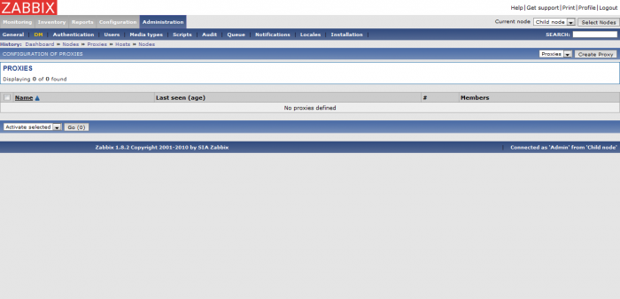](../_detail/zabbix/zabbix-distributed-architecture_proxy-1.png@id=zabbix%253Azabbix-distributed-architecture.html "zabbix:zabbix-distributed-architecture_proxy-1.png")

Lorsque que vous avez cliqué sur le bouton de création d’un proxy, vous
devez visualiser une nouvelle page. Il s’agit de l’écran de
configuration d’un proxy :

[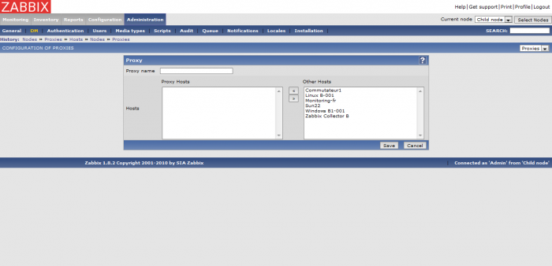](../_detail/zabbix/zabbix-distributed-architecture_proxy-2.png@id=zabbix%253Azabbix-distributed-architecture.html "zabbix:zabbix-distributed-architecture_proxy-2.png")

Ici, il faut tout simplement le paramétrer en lui attribuant un nom. En
l’occurrence, on lui indique le nom que nous avons attribué au Zabbix
Proxy dans la partie précédente, dans le fichier de configuration
**zabbix\_proxy.conf**. Après, on sauvegarde la configuration pour
valider la création de notre proxy.

Voici le résultat de la création de notre Zabbix Proxy, dans la liste
affichée à l’écran, le nouveau proxy doit être visible :

[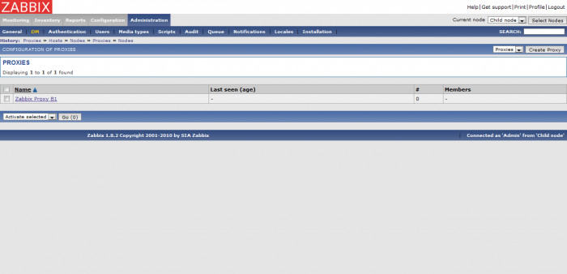](../_detail/zabbix/zabbix-distributed-architecture_proxy-4.png@id=zabbix%253Azabbix-distributed-architecture.html "zabbix:zabbix-distributed-architecture_proxy-4.png")

La mise en place du proxy est enfin terminée. Peut alors débuter la
supervision d’un hôte par son intermédiaire.

#### Superviser un hôte avec un proxy {#superviser-un-hote-avec-un-proxy}

Maintenant, il est possible d’ajouter un hôte supervisé par
l’intermédiaire du Zabbix Proxy. On va donc utiliser notre Zabbix Proxy
en personne, sur lequel un Zabbix Agent est installé.

[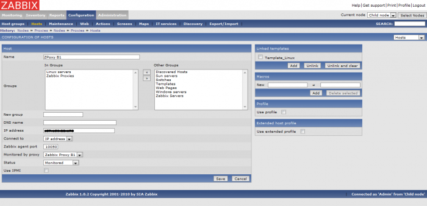](../_detail/zabbix/zabbix-distributed-architecture_proxy-5.png@id=zabbix%253Azabbix-distributed-architecture.html "zabbix:zabbix-distributed-architecture_proxy-5.png")

Il est également possible d’ajouter un hôte déjà crée. Pour cela, il
suffit tout simplement de l’ajouter comme membre depuis l’écran de
paramétrage du Zabbix Proxy concerné (voir la page
**Administration/DM**) :

[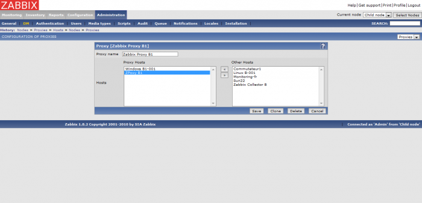](../_detail/zabbix/zabbix-distributed-architecture_proxy-6.png@id=zabbix%253Azabbix-distributed-architecture.html "zabbix:zabbix-distributed-architecture_proxy-6.png")

En tout cas, voici le résultat dans l’écran de configuration des hôtes,
une fois l’usage d’un proxy ajouté à un hôte :

[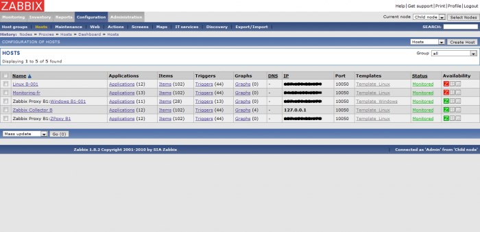](../_detail/zabbix/zabbix-distributed-architecture_proxy-7.png@id=zabbix%253Azabbix-distributed-architecture.html "zabbix:zabbix-distributed-architecture_proxy-7.png")

Autre résultat de la supervision d’un hôte par un proxy, dans la fenêtre
d’administration des Zabbix Proxy :

[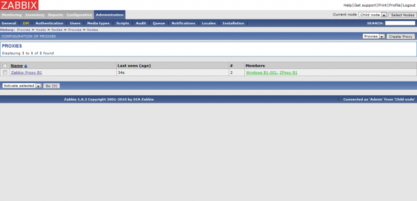](../_detail/zabbix/zabbix-distributed-architecture_proxy-8.png@id=zabbix%253Azabbix-distributed-architecture.html "zabbix:zabbix-distributed-architecture_proxy-8.png")

Le tutoriel de mise en place et d’usage d’un proxy est maintenant
terminé.

### Ajout d'un serveur {#ajout-d-un-serveur .sectionedit7}

#### Pré-requis {#pre-requis1}

Pour la mise en place d’un groupe de serveurs Zabbix, il faut en toute
logique au minimum 2 serveurs. Sur chacun de ses serveurs, doivent être
installés les composants Zabbix Server et Zabbix Frontend.

Voir la procédure d’installation de
**[Zabbix](zabbix-ubuntu-install.html "zabbix:zabbix-ubuntu-install")**.

Il y a un serveur central (parent) qui en plus de sa propre
configuration, a le contrôle total sur la configuration d’un serveur
enfant. Ce dernier reporte régulièrement ses évènements, ses historiques
et ses tendances auprès du serveur central.

Pour la procédure d’installation de l’architecture distribuée dit
“multi-serveur”, voici les paramètres que nous allons utiliser pour
illustrer ce tutoriel :

**Paramètre**

**Serveur central (parent)**

**Serveur enfant**

ID nœud

1

2

Adresse IP

192.168.1.100

192.168.1.200

Port

10051

10051

#### Configuration des serveurs

Tout d’abord, pour commencer il faut configurer nos 2 serveurs Zabbix
(Zabbix Server nœud 1 et 2).

##### Serveur parent

Pour débuter, on édite le fichier de configuration de notre Zabbix
Server parent :

~~~~ {.code}
$ sudo vim /usr/local/zabbix/etc/zabbix_server.conf
~~~~

On lui attribue ensuite un ID, puis on sauvegarde notre fichier :

~~~~ {.file}
NodeID=1
~~~~

Ensuite, il faut convertir la base de données du Zabbix Server en
fonction de son NodeID :

Cette étape n’est à réaliser qu’une fois et doit être effectuée pour
chaque nœud Zabbix Server ajouté.

~~~~ {.code}
$ sudo /usr/local/zabbix/sbin/zabbix_server –n 1 –c /usr/local/zabbix/etc/zabbix_server.conf
~~~~

On passe ensuite à la configuration du second serveur, c’est-à-dire
notre Zabbix Server enfant.

##### Serveur enfant

Pour le serveur enfant, il faut reproduire les mêmes étapes que pour le
serveur parent. Il faut juste lui attribuer son propre NodeID.

Donc on commence par édtier le fichier de configuration de notre Zabbix
Server enfant :

~~~~ {.code}
$ sudo vim /usr/local/zabbix/etc/zabbix_server.conf
~~~~

On lui attribue ensuite un ID, puis on sauvegarde notre fichier :

~~~~ {.file}
NodeID=2
~~~~

Ensuite, il faut convertir la base de données du Zabbix Server en
fonction de son NodeID :

Cette étape n’est à réaliser qu’une fois et doit être effectuée pour
chaque nœud Zabbix Server ajouté.

~~~~ {.code}
$ sudo /usr/local/zabbix/sbin/zabbix_server –n 2 –c /usr/local/zabbix/etc/zabbix_server.conf
~~~~

Maintenant on passe au paramétrage de nos 2 serveurs dans l’interface
web de Zabbix.

#### Ajout des serveurs

##### Serveur parent {#serveur-parent1}

Une fois la conversion de la base de données en fonction du NodeID
terminée, dans l’interface Zabbix doit alors apparaître une nouvelle
fonction dans le coin supérieur droit, à savoir la sélection des nœuds
(rafraîchir la page) :

[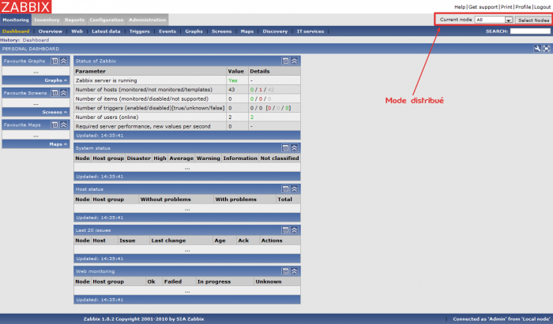](../_detail/zabbix/zabbix-distributed-architecture_server-1.png@id=zabbix%253Azabbix-distributed-architecture.html "zabbix:zabbix-distributed-architecture_server-1.png")

Dans **Administration/DM**, il faut maintenant paramétrer le nœud local,
ici le serveur parent :

[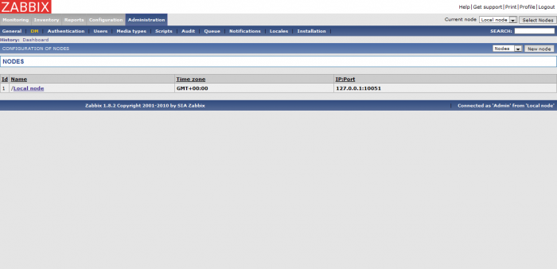](../_detail/zabbix/zabbix-distributed-architecture_server-2.png@id=zabbix%253Azabbix-distributed-architecture.html "zabbix:zabbix-distributed-architecture_server-2.png")

Pour cela cliquer sur **Local node** afin d’afficher la configuration du
nœud :

Ici, on peut alors renseigner les paramètres de notre nœud. Ensuite,
vous pouvez valider la configuration en cliquant sur le bouton **Save**
:

Notre nœud local est enfin paramétré :

[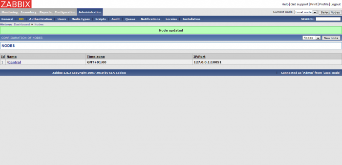](../_detail/zabbix/zabbix-distributed-architecture_server-5.png@id=zabbix%253Azabbix-distributed-architecture.html "zabbix:zabbix-distributed-architecture_server-5.png")

Maintenant, il faut ajouter le second serveur, c’est-à-dire le Zabbix
Server enfant. Tout d’abord cliquez sur le bouton **New node**, on
visualise alors une nouvelle page de configuration d’un nœud :

On configure donc ce nouveau nœud selon les paramètres de notre serveur
enfant :

[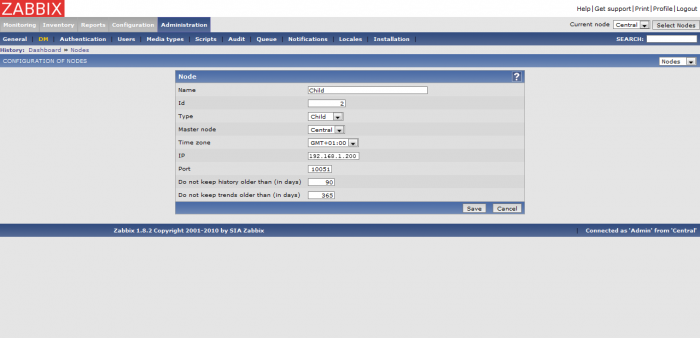](../_detail/zabbix/zabbix-distributed-architecture_server-7.png@id=zabbix%253Azabbix-distributed-architecture.html "zabbix:zabbix-distributed-architecture_server-7.png")

Après la sauvegarde des paramètres du second nœud, on peut alors voir
notre architecture prendre forme :

[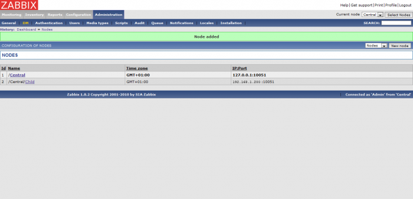](../_detail/zabbix/zabbix-distributed-architecture_server-8.png@id=zabbix%253Azabbix-distributed-architecture.html "zabbix:zabbix-distributed-architecture_server-8.png")

Il ne reste plus qu’à reproduire la même procédure sur le serveur
enfant.

##### Serveur enfant {#serveur-enfant1}

De la même manière que sur le serveur parent (Central), dans l’interface
Zabbix de notre nœud enfant doit alors apparaître une nouvelle fonction
dans le coin supérieur droit, à savoir la sélection des nœuds
(rafraîchir la page) :

Dans **Administration/DM**, il faut maintenant paramétrer le nœud local,
ici le serveur enfant :

Pour cela cliquer sur **Local node** afin d’afficher la configuration du
nœud :

Comme pour le serveur parent à ce stade, vous pouvez remarquer que l’
`Id` est différent. Le champs correspondant étant automatiquement
paramétré selon le `NodeID` indiqué auparavant dans le fichier de
configuration. C’est une manière de vérifier que l’attribution d’un ID
pour ce serveur, a bien été pris en compte.

[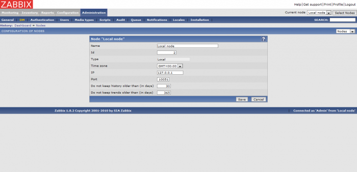](../_detail/zabbix/zabbix-distributed-architecture_server-9.png@id=zabbix%253Azabbix-distributed-architecture.html "zabbix:zabbix-distributed-architecture_server-9.png")

Ici, on peut alors renseigner les paramètres de notre nœud. Ensuite,
vous pouvez valider la configuration en cliquant sur le bouton **Save**
:

Notre nœud local est enfin paramétré :

[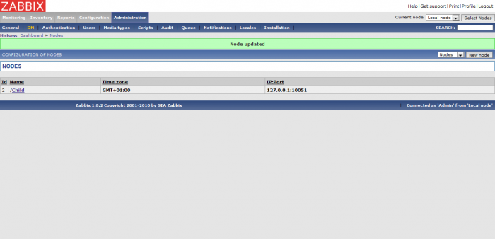](../_detail/zabbix/zabbix-distributed-architecture_server-11.png@id=zabbix%253Azabbix-distributed-architecture.html "zabbix:zabbix-distributed-architecture_server-11.png")

Maintenant, il faut ajouter le second serveur, c’est-à-dire le Zabbix
Server parent. Tout d’abord cliquez sur le bouton **New node**, on
visualise alors une nouvelle page de configuration d’un nœud :

On configure donc ce nouveau nœud selon les paramètres de notre serveur
parent :

[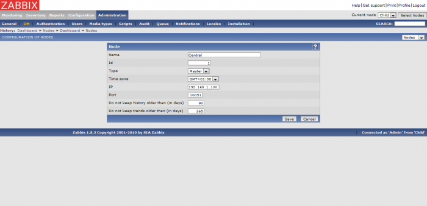](../_detail/zabbix/zabbix-distributed-architecture_server-12.png@id=zabbix%253Azabbix-distributed-architecture.html "zabbix:zabbix-distributed-architecture_server-12.png")

Après la sauvegarde des paramètres du second nœud, on peut alors voir
notre architecture prendre forme :

Les nœuds sont enfin paramétrés, ce qui permet maintenant à notre
architecture Zabbix de fonctionner en mode distribué.

#### Utilisation des serveurs

Une fois la configuration des nœuds terminée. On peut enfin utiliser
notre architecture distribuée.

Dans un premier temps, nous allons effectuer un redémarrage de nos
Zabbix Server (sur les serveurs parent et enfant) :

~~~~ {.code}
$ /usr/local/zabbix/sbin/zabbix_server –c /usr/local/zabbix/etc/zabbix_server.conf
~~~~

Puis on retourne sur l’interface de notre serveur parent. Maintenant, il
doit être possible de jongler entre la visualisation des différents
nœuds dans l’interface (rafraîchir la page) :

[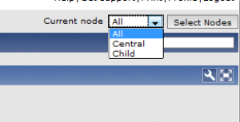](../_detail/zabbix/zabbix-distributed-architecture_server-use-1.png@id=zabbix%253Azabbix-distributed-architecture.html "zabbix:zabbix-distributed-architecture_server-use-1.png")

Il peut être nécessaire de cliquer une première fois sur le bouton
`Select Nodes` juste à côté pour sélectionner les nœuds à afficher
(filtres).

Il en est de même sur le serveur enfant, à la différence qu’il ne peut
afficher que sa propre configuration (ou plus tard, éventuellement ses
propres nœuds enfants).

[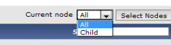](../_detail/zabbix/zabbix-distributed-architecture_server-use-2.png@id=zabbix%253Azabbix-distributed-architecture.html "zabbix:zabbix-distributed-architecture_server-use-2.png")

En tout cas, à partir du nœud central (parent), il donc maintenant
possible de visualiser les évènements provenant du serveur enfant, et
même de réaliser l’ensemble des différentes tâches de configuration d’un
serveur Zabbix comme par exemple l’ajout d’un hôte à superviser, …etc.
Le tout sans avoir besoin de se connecter à l’interface du serveur
enfant.

SOMMAIRE {#sommaire .sectionedit1}
--------

**[Accueil](../start.html "start")**

**[Supervision](../supervision/start.html "supervision:start")**

-   [Nagios](../nagios/start.html "nagios:start")
-   [Centreon](../centreon/start.html "centreon:start")
-   [Shinken](../shinken/start.html "shinken:start")
-   [Zabbix](start.html "zabbix:start")
-   [OpenNMS](../opennms/start.html "opennms:start")
-   [EyesOfNetwork](../eyesofnetwork/start.html "eyesofnetwork:start")
-   [Groundwork](../groundwork/start.html "groundwork:start")
-   [Zenoss](../zenoss/start.html "zenoss:start")
-   [Vigilo](../vigilo/start.html "vigilo:start")
-   [Icinga](../icinga/start.html "icinga:start")
-   [Cacti](../cacti/start.html "cacti:start")
-   [Ressenti
    utilisateur](../supervision/eue/start.html "supervision:eue:start")
-   [Ressenti utilisateur avec
    sikuli](../sikuli/eue/start.html "sikuli:eue:start")

**[Hypervision](../hypervision/start.html "hypervision:start")**

-   [Canopsis](../canopsis/start.html "canopsis:start")

**[Sécurité](../securite/start.html "securite:start")**

**[Infrastructure](../infra/start.html "infra:start")**

**[Développement](../dev/start.html "dev:start")**

Zabbix {#zabbix .sectionedit1}
------

-   [Introduction](zabbix-introduction.html "zabbix:zabbix-introduction")
-   [Fonctionnement](zabbix-work.html "zabbix:zabbix-work")
-   [Ressources et
    performances](zabbix-resources.html "zabbix:zabbix-resources")
-   [Installation sur
    Ubuntu](zabbix-ubuntu-install.html "zabbix:zabbix-ubuntu-install")
-   [Interface Web](zabbix-interface.html "zabbix:zabbix-interface")
-   [Prise en main](zabbix-use.html "zabbix:zabbix-use")
-   [Gestion des items](zabbix-item-use.html "zabbix:zabbix-item-use")
-   [Gestion des
    triggers](zabbix-trigger-use.html "zabbix:zabbix-trigger-use")
-   [Gestion des
    actions](zabbix-action-use.html "zabbix:zabbix-action-use")
-   [Optimisation](zabbix-optimization.html "zabbix:zabbix-optimization")
-   [Architectures
    distribuées](zabbix-distributed-architecture.html "zabbix:zabbix-distributed-architecture")
-   [Découverte
    d'équipements](zabbix-discovery.html "zabbix:zabbix-discovery")
-   [Notification par
    email](zabbix-email-notification.html "zabbix:zabbix-email-notification")
-   [Superviser un hôte
    SNMP](zabbix-snmp-host.html "zabbix:zabbix-snmp-host")
-   [Catalogue des erreurs](zabbix-errors.html "zabbix:zabbix-errors")

-   [Afficher le texte
    source](zabbix-distributed-architecture@do=edit&rev=0.html "Afficher le texte source [V]")
-   [Anciennes
    révisions](zabbix-distributed-architecture@do=revisions.html "Anciennes révisions [O]")
-   [Derniers
    changements](zabbix-distributed-architecture@do=recent.html "Derniers changements [R]")
-   [Liens vers cette
    page](zabbix-distributed-architecture@do=backlink.html "Liens vers cette page")
-   [Gestionnaire de
    médias](zabbix-distributed-architecture@do=media.html "Gestionnaire de médias")
-   [Index](zabbix-distributed-architecture@do=index.html "Index [X]")
-   [Connexion](zabbix-distributed-architecture@do=login&sectok=6bca6bdf16f8880de3d6d3649db89a26.html "Connexion")
-   [Haut de
    page](zabbix-distributed-architecture.html#dokuwiki__top "Haut de page [T]")

zabbix/zabbix-distributed-architecture.txt · Dernière modification:
2013/03/29 09:39 (modification externe)

