Tutoriel décrivant l’interface Web de Zabbix 1.8.2.

Dans ce tutoriel, on considère que l’installation de Zabbix (Server et
Frontend) est terminée. La solution Zabbix est déjà démarrée (avec les
scripts init.d par exemple) et fonctionnelle, de même pour le serveur
Web utilisé pour héberger votre interface, à savoir dans notre procédure
d’installation, le serveur Apache.

Ce tutoriel a été réalisé par :

  **Rôle**        **Nom**
  --------------- ---------------------------------------------------------------------------------------------------------------------------------------------------------
  **Rédacteur**   [Ludovic VALENTIN](http://www.monitoring-fr.org/community/members/ludovic-valentin/ "http://www.monitoring-fr.org/community/members/ludovic-valentin/")

Pour visualiser l’interface Web de Zabbix, il faut donc entrer dans la
barre d’adresse url de votre navigateur internet (IE, Firefox, …etc),
l’adresse ip de votre serveur Zabbix, puis valider le site :

<http://adresse_ip_zabbix/zabbix/>

L’interface doit alors s’afficher, avec comme première page, une demande
d’authentification :

[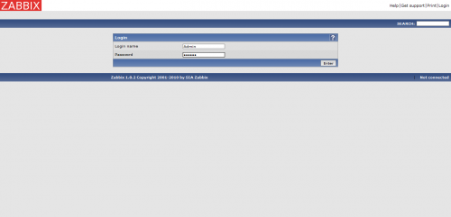](../_detail/supervision/zabbix/zabbix-frontend_login.png@id=zabbix%253Azabbix-interface.html "supervision:zabbix:zabbix-frontend_login.png")

Il faut alors se connecter avec l’utilisateur **Admin** avec **zabbix**
comme mot-de-passe par défaut.

Monitoring {#monitoring .sectionedit3}
----------

### Dashboard {#dashboard .sectionedit4}

Tableau de bord de zabbix, il synthétise l’ensemble des informations
essentielles à la supervision d’une infrastructure.

[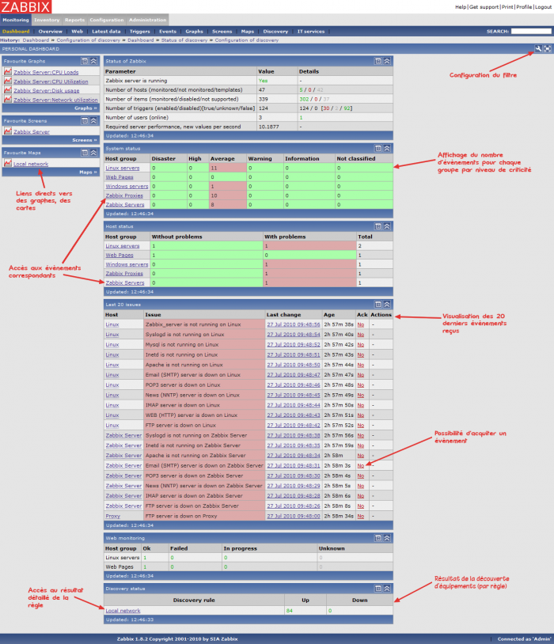](../_detail/supervision/zabbix/zabbix-frontend_monitoring_dashboard.png@id=zabbix%253Azabbix-interface.html "supervision:zabbix:zabbix-frontend_monitoring_dashboard.png")

### Overview {#overview .sectionedit5}

Cette page affiche l’ensemble des statuts remontées (ou interrogés) par
les triggers pour les hôtes supervisés. Il est également possible de
visualiser les données de chaque hôte (Buffers memory, ….).

#### Vue de type Triggers

[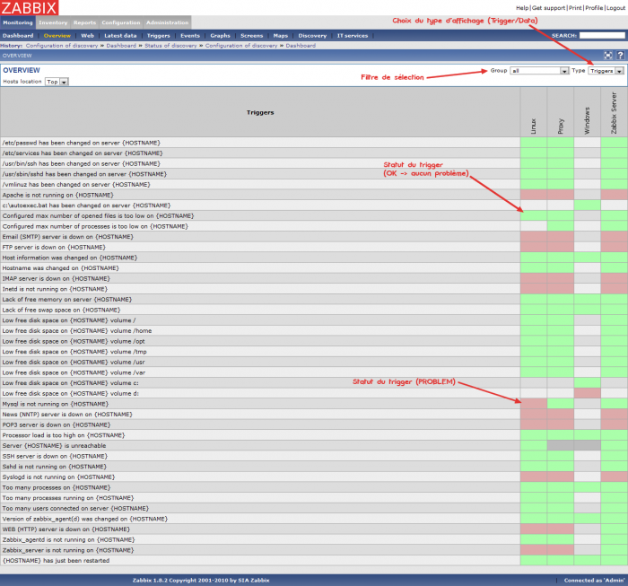](../_detail/supervision/zabbix/zabbix-frontend_monitoring_overview_triggers.png@id=zabbix%253Azabbix-interface.html "supervision:zabbix:zabbix-frontend_monitoring_overview_triggers.png")

#### Vue de type Data

[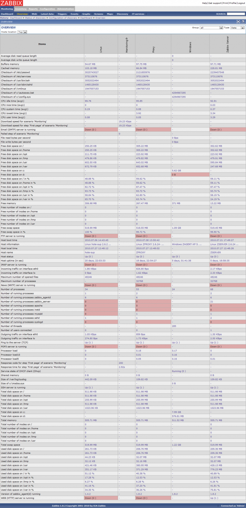](../_detail/supervision/zabbix/zabbix-frontend_monitoring_overview_data.png@id=zabbix%253Azabbix-interface.html "supervision:zabbix:zabbix-frontend_monitoring_overview_data.png")

### Web {#web .sectionedit6}

Affiche les statuts propres à la supervision Web des hôtes (serveurs
Web).

### Latest data {#latest-data .sectionedit7}

Affiche les informations et données remontés par les items.

[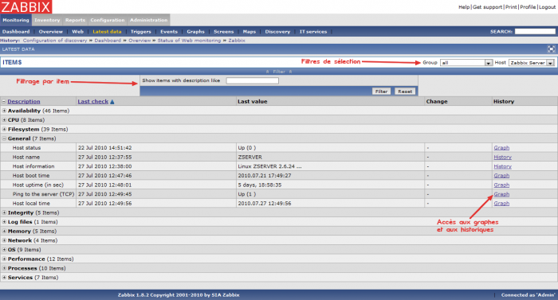](../_detail/supervision/zabbix/zabbix-frontend_monitoring_lastest-data.png@id=zabbix%253Azabbix-interface.html "supervision:zabbix:zabbix-frontend_monitoring_lastest-data.png")

### Triggers {#triggers .sectionedit8}

Affiche les problèmes remontés par les triggers.

[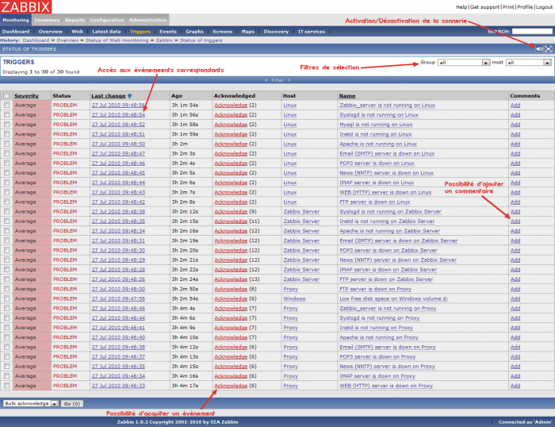](../_detail/supervision/zabbix/zabbix-frontend_monitoring_triggers.png@id=zabbix%253Azabbix-interface.html "supervision:zabbix:zabbix-frontend_monitoring_triggers.png")

### Events {#events .sectionedit9}

Affiche les toutes les alertes de tous niveaux remontées par les
triggers.

[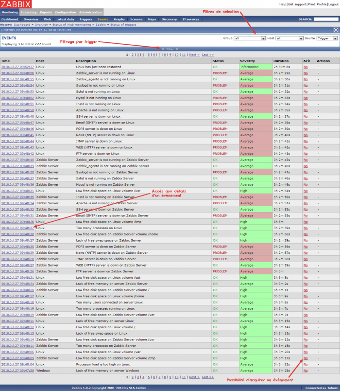](../_detail/supervision/zabbix/zabbix-frontend_monitoring_events_triggers.png@id=zabbix%253Azabbix-interface.html "supervision:zabbix:zabbix-frontend_monitoring_events_triggers.png")

### Graphs {#graphs .sectionedit10}

Page de visualisation des graphs d’un hôte supervisé.

[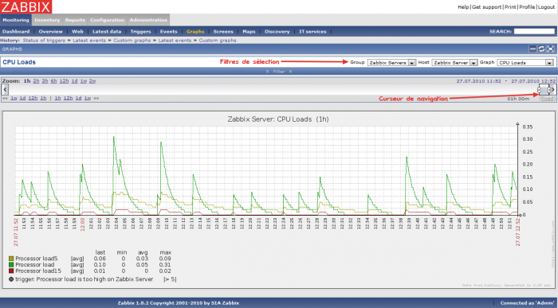](../_detail/supervision/zabbix/zabbix-frontend_monitoring_graphs.png@id=zabbix%253Azabbix-interface.html "supervision:zabbix:zabbix-frontend_monitoring_graphs.png")

### Screens {#screens .sectionedit11}

Affichage des écrans propre à un hôte, avec la carte, et les différents
graphs.

[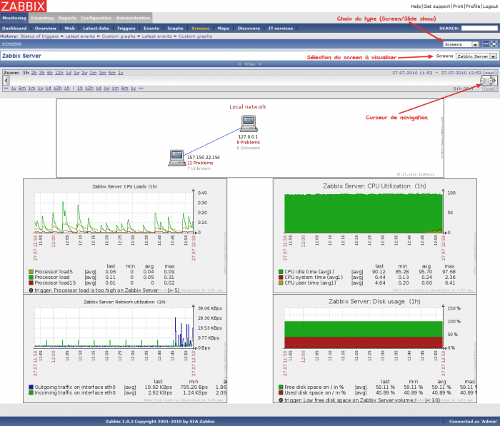](../_detail/supervision/zabbix/zabbix-frontend_monitoring_screens.png@id=zabbix%253Azabbix-interface.html "supervision:zabbix:zabbix-frontend_monitoring_screens.png")

### Maps {#maps .sectionedit12}

Visualisation des cartes.

[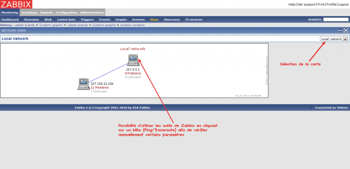](../_detail/supervision/zabbix/zabbix-frontend_monitoring_maps.png@id=zabbix%253Azabbix-interface.html "supervision:zabbix:zabbix-frontend_monitoring_maps.png")

### Discovery {#discovery .sectionedit13}

Affiche les équipements découverts par une règle d’auto-découverte.

[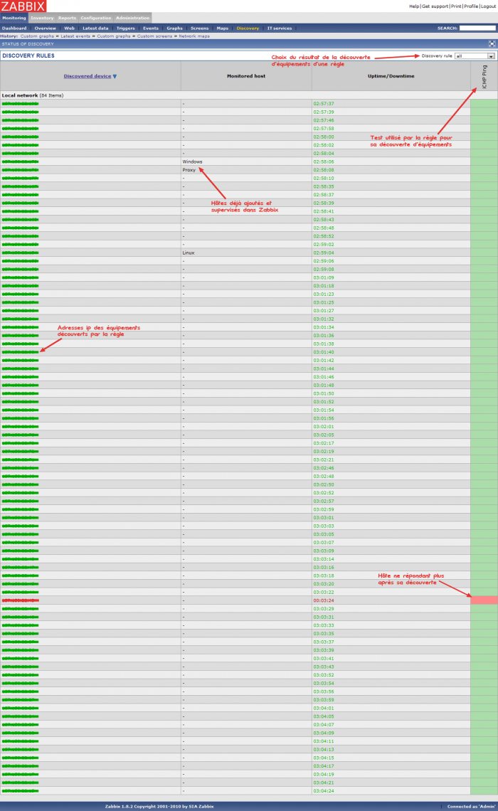](../_detail/supervision/zabbix/zabbix-frontend_monitoring_discovery.png@id=zabbix%253Azabbix-interface.html "supervision:zabbix:zabbix-frontend_monitoring_discovery.png")

### IT services {#it-services .sectionedit14}

Affiche le statut des services, ainsi que leur SLA.

[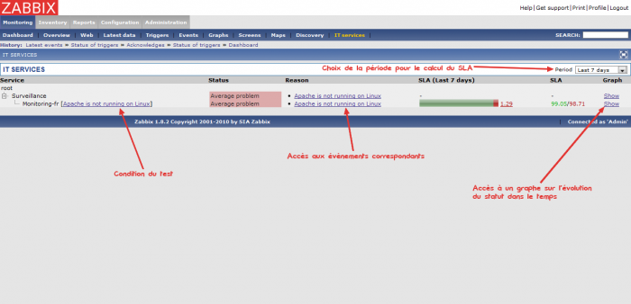](../_detail/supervision/zabbix/zabbix-frontend_monitoring_it-services.png@id=zabbix%253Azabbix-interface.html "supervision:zabbix:zabbix-frontend_monitoring_it-services.png")

Inventory {#inventory .sectionedit15}
---------

### Hosts {#hosts .sectionedit16}

Liste l’ensemble des hôtes, au niveau des profils, informations sur
l’équipement (OS/adresse MAC/…).

[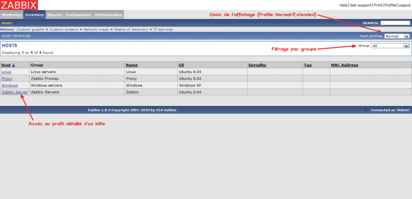](../_detail/supervision/zabbix/zabbix-frontend_inventory_hosts.png@id=zabbix%253Azabbix-interface.html "supervision:zabbix:zabbix-frontend_inventory_hosts.png")

Reports {#reports .sectionedit17}
-------

### Status of Zabbix {#status-of-zabbix .sectionedit18}

Affiche une partie du tableau du Dashboard, propre aux statuts de
zabbix.

[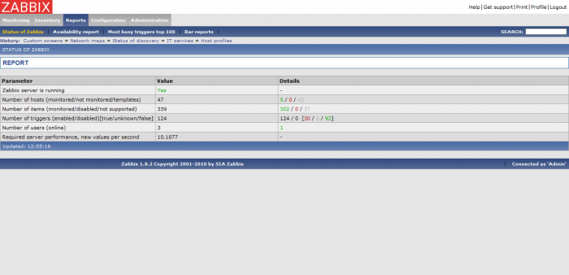](../_detail/supervision/zabbix/zabbix-frontend_reports_status-of-zabbix.png@id=zabbix%253Azabbix-interface.html "supervision:zabbix:zabbix-frontend_reports_status-of-zabbix.png")

### Availability report {#availability-report .sectionedit19}

Affiche des pourcentages de problèmes remontés par les triggers.

[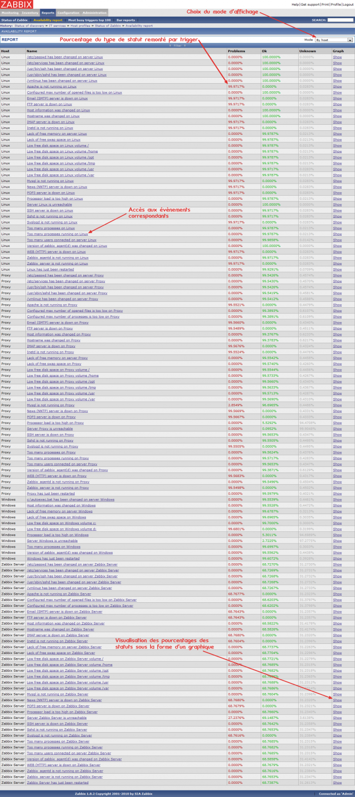](../_detail/supervision/zabbix/zabbix-frontend_reports_availability-report.png@id=zabbix%253Azabbix-interface.html "supervision:zabbix:zabbix-frontend_reports_availability-report.png")

### Most busy triggers top 100 {#most-busy-triggers-top-100 .sectionedit20}

[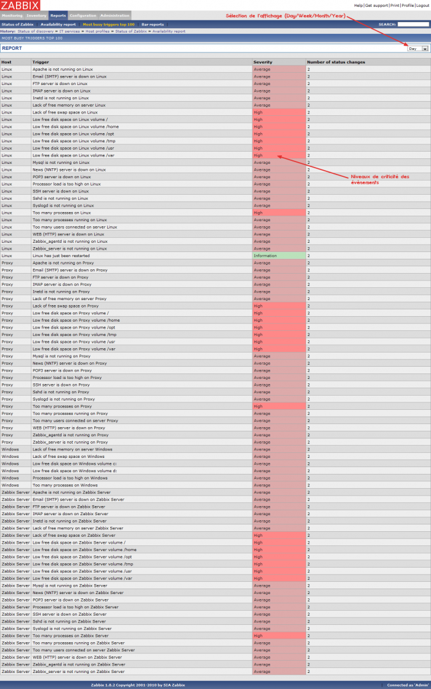](../_detail/supervision/zabbix/zabbix-frontend_reports_most-busy-triggers-top-100.png@id=zabbix%253Azabbix-interface.html "supervision:zabbix:zabbix-frontend_reports_most-busy-triggers-top-100.png")

### Bar reports {#bar-reports .sectionedit21}

Permet de créer un rapport spécifique en fonction d’une période de
temps, d’un item, etc.

[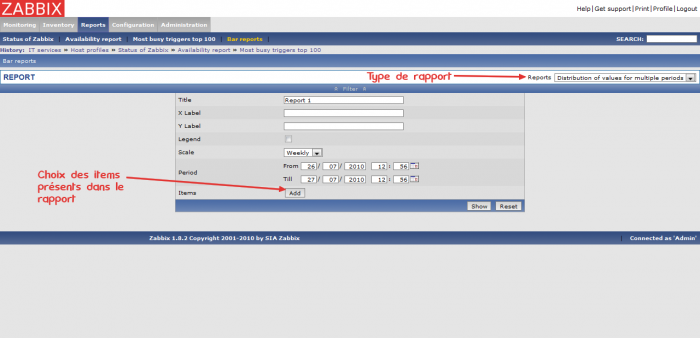](../_detail/supervision/zabbix/zabbix-frontend_reports_bar-reports.png@id=zabbix%253Azabbix-interface.html "supervision:zabbix:zabbix-frontend_reports_bar-reports.png")

Configuration {#configuration .sectionedit22}
-------------

### Host groups {#host-groups .sectionedit23}

Gestion des groupes d’hôtes (création/édition/suppression).

[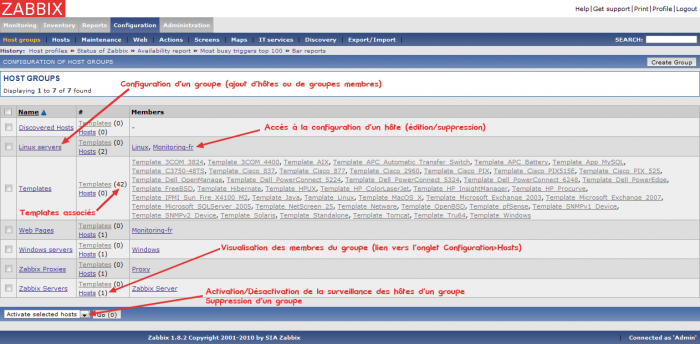](../_detail/supervision/zabbix/zabbix-frontend_configuration_host-groups.png@id=zabbix%253Azabbix-interface.html "supervision:zabbix:zabbix-frontend_configuration_host-groups.png")

### Hosts {#hosts1 .sectionedit24}

Gestion des hôtes (création/édition/suppression).

[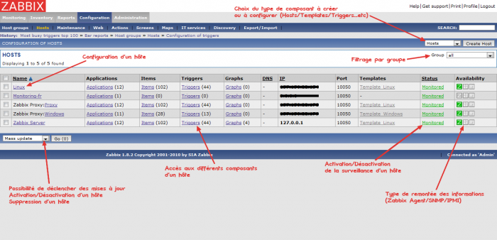](../_detail/supervision/zabbix/zabbix-frontend_configuration_hosts.png@id=zabbix%253Azabbix-interface.html "supervision:zabbix:zabbix-frontend_configuration_hosts.png")

### Maintenance {#maintenance .sectionedit25}

Définition et gestion des périodes de maintenance.

[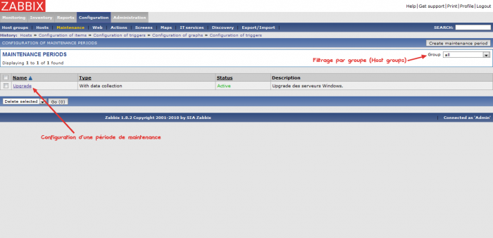](../_detail/supervision/zabbix/zabbix-frontend_configuration_maintenance.png@id=zabbix%253Azabbix-interface.html "supervision:zabbix:zabbix-frontend_configuration_maintenance.png")

### Web {#web1 .sectionedit26}

Configuration des scénarios de surveillance Web.

[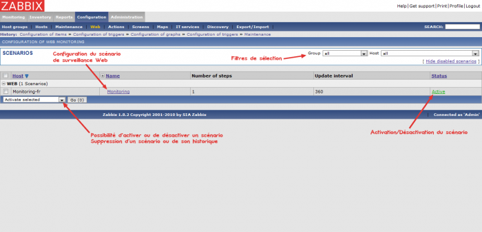](../_detail/supervision/zabbix/zabbix-frontend_configuration_web.png@id=zabbix%253Azabbix-interface.html "supervision:zabbix:zabbix-frontend_configuration_web.png")

### Actions {#actions .sectionedit27}

Permet de gérer des actions (réaction en fonction d’un évènement …).

[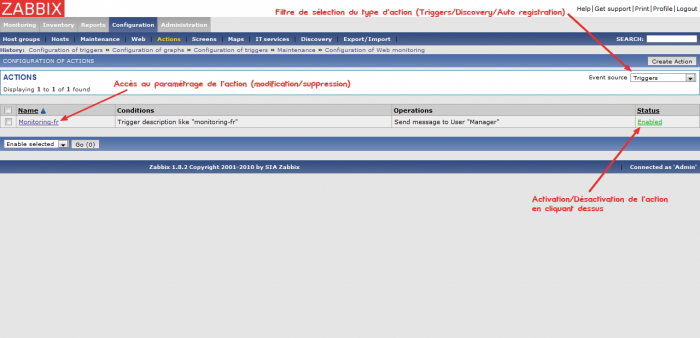](../_detail/supervision/zabbix/zabbix-frontend_configuration_actions.png@id=zabbix%253Azabbix-interface.html "supervision:zabbix:zabbix-frontend_configuration_actions.png")

### Screens {#screens1 .sectionedit28}

Permet de gérer les écrans d’hôte et les slides.

[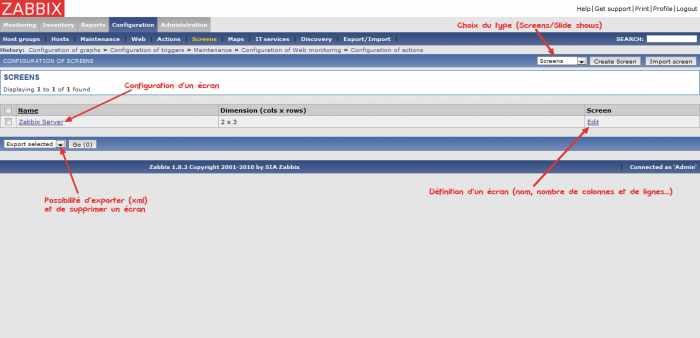](../_detail/supervision/zabbix/zabbix-frontend_configuration_screens.png@id=zabbix%253Azabbix-interface.html "supervision:zabbix:zabbix-frontend_configuration_screens.png")

### Maps {#maps1 .sectionedit29}

Gestion des cartes.

[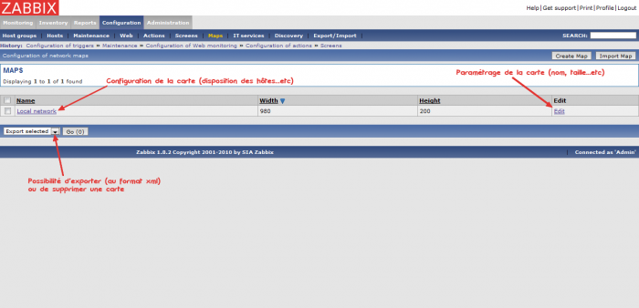](../_detail/supervision/zabbix/zabbix-frontend_configuration_maps.png@id=zabbix%253Azabbix-interface.html "supervision:zabbix:zabbix-frontend_configuration_maps.png")

### IT services {#it-services1 .sectionedit30}

Administration et gestion des services IT.

### Discovery {#discovery1 .sectionedit31}

Administration des règles d’auto-découverte d’équipements.

[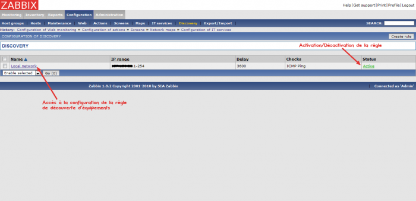](../_detail/supervision/zabbix/zabbix-frontend_configuration_discovery.png@id=zabbix%253Azabbix-interface.html "supervision:zabbix:zabbix-frontend_configuration_discovery.png")

### Export/Import {#exportimport .sectionedit32}

Permet d’exporter/importer des templates, ou des composants tels que des
items et des triggers.

[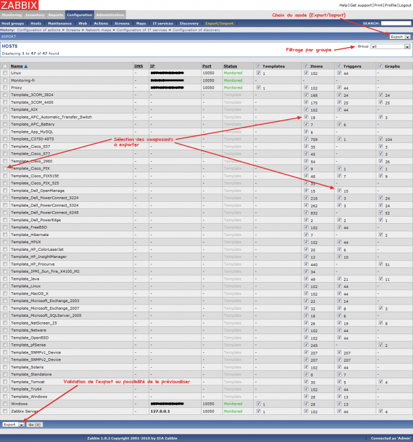](../_detail/supervision/zabbix/zabbix-frontend_configuration_export-import.png@id=zabbix%253Azabbix-interface.html "supervision:zabbix:zabbix-frontend_configuration_export-import.png")

Administration {#administration .sectionedit33}
--------------

### General {#general .sectionedit34}

Permet d’éditer Zabbix en important des images/icônes, de choisir un
thème d’affichage, ou encore de préciser les informations spécifique à
l’entreprise, avec par exemple les heures de travail, …etc. Ainsi que
les informations par défaut.

[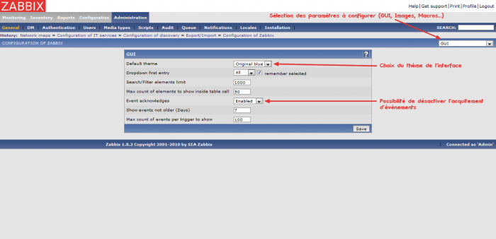](../_detail/supervision/zabbix/zabbix-frontend_administration_general.png@id=zabbix%253Azabbix-interface.html "supervision:zabbix:zabbix-frontend_administration_general.png")

### DM {#dm .sectionedit35}

Gestion des serveurs Zabbix et Proxy pour le mode distribué.

[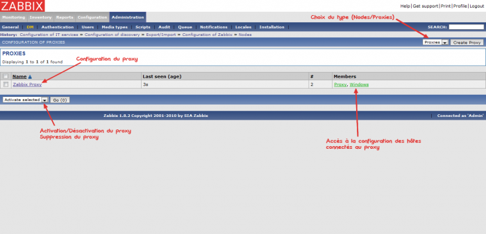](../_detail/supervision/zabbix/zabbix-frontend_administration_dm.png@id=zabbix%253Azabbix-interface.html "supervision:zabbix:zabbix-frontend_administration_dm.png")

### Authentication {#authentication .sectionedit36}

Choix du système d’authentification de Zabbix (LDAP, …).

[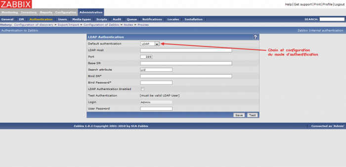](../_detail/supervision/zabbix/zabbix-frontend_administration_authentication.png@id=zabbix%253Azabbix-interface.html "supervision:zabbix:zabbix-frontend_administration_authentication.png")

### Users {#users .sectionedit37}

Permet de gérer les utilisateurs et les groupes avec l’attribution des
permissions.

[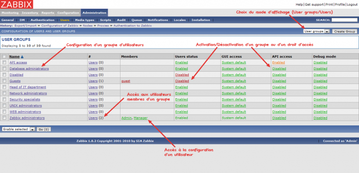](../_detail/supervision/zabbix/zabbix-frontend_administration_users.png@id=zabbix%253Azabbix-interface.html "supervision:zabbix:zabbix-frontend_administration_users.png")

### Media types {#media-types .sectionedit38}

Permet de gérer les types de serveurs annexes utilisés par Zabbix
(serveur mail/jabber/sms, …etc).

[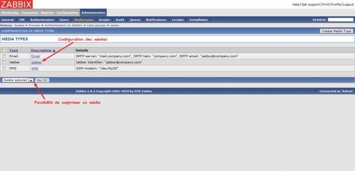](../_detail/supervision/zabbix/zabbix-frontend_administration_media-types.png@id=zabbix%253Azabbix-interface.html "supervision:zabbix:zabbix-frontend_administration_media-types.png")

### Scripts {#scripts .sectionedit39}

Gestion des scripts à utiliser dans Zabbix. Ajout d’une commande
(script) spécifique afin de répondre à un besoin précis de
l’utilisateur.

[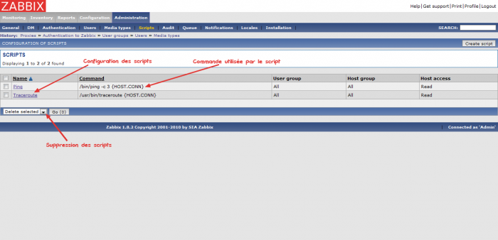](../_detail/supervision/zabbix/zabbix-frontend_administration_scripts.png@id=zabbix%253Azabbix-interface.html "supervision:zabbix:zabbix-frontend_administration_scripts.png")

### Audit {#audit .sectionedit40}

Permet de visualiser les dernières modifications ou utilisations de
Zabbix grâce aux actions ou aux logs.

[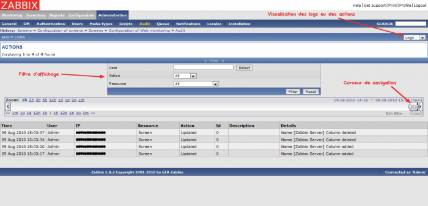](../_detail/supervision/zabbix/zabbix-frontend_administration_audit.png@id=zabbix%253Azabbix-interface.html "supervision:zabbix:zabbix-frontend_administration_audit.png")

### Queue {#queue .sectionedit41}

Affiche les piles de mise à jour des statuts remontés par les items.

[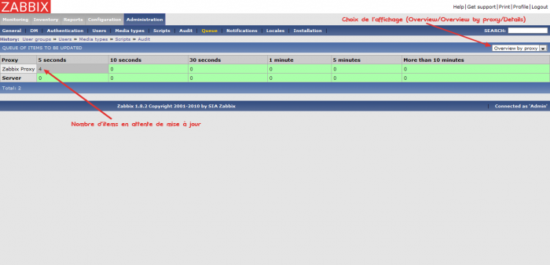](../_detail/supervision/zabbix/zabbix-frontend_administration_queue.png@id=zabbix%253Azabbix-interface.html "supervision:zabbix:zabbix-frontend_administration_queue.png")

### Notifications {#notifications .sectionedit42}

Visualisation des notifications envoyées par type de médias à chaque
utilisateur.

[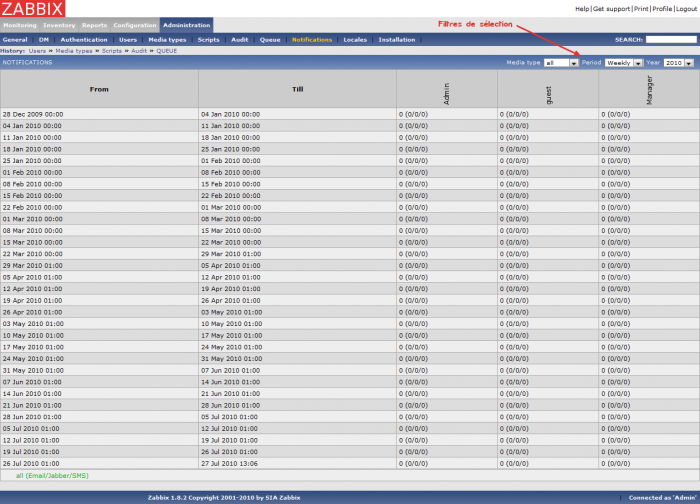](../_detail/supervision/zabbix/zabbix-frontend_administration_notifications.png@id=zabbix%253Azabbix-interface.html "supervision:zabbix:zabbix-frontend_administration_notifications.png")

### Locales {#locales .sectionedit43}

Gestion du langage de l’interface. Il est possible de changer la langue
d’affichage de l’interface, ou bien de modifier certaines entrées (titre
d’un menu, …etc).

[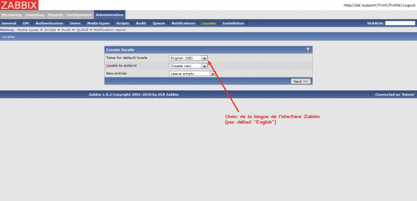](../_detail/supervision/zabbix/zabbix-frontend_administration_locales.png@id=zabbix%253Azabbix-interface.html "supervision:zabbix:zabbix-frontend_administration_locales.png")

### Installation {#installation .sectionedit44}

Permet de réinstaller l’interface (configuration à la bdd en cas de
changement par exemple, depuis l’interface sans avoir à modifier dans le
fichier de conf).

[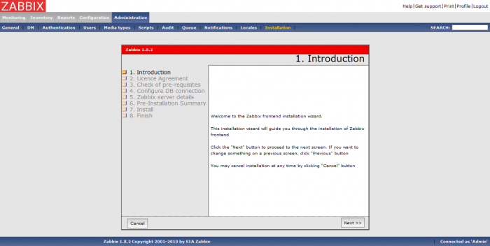](../_detail/supervision/zabbix/zabbix-frontend_administration_installation.png@id=zabbix%253Azabbix-interface.html "supervision:zabbix:zabbix-frontend_administration_installation.png")