[[[Gestion des items dans Zabbix](zabbix-item-use@do=backlink.html)]]

[wiki monitoring-fr.org](../start.html "[ALT+H]")

-   [Accueil](../index.html "Cliquez pour revenir |  l'accueil")
-   [Blog](http://www.monitoring-fr.org "Blog & News")
-   [Forums](http://forums.monitoring-fr.org "Forums")
-   [Doc](http://doc.monitoring-fr.org "Doc")
-   [Forge](https://github.com/monitoring-fr "Forge")

Vous êtes ici: [Accueil](../start.html "start") »
[Zabbix](start.html "zabbix:start") » [Gestion des items dans
Zabbix](zabbix-item-use.html "zabbix:zabbix-item-use")

### Table des matières {.toggle}

-   [Gestion des items dans
    Zabbix](zabbix-item-use.html#gestion-des-items-dans-zabbix)
    -   [Présentation](zabbix-item-use.html#presentation)
    -   [Définition d'un
        item](zabbix-item-use.html#definition-d-un-item)
    -   [Création d'un item](zabbix-item-use.html#creation-d-un-item)
        -   [Accès à la création d’un
            item](zabbix-item-use.html#acces-a-la-creation-d-un-item)
        -   [Création d’un
            item](zabbix-item-use.html#creation-d-un-item1)
    -   [Edition d'un item](zabbix-item-use.html#edition-d-un-item)
    -   [Suppression d'un
        item](zabbix-item-use.html#suppression-d-un-item)

Gestion des items dans Zabbix {#gestion-des-items-dans-zabbix .sectionedit1}
=============================

Tutoriel rédigé pour une version Ubuntu 8.04/10.04 LTS et Zabbix 1.8.2.

Dans ce tutoriel, nous allons décrire et présenter l’utilisation et la
gestion des items dans Zabbix.

Ce tutoriel a été réalisé par :

  **Rôle**        **Nom**
  --------------- ---------------------------------------------------------------------------------------------------------------------------------------------------------
  **Rédacteur**   [Ludovic VALENTIN](http://www.monitoring-fr.org/community/members/ludovic-valentin/ "http://www.monitoring-fr.org/community/members/ludovic-valentin/")

en cours

Présentation {#presentation .sectionedit3}
------------

Zabbix utilise le principe d’item actif ou passif pour récupérer des
valeurs particulières sur un hôte supervisé. Ces valeurs remontées
(interrogées) peuvent être par exemple des interrogations SNMP ou IPMI,
des codes de retour, différents résultats de programmes, ou encore des
données sur un système (performances et état d’un hôte).

Afin d’augmenter les possibilités et le nombre de valeurs pouvant être
récupérées, il est recommandé, lorsque cela est possible (serveur avec
un système d’exploitation supporté), d’installer un Zabbix Agent.

C’est à partir d’un item (valeurs remontées), que Zabbix va pouvoir
déclencher des évènements puis des alertes grâce à d’autres éléments
tels que le trigger et l’action.

Pour plus d’information sur le **[système
d'alerte](zabbix-work.html#systeme-d-alerte "zabbix:zabbix-work")** de
Zabbix.

Définition d'un item {#definition-d-un-item .sectionedit4}
--------------------

Liste des principaux paramètres (ou attributs) d’un item :

  **Paramètre**               **Description**
  --------------------------- ----------------------------------------------------------------------------------------------------------------------------------------------------------------------------------------------------------------------------------------------
  **`Host`**                  Correspond au composant auquel l’item est rattaché (associé). En général il s’agit d’un hôte, ou bien d’un template
  **`Description`**           Ce premier paramètre correspond au nom, à l’intitulé d’un item ou tout simplement à sa description. Il est possible d’intégrer des macros en fonction des paramètres définis dans le champ `Key`
  **`Type`**                  Dans ce champ, il faut sélectionner le type d’item utilisé comme par exemple le type Zabbix Agent, ou encore SNMP. En fonction du choix, les paramètres de création de l’item peuvent changer afin de s’adapter aux besoins
  **`Key`**                   Le paramètre `Key` sert à définir la condition et/ou la valeur que l’item doit remonter.
  **`Data type`**             Permet de préciser type de données attendues
  **`Type of information`**   `Type of information` permet d’indiquer le type de données à enregistrer dans la base de données pour la valeur remontée par l’item
  **`Units`**                 Ce champ sert à renseigner l’unité de mesure (par exemple bps, unixtime, …etc) de la valeur remontée par l’item. Zabbix peut alors affiner l’affichage de la valeur (1815 bytes → 1.8Kb, où 1000 vaut 1K)
  **`Use multiplier`**        Ici, il faut préciser dans le champ `Use multiplier` l’utilisation ou pas d’un multiplieur, notamment afin de convertir les valeurs reçues par l’item (KB, MBps → B ou Bps) et permettre à Zabbix d’appliquer correctement les bonnes unités
  **`Custom multiplier`**     En fonction du choix précédent, c’est-à-dire l’usage d’un multiplicateur, le champ `Custom multiplier` sert à indiquer la valeur du multiplicateur à utiliser
  **`Update interval`**       `Update interval` correspond à la durée en seconde entre chaque nouvelle mise à jour de l’item
  **`Flexible intervals`**    Permet de lister des périodes d’exceptions avec un intervalle de temps différent des mises à jour normales (`Update interval`)
  **`Keep history`**          Ici, il faut indiquer la durée en nombre de jours de conservation des historiques dans la base de données pour cet item
  **`Keep trends`**           Ce champ sert à préciser le nombre de jours de conservation des tendances (servant notamment dans la création des graphiques) dans la base de données pour cet item
  **`Status`**                `Status` indique si l’item est activé, désactivé ou encore non-supporté
  **`Store value`**           Le paramètre `Store value` permet de modifier l’enregistrement de la valeur remontée l’item. Par défaut c’est le paramètre `As is` qui est de rigueur, c’est-à-dire aucun changement de la valeur
  **`Show value`**            `Show value` permet de modifier l’affichage dans l’interface de la valeur remontée par l’item. Par défaut c’est le paramètre `As is` qui est de rigueur, c’est-à-dire aucun changement de la valeur
  **`Applications`**          Permet de lier l’item à une ou plusieurs applications
  **`Group`**                 Ce paramètre optionnel peut être utilisé après la création de l’item, il sert à associer ce dernier à un groupe

Création d'un item {#creation-d-un-item .sectionedit6}
------------------

### Accès à la création d’un item {#acces-a-la-creation-d-un-item .sectionedit7}

Pour créer un nouvel item, il existe plusieurs chemins dans l’interface
pour y parvenir. Chacun de ses chemins ont un intérêt, car ils
permettent quelques raccourcis au niveau de l’association d’un nouvel
item avec un autre composant de Zabbix (hôte, template) :

#### Depuis un hôte {#depuis-un-hote}

Pour associer un item directement à un hôte, il faut passer par la page
Configuration/Hosts, et éventuellement jongler avec les filtres (au
niveau des groupes d’hôtes notamment) afin d’afficher l’hôte concerné
par ce nouvel item :

[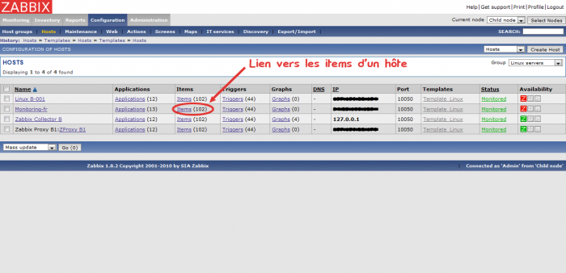](../_detail/zabbix/zabbix-item-use_acces-depuis-hote.png@id=zabbix%253Azabbix-item-use.html "zabbix:zabbix-item-use_acces-depuis-hote.png")

Après avoir cliqué sur le lien des items déjà associés à l’hôte, la page
de la liste des items est alors chargée mais cette dernière est
automatiquement filtrée, et ne contient donc que les items propres à
notre hôte auquel on veut en ajouter un. Il ne reste plus qu’à commencer
la création de l’item.

#### Depuis un template

Dans le même principe que l’association d’un item à un hôte, il est
possible d’en faire autant pour un template. Pour cela, dans la page
Configuration/Hosts il faut choisir d’afficher les éléments Templates
avec l’outil de filtre en haut à droite dans l’interface, il s’agit tout
simplement de se rendre sur la page de création des templates. Après
sélection voici une liste des templates devant s’afficher :

[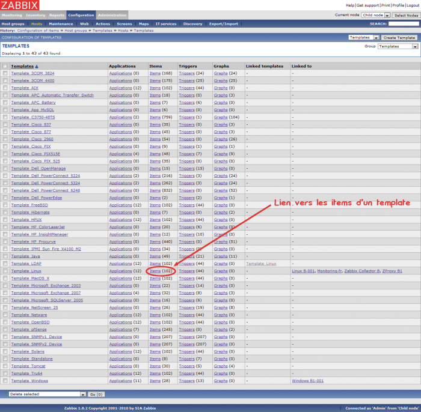](../_detail/zabbix/zabbix-item-use_acces-depuis-template.png@id=zabbix%253Azabbix-item-use.html "zabbix:zabbix-item-use_acces-depuis-template.png")

En cliquant sur le lien des items d’un template, l’affichage bascule
alors sur la page des items, mais la liste affiché de ces derniers doit
ne correspondre qu’au seul template concerné voulu. La création de
l’item peut alors débuter.

#### Depuis les items

Procédure classique pour créer un item, il s’agit de se rendre sur la
page Configuration/Hosts, de sélectionner l’affichage des items avec
l’outil en haut à droite de la page, et ainsi pouvoir visualiser le
bouton de création de ces derniers :

[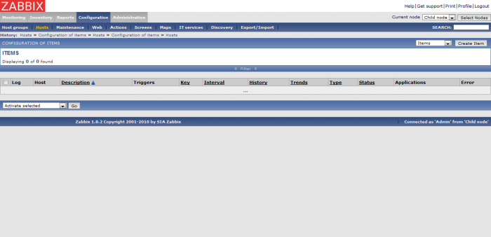](../_detail/zabbix/zabbix-item-use_acces-depuis-items.png@id=zabbix%253Azabbix-item-use.html "zabbix:zabbix-item-use_acces-depuis-items.png")

Il est possible qu’une liste d’items associé à un hôte soit affichée
automatiquement (filtrage automatique de Zabbix en fonction du cache),
dans cette situation il peut être nécessaire d’utiliser la fonction
Filter intégrée, mais cela n’est absolument pas impératif voir
nécessaire pour créer un item. Peu importe l’affichage d’une liste ou
pas, à partir de cette page la création d’un nouvel item peut enfin
commencer.

### Création d’un item {#creation-d-un-item1 .sectionedit8}

Dans tous les cas, quelque soit la voie choisie pour créer un item, vous
devez maintenant être sur la page des items. Il faut alors cliquer sur
le bouton Create Item sur la droite, en haut de l’interface :

[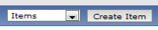](../_detail/zabbix/zabbix-item-use_bouton-creation-item.png@id=zabbix%253Azabbix-item-use.html "zabbix:zabbix-item-use_bouton-creation-item.png")

Après avoir cliqué sur le bouton, un formulaire de paramétrage d’un
nouvel item doit alors s’afficher sur la page. Si vous avez suivi un des
raccourcis d’accès précédents pour associer un item à un élément
particulier (hôte, template), ce champ doit alors contenir l’élément
voulu. Sinon, par défaut la partie Host de ce formulaire affiche not
selected :

En fonction de l’item à créer, le formulaire de configuration d’un
nouvel item peut changer. Ce choix se fait au niveau du champ Type, en
sélectionnant le type voulu :

[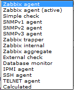](../_detail/zabbix/zabbix-item-use_liste-types-item.png@id=zabbix%253Azabbix-item-use.html "zabbix:zabbix-item-use_liste-types-item.png")

Voici donc une liste de la création des principaux/différents types
d’item :

#### Item de type Zabbix agent

En sélectionnant le type Zabbix agent (par défaut), voici le formulaire
de configuration d’un nouvel item :

Exemple de configuration :

[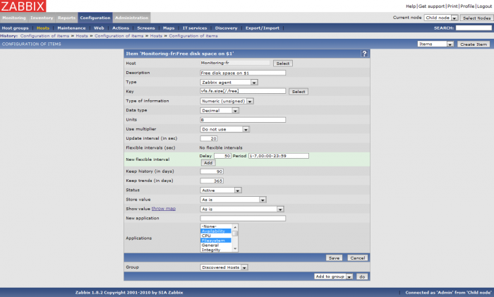](../_detail/zabbix/zabbix-item-use_creation-item-zabbix-agent.png@id=zabbix%253Azabbix-item-use.html "zabbix:zabbix-item-use_creation-item-zabbix-agent.png")

#### Item de type SNMP

En sélectionnant l’un des types SNMP, voici le formulaire de
configuration d’un nouvel item :

##### SNMPv1 agent (ou SNMPv2 agent)

[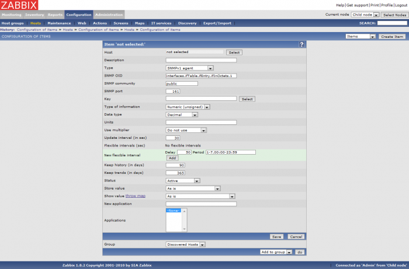](../_detail/zabbix/zabbix-item-use_creation-item-snmpv1v2-1.png@id=zabbix%253Azabbix-item-use.html "zabbix:zabbix-item-use_creation-item-snmpv1v2-1.png")

Exemple de configuration :

[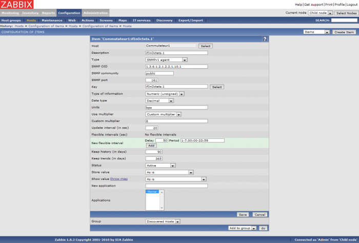](../_detail/zabbix/zabbix-item-use_creation-item-snmpv1v2-2.png@id=zabbix%253Azabbix-item-use.html "zabbix:zabbix-item-use_creation-item-snmpv1v2-2.png")

##### SNMPv3 agent

[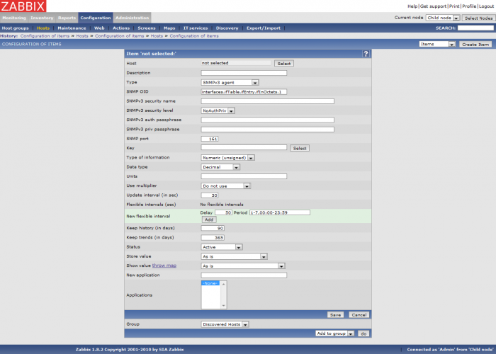](../_detail/zabbix/zabbix-item-use_creation-item-snmpv3-1.png@id=zabbix%253Azabbix-item-use.html "zabbix:zabbix-item-use_creation-item-snmpv3-1.png")

Exemple de configuration :

[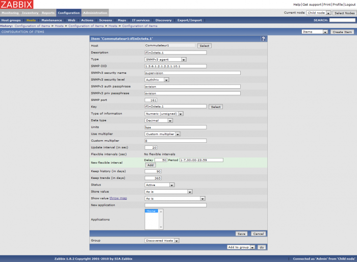](../_detail/zabbix/zabbix-item-use_creation-item-snmpv3-2.png@id=zabbix%253Azabbix-item-use.html "zabbix:zabbix-item-use_creation-item-snmpv3-2.png")

#### Item de type IPMI agent

En sélectionnant le type IPMI agent, voici le formulaire de
configuration d’un nouvel item :

[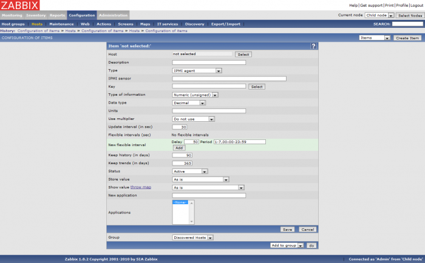](../_detail/zabbix/zabbix-item-use_creation-item-ipmi-1.png@id=zabbix%253Azabbix-item-use.html "zabbix:zabbix-item-use_creation-item-ipmi-1.png")

Exemple de configuration :

[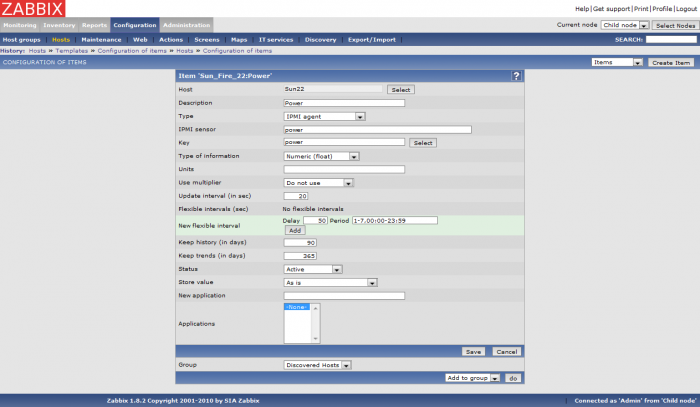](../_detail/zabbix/zabbix-item-use_creation-item-ipmi-2.png@id=zabbix%253Azabbix-item-use.html "zabbix:zabbix-item-use_creation-item-ipmi-2.png")

Edition d'un item {#edition-d-un-item .sectionedit9}
-----------------

Suppression d'un item {#suppression-d-un-item .sectionedit10}
---------------------

SOMMAIRE {#sommaire .sectionedit1}
--------

**[Accueil](../start.html "start")**

**[Supervision](../supervision/start.html "supervision:start")**

-   [Nagios](../nagios/start.html "nagios:start")
-   [Centreon](../centreon/start.html "centreon:start")
-   [Shinken](../shinken/start.html "shinken:start")
-   [Zabbix](start.html "zabbix:start")
-   [OpenNMS](../opennms/start.html "opennms:start")
-   [EyesOfNetwork](../eyesofnetwork/start.html "eyesofnetwork:start")
-   [Groundwork](../groundwork/start.html "groundwork:start")
-   [Zenoss](../zenoss/start.html "zenoss:start")
-   [Vigilo](../vigilo/start.html "vigilo:start")
-   [Icinga](../icinga/start.html "icinga:start")
-   [Cacti](../cacti/start.html "cacti:start")
-   [Ressenti
    utilisateur](../supervision/eue/start.html "supervision:eue:start")
-   [Ressenti utilisateur avec
    sikuli](../sikuli/eue/start.html "sikuli:eue:start")

**[Hypervision](../hypervision/start.html "hypervision:start")**

-   [Canopsis](../canopsis/start.html "canopsis:start")

**[Sécurité](../securite/start.html "securite:start")**

**[Infrastructure](../infra/start.html "infra:start")**

**[Développement](../dev/start.html "dev:start")**

Zabbix {#zabbix .sectionedit1}
------

-   [Introduction](zabbix-introduction.html "zabbix:zabbix-introduction")
-   [Fonctionnement](zabbix-work.html "zabbix:zabbix-work")
-   [Ressources et
    performances](zabbix-resources.html "zabbix:zabbix-resources")
-   [Installation sur
    Ubuntu](zabbix-ubuntu-install.html "zabbix:zabbix-ubuntu-install")
-   [Interface Web](zabbix-interface.html "zabbix:zabbix-interface")
-   [Prise en main](zabbix-use.html "zabbix:zabbix-use")
-   [Gestion des items](zabbix-item-use.html "zabbix:zabbix-item-use")
-   [Gestion des
    triggers](zabbix-trigger-use.html "zabbix:zabbix-trigger-use")
-   [Gestion des
    actions](zabbix-action-use.html "zabbix:zabbix-action-use")
-   [Optimisation](zabbix-optimization.html "zabbix:zabbix-optimization")
-   [Architectures
    distribuées](zabbix-distributed-architecture.html "zabbix:zabbix-distributed-architecture")
-   [Découverte
    d'équipements](zabbix-discovery.html "zabbix:zabbix-discovery")
-   [Notification par
    email](zabbix-email-notification.html "zabbix:zabbix-email-notification")
-   [Superviser un hôte
    SNMP](zabbix-snmp-host.html "zabbix:zabbix-snmp-host")
-   [Catalogue des erreurs](zabbix-errors.html "zabbix:zabbix-errors")

-   [Afficher le texte
    source](zabbix-item-use@do=edit&rev=0.html "Afficher le texte source [V]")
-   [Anciennes
    révisions](zabbix-item-use@do=revisions.html "Anciennes révisions [O]")
-   [Derniers
    changements](zabbix-item-use@do=recent.html "Derniers changements [R]")
-   [Liens vers cette
    page](zabbix-item-use@do=backlink.html "Liens vers cette page")
-   [Gestionnaire de
    médias](zabbix-item-use@do=media.html "Gestionnaire de médias")
-   [Index](zabbix-item-use@do=index.html "Index [X]")
-   [Connexion](zabbix-item-use@do=login&sectok=6bca6bdf16f8880de3d6d3649db89a26.html "Connexion")
-   [Haut de
    page](zabbix-item-use.html#dokuwiki__top "Haut de page [T]")

zabbix/zabbix-item-use.txt · Dernière modification: 2013/03/29 09:39
(modification externe)

