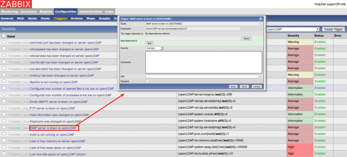
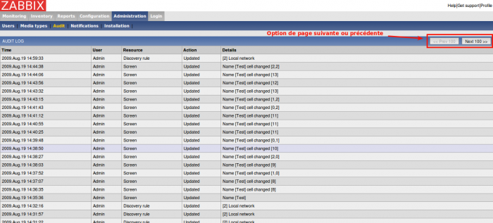

[[[Installation Zabbix 1.4.2 sur Ubuntu
8.04](zabbix-ubuntu-install-old@do=backlink.html)]]

[wiki monitoring-fr.org](../start.html "[ALT+H]")

-   [Accueil](../index.html "Cliquez pour revenir |  l'accueil")
-   [Blog](http://www.monitoring-fr.org "Blog & News")
-   [Forums](http://forums.monitoring-fr.org "Forums")
-   [Doc](http://doc.monitoring-fr.org "Doc")
-   [Forge](https://github.com/monitoring-fr "Forge")

Vous êtes ici: [Accueil](../start.html "start") »
[Zabbix](start.html "zabbix:start") » [Installation Zabbix 1.4.2 sur
Ubuntu
8.04](zabbix-ubuntu-install-old.html "zabbix:zabbix-ubuntu-install-old")

### Table des matières {.toggle}

-   [Installation Zabbix 1.4.2 sur Ubuntu
    8.04](zabbix-ubuntu-install-old.html#installation-zabbix-142-sur-ubuntu-804)
    -   [Pré-requis](zabbix-ubuntu-install-old.html#pre-requis)
    -   [Installation](zabbix-ubuntu-install-old.html#installation)
        -   [Installation du
            serveur](zabbix-ubuntu-install-old.html#installation-du-serveur)
        -   [Installation de l'interface
            Web](zabbix-ubuntu-install-old.html#installation-de-l-interface-web)
        -   [Installation / Configuration Zabbix
            Agent](zabbix-ubuntu-install-old.html#installationconfiguration-zabbix-agent)
    -   [Présentation](zabbix-ubuntu-install-old.html#presentation)
        -   [Monitoring](zabbix-ubuntu-install-old.html#monitoring)
        -   [Reports](zabbix-ubuntu-install-old.html#reports)
        -   [Configuration](zabbix-ubuntu-install-old.html#configuration)
        -   [Administration](zabbix-ubuntu-install-old.html#administration)

Installation Zabbix 1.4.2 sur Ubuntu 8.04 {#installation-zabbix-142-sur-ubuntu-804 .sectionedit1}
=========================================

Procédure d’installation d’une ancienne version Zabbix. Rendez-vous
plutôt dans le dossier Zabbix du wiki pour la documentation complète sur
Zabbix 1.8.x :

**[Documentation Zabbix](start.html "zabbix:start")**

[Zabbix](http://www.zabbix.com/ "http://www.zabbix.com/") est un
logiciel de monitoring réseau Opensource et multiplateforme créé en 2002
par un Letton, Alexei Vladishev. Il permet de surveiller le statut de
divers services réseau, serveurs, postes de travail et autres matériels
(routeurs, parefeu, imprimantes, etc.).

Ce tutoriel a été réalisé par :

  **Rôle**        **Nom**
  --------------- ---------------------------------------------------------------------------------------------------------------------------------------------------------
  **Rédacteur**   [Romuald FRONTEAU](http://www.monitoring-fr.org/community/members/romuald-fronteau/ "http://www.monitoring-fr.org/community/members/romuald-fronteau/")

Ce que Zabbix peut surveiller :

-   Les protocoles : HTTP, SSH, FTP, IMAP, SMTP, etc.
-   Les ports : 21, 80, 1434, 10050, etc.
-   Les processus tournant sur une machine : apache2, sshd, etc.
-   Les ressources matérielles : mémoire vive, espace disque, CPU,
    température, etc.
-   Les sites web : temps de réponse, vitesse de transfert, etc.
-   L’intégrité des fichiers : /etc/passwd à été modifié, etc.
-   Analyse des logs

Comment Zabbix peut-il surveiller :

-   Des tests de connexion simples (ping, test de ports, etc.)
-   Interrogation d’un agent SNMP présent sur la machine à surveiller
-   Installation d’un agent Zabbix sur la machine à surveiller (agent
    disponible sur toutes les plateformes)

Vous pouvez retrouver des bonnes procédures sur [zabbix - Documentation
Ubuntu
Francophone](http://doc.ubuntu-fr.org/zabbix "http://doc.ubuntu-fr.org/zabbix")
et
[Génération-linux.fr](http://www.generation-linux.fr/index.php?post/2009/06/03/Zabbix-un-excellent-logiciel-de-supervision-reseau "http://www.generation-linux.fr/index.php?post/2009/06/03/Zabbix-un-excellent-logiciel-de-supervision-reseau")
pour les puristes de la compilations de sources. Celle-ci s’en inspire
mais s’oriente plus sur la mise en place rapide de zabbix (donc
installation via les dépôts) et complète certains points non précisés.

**Première approche**

Mes premières impressions sur zabbix sont mitigées. Zabbix est un outil
très complet qui offre de la métrologie, une gestion automatique de
checks en fonction de templates prédéfinis.

Un des gros avantages de zabbix, c’est la simplicité d’installation que
ce soit côté serveur comme client. Installation de l’agent et ça y est;
un éventail assez large dans la diversité des checks s’ouvre à vous.

J’ai trouvé que la GUI de zabbix n’est pas intuitive. Il faut chercher
et au moment où je vous écrit cette phrase, je n’ai pas trouvé (sans
recherche en documentation) comment replanifier un check d’un hôte.

On peut reprocher à Nagios le manque de charme de son interface mais ce
que l’on cherche, on le trouve tout de suite. Tandis que Zabbix,
certaines fonctionnalités ne nous sautent pas aux yeux. Je pense qu’un
GUI plus ergonomique donnerait un bon coup de boost à cet outil.

Pré-requis {#pre-requis .sectionedit3}
----------

-   Installation de mysql

~~~~ {.code}
sudo apt-get install mysql-server
~~~~

Vous devrez définir la mot de passe de l’utilisateur root de Mysql

-   Installation de php pour la gestion de mysql (zabbix-frontend)

~~~~ {.code}
sudo apt-get install php5-mysql
~~~~

Installation {#installation .sectionedit4}
------------

Zabbix se compose de 3 modules :

-   zabbix-server-mysql ou zabbix-server-pqsql (si vous avez du
    postgresql server bien sûr)
-   zabbix-frontend-php (l’interface Web)
-   zabbix-agent (l’agent d’interrogation machines de zabbix)
    *optionnel* mais indispensable pour profiter de la puissance de
    zabbix au maximum.

### Installation du serveur {#installation-du-serveur .sectionedit5}

~~~~ {.code}
sudo apt-get install zabbix-server-mysql
~~~~

Demande du mot de passe du user root pour la création de la base.

Demande du mot de passe connexion user pour la base zabbix

### Installation de l'interface Web {#installation-de-l-interface-web .sectionedit6}

~~~~ {.code}
sudo apt-get install zabbix-frontend-php
~~~~

Toutes les dépendances concernant le php seront installées avec.

Vous pouvez accéder à l’interface Web à l’URL suivante:
<http://ip_mon_serv_zabbix/zabbix>

Utilisateur: Admin

mot de passe : N/A

Si message Timezone for PHP is not set. Please set “date.timezone”
option in php.ini.

Editez /etc/php5/apache2/php.ini

retirez le ”;” devant **date.timezone** et mettre :

date.timezone= “Europe/Paris”

sudo /etc/init.d/apache2 restart

### Installation / Configuration Zabbix Agent {#installationconfiguration-zabbix-agent .sectionedit7}

***OPTIONNEL:* Il est dit que l’installation du zabbix-agent n’est pas
obligatoire mais la puissance des informations remontées sera
inférieure.**

sudo apt-get install zabbix-agent

Je recommande vivement de l’installer sinon zabbix se retrouve plus que
limité … limite ne peut même pas faire un ping avec les templates car il
s’agit d’un ping utilisé via leur agent.

-   **Sur l’installation client (machine à superviser)**

Il faut paramétrer votre zabbix-agent pour sortir du mode
d’interrogation localhost. Pour ceci, il y a 2 fichiers à modifier :

*/etc/zabbix/zabbix-agent.conf*

~~~~ {.code}
# This is config file for zabbix_agent
# To get more information about ZABBIX,
# go http://www.zabbix.com

# IP address of ZABBIX server
# Connections from other hosts will be denied

Server=@IP_Serv_ZABBIX
~~~~

*/etc/zabbix/zabbix-agentd.conf*

~~~~ {.code}
# This is config file for zabbix_agentd
# To get more information about ZABBIX, go http://www.zabbix.com

############ GENERAL PARAMETERS #################

# List of comma delimited IP addresses (or hostnames) of ZABBIX servers.
# No spaces allowed. First entry is used for sending active checks.
# Note that hostnames must resolve hostname->IP address and
# IP address->hostname.

Server=localhost,@IP_SERV_ZAVVIX
# Server port for sending active checks

ServerPort=10051

# Unique hostname. Required for active checks.

Hostname=HOSTNAME_DANS_ZABBIX

# Listen port. Default is 10050

ListenPort=10050
~~~~

Présentation {#presentation .sectionedit8}
------------

### Monitoring {#monitoring .sectionedit9}

#### Overview

#### Latest Data

Cette vue permet d’avoir un récapitulatif des dernières valeurs
récupérées avec possibilité d’accès directe aux graphs.

#### Triggers

C’est marrant, cette vue à un système d’alertes sonores qui ressemble
exactement à la sonnerie de mon réveil. Revenons à nos moutons,
j’explique l’intérêt de cette vue dans la capture ci-dessous.

#### Queue

Cette vue doit servir à voir si votre logiciel zabbix est bien à jour
(pas de process tombé ou autres). Il y a un code de couleurs qui
montrent la criticité du retard de mise à jour. Pas mal pensé je dirai,
un bon aspect visuel qui nous ôte l’idée que notre supervision est
défaillante.

#### Events

Cette vue est une équivalent des events log de nagios.

#### Actions

Cette vue permet d’avoir un historique des actions menées.

#### Map

Zabbix propose une vue représentant une carte du réseau supervisé.
D’après Génération-linux, cette map est certainement à paramétrer à la
main mais après vos données apparaissent en temps réel.

#### Graphs

Cette vue permet de visualiser le graph que vous désirez.

#### Screens

Cette vue est vraiment pas mal. Vous pouvez créer votre espace de
supervision sur une page et choisir ce que vous voulez afficher. La
partie création et choix se trouvent dans l’onglet configuration.

### Reports {#reports .sectionedit10}

Cette vue vous permet d’avoir les pourcentages de fiabilité de vos
équipements supervisés et dans extraire des graphs.

### Configuration {#configuration .sectionedit11}

#### Général {#general}

Cette vue vous permet de modifier des paramètres de base de zabbix (taux
de rafraichissement, commbien de temps garder l’historique, …)

#### Hosts

Cette vue vous permet d’ajouter et de gérer vos hôtes créés.

#### Items

#### Triggers {#triggers1}

Dans cette vue, vous aurez la liste des seuils pour chacun des items /
Machines. Vous avez la possibilité de les modifier.

#### Maps

Cette vue vous permet de créer ou customiser vos maps.

#### Graphs {#graphs1}

Grâce à cette vue, vous pourrez créer les graphs dont vous avez toujours
rêver ;)

#### Screens {#screens1}

Il s’agit de la vue permettant de configurer le ou les dashboard que
vous utiliserez pour Zabbix.

#### Discovery

Il s’agit du panneau de configuration pour les règles de découverte
réseau. Vous pouvez créer des règles sur des protocoles dont le SNMP
avec paramétrage d’un OID particulier.

### Administration {#administration .sectionedit12}

#### Users

Il s’agit du panneau de configuration des utilisateurs et de leur droits
dans l’interface Web Zabbix.

#### Media Types

Il s’agit du panneau de configuration du type de notifications.

#### Audit

Cette vue correspond à un eventlog de nagios.

#### Notifications

Cette vue trace l’historique des notifications depuis une période de
temps.

#### Installation {#installation1}

Cette vue permet de relancer une installation de zabbix via interface
Web avec contrôle de pré-requis ect …

SOMMAIRE {#sommaire .sectionedit1}
--------

**[Accueil](../start.html "start")**

**[Supervision](../supervision/start.html "supervision:start")**

-   [Nagios](../nagios/start.html "nagios:start")
-   [Centreon](../centreon/start.html "centreon:start")
-   [Shinken](../shinken/start.html "shinken:start")
-   [Zabbix](start.html "zabbix:start")
-   [OpenNMS](../opennms/start.html "opennms:start")
-   [EyesOfNetwork](../eyesofnetwork/start.html "eyesofnetwork:start")
-   [Groundwork](../groundwork/start.html "groundwork:start")
-   [Zenoss](../zenoss/start.html "zenoss:start")
-   [Vigilo](../vigilo/start.html "vigilo:start")
-   [Icinga](../icinga/start.html "icinga:start")
-   [Cacti](../cacti/start.html "cacti:start")
-   [Ressenti
    utilisateur](../supervision/eue/start.html "supervision:eue:start")
-   [Ressenti utilisateur avec
    sikuli](../sikuli/eue/start.html "sikuli:eue:start")

**[Hypervision](../hypervision/start.html "hypervision:start")**

-   [Canopsis](../canopsis/start.html "canopsis:start")

**[Sécurité](../securite/start.html "securite:start")**

**[Infrastructure](../infra/start.html "infra:start")**

**[Développement](../dev/start.html "dev:start")**

Zabbix {#zabbix .sectionedit1}
------

-   [Introduction](zabbix-introduction.html "zabbix:zabbix-introduction")
-   [Fonctionnement](zabbix-work.html "zabbix:zabbix-work")
-   [Ressources et
    performances](zabbix-resources.html "zabbix:zabbix-resources")
-   [Installation sur
    Ubuntu](zabbix-ubuntu-install.html "zabbix:zabbix-ubuntu-install")
-   [Interface Web](zabbix-interface.html "zabbix:zabbix-interface")
-   [Prise en main](zabbix-use.html "zabbix:zabbix-use")
-   [Gestion des items](zabbix-item-use.html "zabbix:zabbix-item-use")
-   [Gestion des
    triggers](zabbix-trigger-use.html "zabbix:zabbix-trigger-use")
-   [Gestion des
    actions](zabbix-action-use.html "zabbix:zabbix-action-use")
-   [Optimisation](zabbix-optimization.html "zabbix:zabbix-optimization")
-   [Architectures
    distribuées](zabbix-distributed-architecture.html "zabbix:zabbix-distributed-architecture")
-   [Découverte
    d'équipements](zabbix-discovery.html "zabbix:zabbix-discovery")
-   [Notification par
    email](zabbix-email-notification.html "zabbix:zabbix-email-notification")
-   [Superviser un hôte
    SNMP](zabbix-snmp-host.html "zabbix:zabbix-snmp-host")
-   [Catalogue des erreurs](zabbix-errors.html "zabbix:zabbix-errors")

-   [Afficher le texte
    source](zabbix-ubuntu-install-old@do=edit&rev=0.html "Afficher le texte source [V]")
-   [Anciennes
    révisions](zabbix-ubuntu-install-old@do=revisions.html "Anciennes révisions [O]")
-   [Derniers
    changements](zabbix-ubuntu-install-old@do=recent.html "Derniers changements [R]")
-   [Liens vers cette
    page](zabbix-ubuntu-install-old@do=backlink.html "Liens vers cette page")
-   [Gestionnaire de
    médias](zabbix-ubuntu-install-old@do=media.html "Gestionnaire de médias")
-   [Index](zabbix-ubuntu-install-old@do=index.html "Index [X]")
-   [Connexion](zabbix-ubuntu-install-old@do=login&sectok=6bca6bdf16f8880de3d6d3649db89a26.html "Connexion")
-   [Haut de
    page](zabbix-ubuntu-install-old.html#dokuwiki__top "Haut de page [T]")

zabbix/zabbix-ubuntu-install-old.txt · Dernière modification: 2013/03/29
09:39 (modification externe)

