[[[Prise en main de Zabbix](zabbix-use@do=backlink.html)]]

[wiki monitoring-fr.org](../start.html "[ALT+H]")

-   [Accueil](../index.html "Cliquez pour revenir |  l'accueil")
-   [Blog](http://www.monitoring-fr.org "Blog & News")
-   [Forums](http://forums.monitoring-fr.org "Forums")
-   [Doc](http://doc.monitoring-fr.org "Doc")
-   [Forge](https://github.com/monitoring-fr "Forge")

Vous êtes ici: [Accueil](../start.html "start") »
[Zabbix](start.html "zabbix:start") » [Prise en main de
Zabbix](zabbix-use.html "zabbix:zabbix-use")

### Table des matières {.toggle}

-   [Prise en main de Zabbix](zabbix-use.html#prise-en-main-de-zabbix)
    -   [Ajout d'un hôte](zabbix-use.html#ajout-d-un-hote)
    -   [Ajout d'un groupe
        d'hôtes](zabbix-use.html#ajout-d-un-groupe-d-hotes)
    -   [Ajout d'un template](zabbix-use.html#ajout-d-un-template)
    -   [Ajout d'un item](zabbix-use.html#ajout-d-un-item)
    -   [Ajout d'un trigger](zabbix-use.html#ajout-d-un-trigger)
    -   [Ajout d'une action](zabbix-use.html#ajout-d-une-action)
    -   [Ajout d'une période de
        maintenance](zabbix-use.html#ajout-d-une-periode-de-maintenance)
    -   [Ajout d'un scénario de surveillance
        Web](zabbix-use.html#ajout-d-un-scenario-de-surveillance-web)
    -   [Ajout d'un écran](zabbix-use.html#ajout-d-un-ecran)
    -   [Ajout d'un carte](zabbix-use.html#ajout-d-un-carte)
    -   [Ajout d'une règle de découverte
        d'équipements](zabbix-use.html#ajout-d-une-regle-de-decouverte-d-equipements)
    -   [Ajout d'un utilisateur](zabbix-use.html#ajout-d-un-utilisateur)
    -   [Ajout d'un groupe
        d'utilisateurs](zabbix-use.html#ajout-d-un-groupe-d-utilisateurs)
    -   [Ajout d'un média](zabbix-use.html#ajout-d-un-media)
    -   [Ajout d'un script](zabbix-use.html#ajout-d-un-script)
    -   [Choix de la langue de
        l'interface](zabbix-use.html#choix-de-la-langue-de-l-interface)

Prise en main de Zabbix {#prise-en-main-de-zabbix .sectionedit1}
=======================

Tutoriel de prise en main de Zabbix 1.8.2.

Cette page constitue une première approche, et une aide simplifié pour
faciliter la prise en main de l’interface web de Zabbix (Zabbix
Frontend).

Ce tutoriel a été réalisé par :

  **Rôle**        **Nom**
  --------------- ---------------------------------------------------------------------------------------------------------------------------------------------------------
  **Rédacteur**   [Ludovic VALENTIN](http://www.monitoring-fr.org/community/members/ludovic-valentin/ "http://www.monitoring-fr.org/community/members/ludovic-valentin/")

Ajout d'un hôte {#ajout-d-un-hote .sectionedit3}
---------------

Après avoir cliquer sur le bouton de création d’un hôte Create Host dans
la page Configuration/Hosts, la fenêtre de configuration suivante doit
alors s’afficher :

[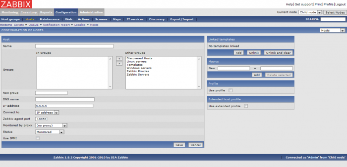](../_detail/zabbix/zabbix-use_host-1.png@id=zabbix%253Azabbix-use.html "zabbix:zabbix-use_host-1.png")

Le paramétrage d’un hôte est des plus simples, il suffit en effet de
remplir quelques champs et de sélectionner certains paramètres
nécessaires à la supervision du nouvel hôte.

Les champs obligatoires et communs à tous types d’hôtes ajoutés
(agent/snmp/ipmi) sont le nom, l’adresse ip (ou le nom dns) et bien sûr
le type de connexion à mettre en place (avec adresse ip, ou avec nom
dns).

Voici un exemple, avec l’ajout d’un serveur Linux, pour lequel on
précise en plus des champs précédemment cités, le groupe auquel l’hôte
appartient, et on l’associe à un template :

[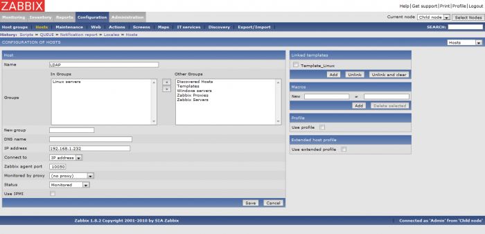](../_detail/zabbix/zabbix-use_host-2.png@id=zabbix%253Azabbix-use.html "zabbix:zabbix-use_host-2.png")

Ajout d'un groupe d'hôtes {#ajout-d-un-groupe-d-hotes .sectionedit4}
-------------------------

Dans la fenêtre Configuration/Host groups, il faut cliquer sur « Create
Group » pour afficher le formulaire de création d’un groupe :

[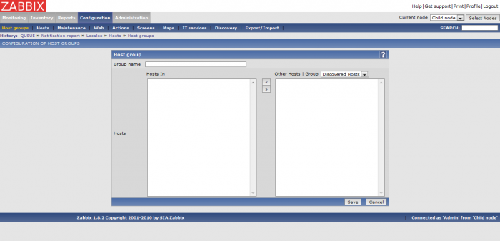](../_detail/zabbix/zabbix-use_hostgroup-1.png@id=zabbix%253Azabbix-use.html "zabbix:zabbix-use_hostgroup-1.png")

Sans doute la configuration la plus simple et la plus rapide de toute
l’interface Zabbix, la création d’un groupe d’hôtes ne nécessite que
l’attribution d’un nom. Il est éventuellement possible d’ajouter
directement des hôtes membres de ce nouveau groupe.

Exemple de création d’un groupe :

[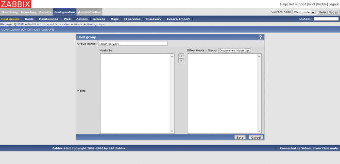](../_detail/zabbix/zabbix-use_hostgroup-2.png@id=zabbix%253Azabbix-use.html "zabbix:zabbix-use_hostgroup-2.png")

Ajout d'un template {#ajout-d-un-template .sectionedit5}
-------------------

A partir de la page Configuration/Hosts, il est possible de créer un
template en jonglant avec le filtre d’affichage sur la droite, par
défaut ce sont les hôtes qui sont affichés, il faut alors sélectionner
Templates afin de pouvoir cliquer sur le bouton Create Template.

Voici le formulaire de création d’un template :

[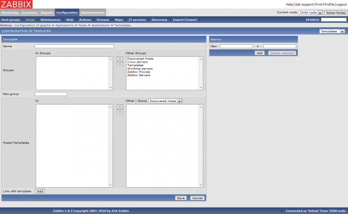](../_detail/zabbix/zabbix-use_template-1.png@id=zabbix%253Azabbix-use.html "zabbix:zabbix-use_template-1.png")

La création d’un template requiert un nom, et par convention, il est
placé dans le groupe Templates, ce dernier regroupant l’ensemble des
templates de Zabbix fournis par défaut. Ensuite, il est possible
d’associer directement des hôtes à ce nouveau template, ou bien encore
de le lier avec d’autres templates. Les lien avec des templates a pour
effet d’hériter de tous les paramètres des templates auquel il est
associé (applications, items, triggers, …etc).

Dans l’exemple suivant, un template pour les serveurs LDAP est créé. Il
est associé au template de base des serveurs Linux (Template\_Linux) et
hérite donc de l’ensemble de ses données. Ces données tels que les items
par exemple pourront être désactivés par la suite afin de faire
correspondre ce nouveau template à nos besoins spécifiques :

[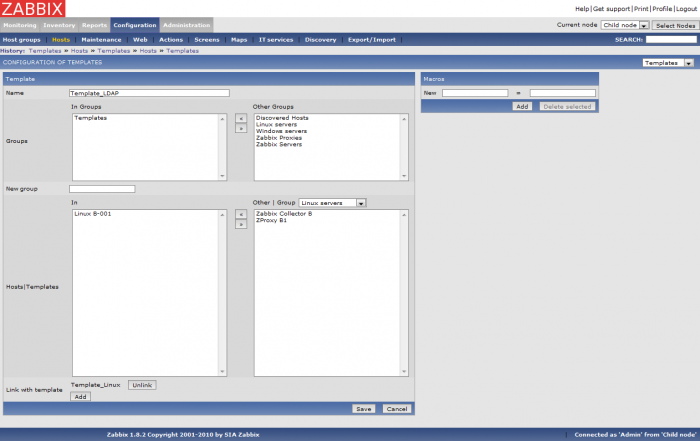](../_detail/zabbix/zabbix-use_template-2.png@id=zabbix%253Azabbix-use.html "zabbix:zabbix-use_template-2.png")

Ajout d'un item {#ajout-d-un-item .sectionedit6}
---------------

La création d’un item se fait dans Configuration/Hosts. Après avoir
choisis l’affichage des items, il faut cliquer sur Create Item afin de
charger la page de configuration d’un nouvel item :

[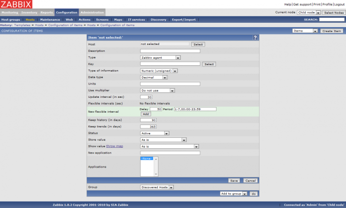](../_detail/zabbix/zabbix-use_item-1.png@id=zabbix%253Azabbix-use.html "zabbix:zabbix-use_item-1.png")

Lors de la création d’un item, il faut dans un premier temps choisir à
quel hôte ce dernier s’applique-t-il, ou bien à quel template. Ensuite,
il faut sélectionner le type de l’item, c’est-à-dire un item de type
Zabbix Agent, SNMP, IPMI, SSH ou encore un simple check pour n’en citer
que quelques uns. Un item de type Zabbix Agent par exemple, sous-entend
bien sûr qu’un agent Zabbix est installé sur l’hôte en question.

Après le choix du type de l’item, le champs le plus important est sans
nul doute le Key, ce dernier représente la commande à exécuter pour
obtenir l’information désirée. Il existe un vaste choix de possibilités,
de commandes exécutables, en cliquant tout simplement sur le bouton
Select correspondant pour en afficher une liste.

A partir d’un template (Template\_LDAP), voici un exemple de création
d’un item remontant l’heure locale d’un hôte :

[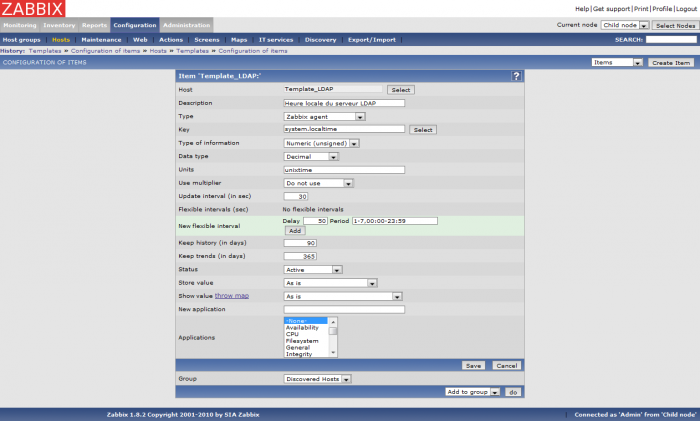](../_detail/zabbix/zabbix-use_item-2.png@id=zabbix%253Azabbix-use.html "zabbix:zabbix-use_item-2.png")

Ajout d'un trigger {#ajout-d-un-trigger .sectionedit7}
------------------

A travers la page Configuration/Hosts, il est possible de créer un
trigger qui va permettre de déclencher des évènements en fonction des
remontées d’un item.

Voici l’écran de création d’un trigger :

[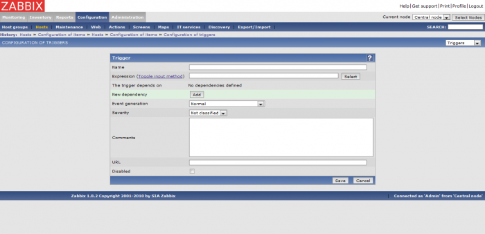](../_detail/zabbix/zabbix-use_trigger-1.png@id=zabbix%253Azabbix-use.html "zabbix:zabbix-use_trigger-1.png")

Lors de la définition d’un trigger, auquel il faut bien sûr donner un
nom, c’est au niveau de l’expression, qui est en quelque sorte une
condition de test d’un item, qu’il faut renseigner avec soin. Pour cela,
il suffit de sélectionner l’item sur lequel le trigger doit être
associé, grâce notamment au bouton Select.

Pour finir, tout trigger doit se voir indiquer la sévérité de ses
évènements futurs et éventuellement un commentaire afin de détailler les
évènements de ce trigger.

Pour exemple, voici un trigger qui déclenche des évènements de type
Warning lorsque le débit entrant sur le port 1 d’un switch (en
l’occurrence) dépasse les 500 Kbps. Les données du débits sont remontées
par un item, par l’usage du protocole SNMP (défini au niveau de l’item),
c’est au niveau du champs Expression que la condition est précisée :

[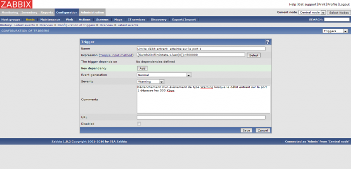](../_detail/zabbix/zabbix-use_trigger-2.png@id=zabbix%253Azabbix-use.html "zabbix:zabbix-use_trigger-2.png")

Ajout d'une action {#ajout-d-une-action .sectionedit8}
------------------

Le déclenchement d’alertes (ou de notifications) se fait par les
actions. Celles-ci surveillent notamment les évènements générés par des
triggers auxquels elles sont rattachées, ensuite en fonction de leurs
conditions de test, elles génèrent des alertes.

La création d’une action se fait dans Configuration/Actions en cliquant
sur Create Action, voici le formulaire de paramétrage :

[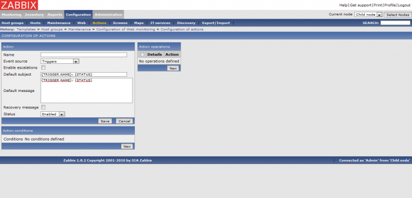](../_detail/zabbix/zabbix-use_action-1.png@id=zabbix%253Azabbix-use.html "zabbix:zabbix-use_action-1.png")

Durant le paramétrage d’une nouvelle action, il faut sélectionner les
opérations à faire, c’est-à-dire à qui envoyer les notifications ? et
comment ? Il faut donc choisir un utilisateur ou un groupe
d’utilisateurs avec le moyen utilisé pour les alerter (email, SMS,
Jabber).

Pour préciser à partir de quels évènements il faut générer des alertes,
il est possible d’ajouter une condition, ou encore de choisir la source
d’émission des évènements (depuis les triggers ou les auto-découvertes
d’équipements).

Pour exemple de configuration :

[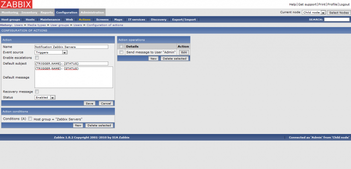](../_detail/zabbix/zabbix-use_action-2.png@id=zabbix%253Azabbix-use.html "zabbix:zabbix-use_action-2.png")

Ajout d'une période de maintenance {#ajout-d-une-periode-de-maintenance .sectionedit9}
----------------------------------

Les périodes de maintenance permettent d’informer les utilisateurs de
Zabbix de la maintenance d’un hôte ou d’un groupe d’hôtes, et elles
désactivent temporairement (ou pas selon les besoins) la surveillance
des hôtes concernés.

Pour créer une période de maintenance, il faut se rendre sur la page
Configuration/Maintenance et cliquer sur Create maintenance period pour
afficher la fenêtre de configuration d’une nouvelle période :

[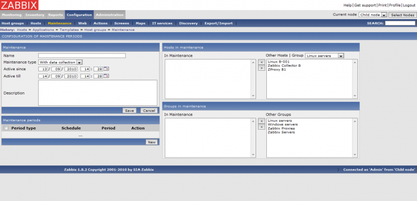](../_detail/zabbix/zabbix-use_maintenance-1.png@id=zabbix%253Azabbix-use.html "zabbix:zabbix-use_maintenance-1.png")

Sur la page de création d’une période de maintenance, il y a le choix
entre 2 types de maintenance, l’un avec surveillance (collecte de
données) et l’autre où la collecte de données est désactivée. Après
avoir défini la durée de la période de maintenance, il reste à
sélectionner les hôtes ou/et les groupes d’hôtes concernés par cette
nouvelle maintenance.

Un exemple de configuration d’une nouvelle période de maintenance :

[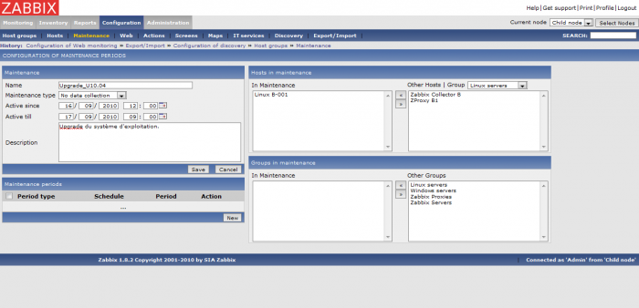](../_detail/zabbix/zabbix-use_maintenance-2.png@id=zabbix%253Azabbix-use.html "zabbix:zabbix-use_maintenance-2.png")

Ajout d'un scénario de surveillance Web {#ajout-d-un-scenario-de-surveillance-web .sectionedit10}
---------------------------------------

Dans Zabbix, il est possible de mette en place des scénarios de
surveillance de sites internet dans Configuration/Web.

Voici l’écran de création d’un scénario :

[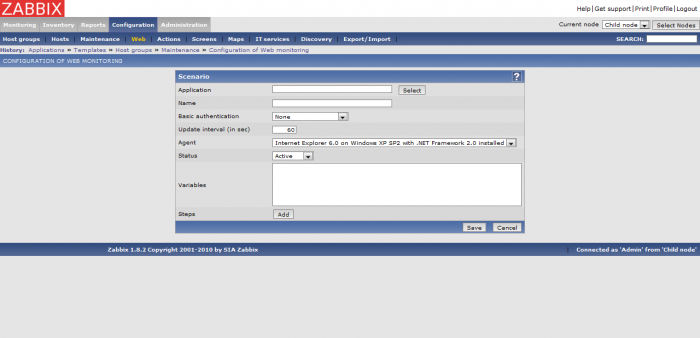](../_detail/zabbix/zabbix-use_web-1.png@id=zabbix%253Azabbix-use.html "zabbix:zabbix-use_web-1.png")

Pour ajouter un scénario quelques pré-requis sont nécessaires tel qu’un
hôte existant (le serveur hébergeant le site internet à surveiller, voir
Configuration/Hosts puis Create host) et une application qui s’y
rattache (dans Zabbix, voir Configuration/Hosts puis Create
application).

Ensuite, il faut est possible de configurer le nouveau scénario en
sélectionnant notamment une application. Cette dernière est nécessaire
pour associer le scénario à un hôte en tant qu’application (ce n’est pas
un item). Après le choix de l’agent chargé de réaliser les tests du
scénario, il faut bien sûr ajouter au moins une étape de test.

Pour illustrer la configuration d’un scénario, voici un exemple dans
lequel il y a une seule étape, chargée de vérifier la disponibilité de
la page d’accueil d’un site internet, en checkant par exemple la
présence d’une phrase dans la page du site que l’agent (navigateur
internet choisi précédemment) va charger :

[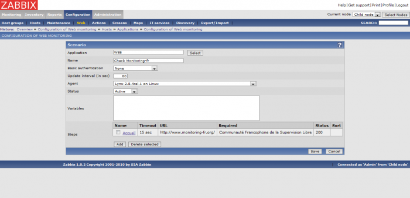](../_detail/zabbix/zabbix-use_web-2.png@id=zabbix%253Azabbix-use.html "zabbix:zabbix-use_web-2.png")

Ajout d'un écran {#ajout-d-un-ecran .sectionedit11}
----------------

en cours

Ajout d'un carte {#ajout-d-un-carte .sectionedit12}
----------------

en cours

Ajout d'une règle de découverte d'équipements {#ajout-d-une-regle-de-decouverte-d-equipements .sectionedit13}
---------------------------------------------

L’écriture d’une règle d’auto-découverte se fait dans
Configuration/Discovery. Il est possible de créer plusieurs règles, avec
pour chacune un ou plusieurs critères de découverte d’équipements, comme
par exemple un test ICMP (ping), SNMP, ou encore par Zabbix Agent.

Après avoir cliqué sur Create rule :

[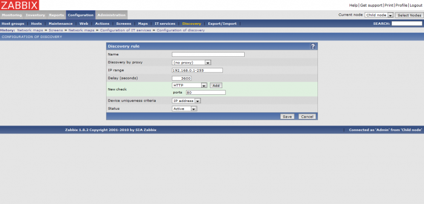](../_detail/zabbix/zabbix-use_rule-1.png@id=zabbix%253Azabbix-use.html "zabbix:zabbix-use_rule-1.png")

Pour illustrer notre explication, voici un scénario qui est chargé de
découvrir des équipements sur une plage d’adresse ip, à partir de
simples tests ICMP ping :

[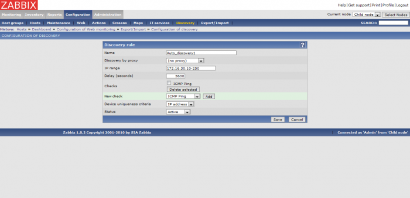](../_detail/zabbix/zabbix-use_rule-2.png@id=zabbix%253Azabbix-use.html "zabbix:zabbix-use_rule-2.png")

Ajout d'un utilisateur {#ajout-d-un-utilisateur .sectionedit14}
----------------------

en cours

Ajout d'un groupe d'utilisateurs {#ajout-d-un-groupe-d-utilisateurs .sectionedit15}
--------------------------------

en cours

Ajout d'un média {#ajout-d-un-media .sectionedit16}
----------------

en cours

Ajout d'un script {#ajout-d-un-script .sectionedit17}
-----------------

en cours

Choix de la langue de l'interface {#choix-de-la-langue-de-l-interface .sectionedit18}
---------------------------------

Le choix de la langue ne se fait pas au niveau global, pour toute
l’infrastructure Zabbix. En effet, Zabbix permet de choisir des langues
différentes pour chaque utilisateur (ou groupe d’utilisateurs), ce qui
répond notamment aux besoins de supervision multi-sites avec des langues
variées. Ainsi chaque utilisateur peut disposer de la langue de son
choix dans l’interface Zabbix. Pour changer la langue d’un utilisateur,
il faut donc éditer (ou créer) un utilisateur dans la page
Administration/Users.

[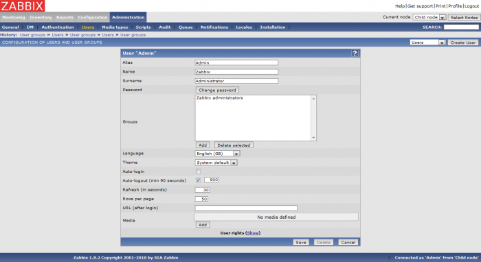](../_detail/zabbix/zabbix-use_langue-1.png@id=zabbix%253Azabbix-use.html "zabbix:zabbix-use_langue-1.png")

Dans notre interface en anglais, langue par défaut de l’utilisateur
Admin, nous allons dans notre exemple choisir la langue française pour
cet utilisateur. Cette modification peut être opérée même sur un
utilisateur en cours de session.

Lorsque le changement de langue de l’utilisateur est sauvegardé,
l’interface doit ensuite s’afficher en français (en actualisant une
page) :

[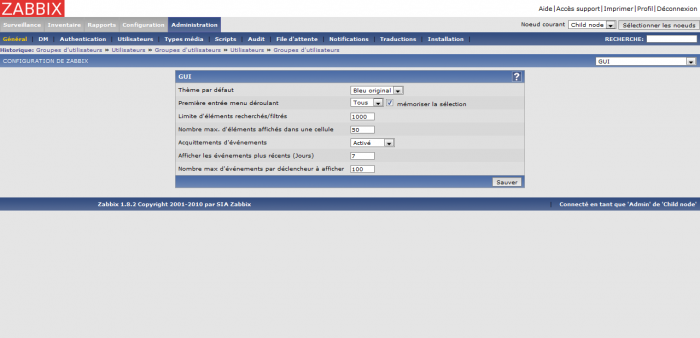](../_detail/zabbix/zabbix-use_langue-2.png@id=zabbix%253Azabbix-use.html "zabbix:zabbix-use_langue-2.png")

SOMMAIRE {#sommaire .sectionedit1}
--------

**[Accueil](../start.html "start")**

**[Supervision](../supervision/start.html "supervision:start")**

-   [Nagios](../nagios/start.html "nagios:start")
-   [Centreon](../centreon/start.html "centreon:start")
-   [Shinken](../shinken/start.html "shinken:start")
-   [Zabbix](start.html "zabbix:start")
-   [OpenNMS](../opennms/start.html "opennms:start")
-   [EyesOfNetwork](../eyesofnetwork/start.html "eyesofnetwork:start")
-   [Groundwork](../groundwork/start.html "groundwork:start")
-   [Zenoss](../zenoss/start.html "zenoss:start")
-   [Vigilo](../vigilo/start.html "vigilo:start")
-   [Icinga](../icinga/start.html "icinga:start")
-   [Cacti](../cacti/start.html "cacti:start")
-   [Ressenti
    utilisateur](../supervision/eue/start.html "supervision:eue:start")
-   [Ressenti utilisateur avec
    sikuli](../sikuli/eue/start.html "sikuli:eue:start")

**[Hypervision](../hypervision/start.html "hypervision:start")**

-   [Canopsis](../canopsis/start.html "canopsis:start")

**[Sécurité](../securite/start.html "securite:start")**

**[Infrastructure](../infra/start.html "infra:start")**

**[Développement](../dev/start.html "dev:start")**

Zabbix {#zabbix .sectionedit1}
------

-   [Introduction](zabbix-introduction.html "zabbix:zabbix-introduction")
-   [Fonctionnement](zabbix-work.html "zabbix:zabbix-work")
-   [Ressources et
    performances](zabbix-resources.html "zabbix:zabbix-resources")
-   [Installation sur
    Ubuntu](zabbix-ubuntu-install.html "zabbix:zabbix-ubuntu-install")
-   [Interface Web](zabbix-interface.html "zabbix:zabbix-interface")
-   [Prise en main](zabbix-use.html "zabbix:zabbix-use")
-   [Gestion des items](zabbix-item-use.html "zabbix:zabbix-item-use")
-   [Gestion des
    triggers](zabbix-trigger-use.html "zabbix:zabbix-trigger-use")
-   [Gestion des
    actions](zabbix-action-use.html "zabbix:zabbix-action-use")
-   [Optimisation](zabbix-optimization.html "zabbix:zabbix-optimization")
-   [Architectures
    distribuées](zabbix-distributed-architecture.html "zabbix:zabbix-distributed-architecture")
-   [Découverte
    d'équipements](zabbix-discovery.html "zabbix:zabbix-discovery")
-   [Notification par
    email](zabbix-email-notification.html "zabbix:zabbix-email-notification")
-   [Superviser un hôte
    SNMP](zabbix-snmp-host.html "zabbix:zabbix-snmp-host")
-   [Catalogue des erreurs](zabbix-errors.html "zabbix:zabbix-errors")

-   [Afficher le texte
    source](zabbix-use@do=edit&rev=0.html "Afficher le texte source [V]")
-   [Anciennes
    révisions](zabbix-use@do=revisions.html "Anciennes révisions [O]")
-   [Derniers
    changements](zabbix-use@do=recent.html "Derniers changements [R]")
-   [Liens vers cette
    page](zabbix-use@do=backlink.html "Liens vers cette page")
-   [Gestionnaire de
    médias](zabbix-use@do=media.html "Gestionnaire de médias")
-   [Index](zabbix-use@do=index.html "Index [X]")
-   [Connexion](zabbix-use@do=login&sectok=6bca6bdf16f8880de3d6d3649db89a26.html "Connexion")
-   [Haut de page](zabbix-use.html#dokuwiki__top "Haut de page [T]")

zabbix/zabbix-use.txt · Dernière modification: 2013/11/21 14:58 par
Ludovic VALENTIN

