Présentation de l’interface Web de Zenoss.

Le portail Zenoss est accessible via l’url suivante:
<http://ip_serv_zenoss:8080>

Ce tutoriel a été réalisé par :

  **Rôle**        **Nom**
  --------------- ------------------
  **Rédacteur**   Romuald FRONTEAU

Login {#login .sectionedit3}
-----

Je n’aurai pas assez de le dire, très classe. Ce portail est bien
dessiné et à vraiment le look de site Web 2.0.

[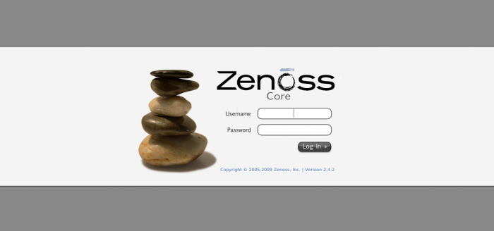](../_detail/supervision/zenoss_login.png@id=zenoss%253Azenoss-interface.html "supervision:zenoss_login.png")

Main Views {#main-views .sectionedit4}
----------

### Dashboard {#dashboard .sectionedit5}

Le dashboard est vraiment génial avec le système de Drag’n Drop des
portlets. Un portlet que j’affectionne pas mal et la googlemap. Elle
peut aussi être mis en place en tant que statusmap de Nagios, Une map
comme ça ravit pas mal les DSI.

[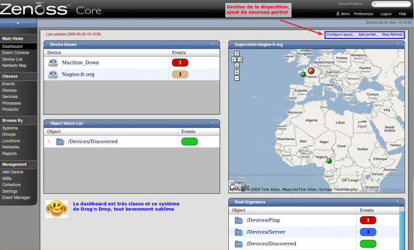](../_detail/supervision/zenoss_dashboard.png@id=zenoss%253Azenoss-interface.html "supervision:zenoss_dashboard.png")

### Event Console {#event-console .sectionedit6}

Il s’agit d’une vue des divers évènements que la supervision a détecté.

[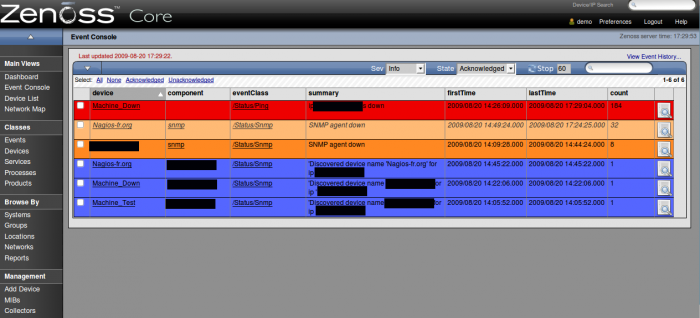](../_detail/supervision/zenoss_event-console.png@id=zenoss%253Azenoss-interface.html "supervision:zenoss_event-console.png")

### Device List {#device-list .sectionedit7}

Cette vue est une liste des hôtes avec un indice de couleurs sur la
criticité des évènements se passant sur les machines.

[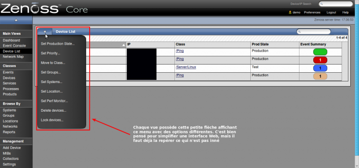](../_detail/supervision/zenoss_device_list1.png@id=zenoss%253Azenoss-interface.html "supervision:zenoss_device_list1.png")

Quelques onglets pratiques dans cette vue :

[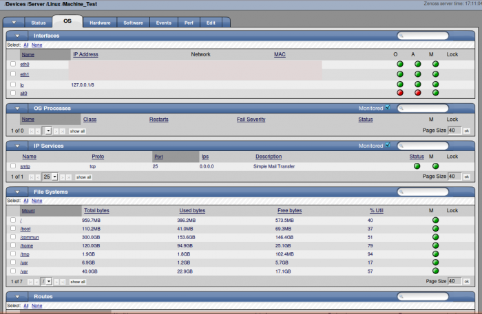](../_detail/supervision/zenoss_device_list_onglet-os.png@id=zenoss%253Azenoss-interface.html "supervision:zenoss_device_list_onglet-os.png")

[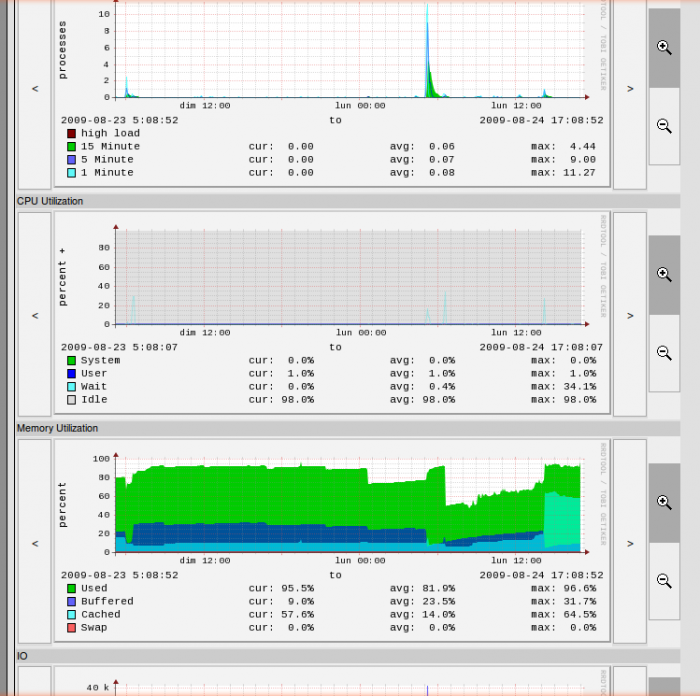](../_detail/supervision/zenoss_device_list_onglet1.png@id=zenoss%253Azenoss-interface.html "supervision:zenoss_device_list_onglet1.png")

Classes {#classes .sectionedit8}
-------

Cette partie est vraiment basé administration réseau pur et dur. Bons
nombres d’éléments m’échappent, mais tous ce que je peux dire, c’est que
c’est bien complet pour interroger votre parc.

### Events {#events .sectionedit9}

Dans cette vue, vous avez une liste des évènements que Zenoss sait
répertorier (paramétrage de la syntaxe de recherche de ces évènements).
Ils sont classer par type de matériel. Vous pourrez gérer (ajouter,
supprimer, classer) vos propres règles.

[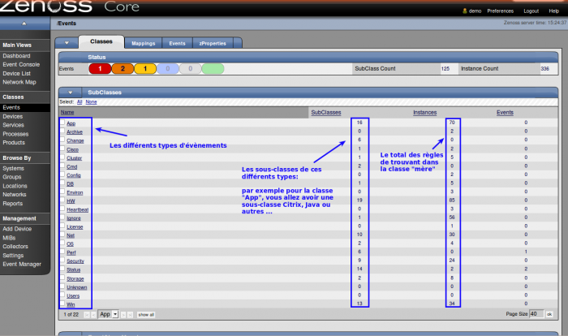](../_detail/supervision/zenoss_classe_events.png@id=zenoss%253Azenoss-interface.html "supervision:zenoss_classe_events.png")

### Device {#device .sectionedit10}

Dans cette vue, on retrouve une liste des règles classer par type
d’interrogation aux matériels qu’on supervise. Nos hôtes seront classés
dans ces catégories.

[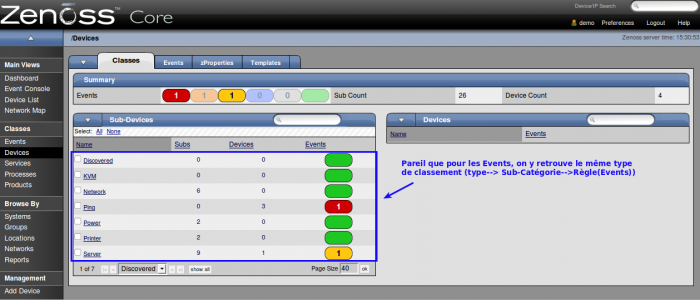](../_detail/supervision/zenoss_classe_device.png@id=zenoss%253Azenoss-interface.html "supervision:zenoss_classe_device.png")

### Service {#service .sectionedit11}

Dans cette vue, Zenoss contient plus de 3700 service IP et 109 service
Windows connues.

[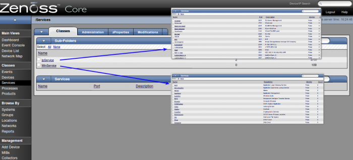](../_detail/supervision/zenoss_classe_service.png@id=zenoss%253Azenoss-interface.html "supervision:zenoss_classe_service.png")

### Products {#products .sectionedit12}

Dans cette vue, on peut voir l’éventail de fabricants connues par
Zenoss, ça donne le vertige.

[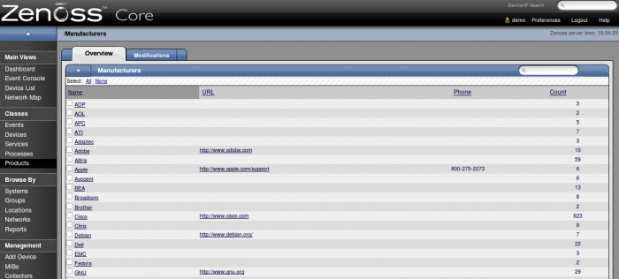](../_detail/supervision/zenoss_products.png@id=zenoss%253Azenoss-interface.html "supervision:zenoss_products.png")

Browse by {#browse-by .sectionedit13}
---------

Cette catégorie sert à lister vos hôtes soit par systems, groups,
locations, networks. Nous allons nous arrêter sur certaines d’entre
elles car elles sont plus intéressantes.

### Locations {#locations .sectionedit14}

Cette vue vous permet de créer, supprimer des lieux pour la localisation
de vos machines. Cette vue est vraiment bien et est étroitement liée
avec la googlemap dans le Dashboard. Le principe est de créer un lieu et
d’ensuite le rattacher dans le détail de votre machine. Avec l’adresse
que vous avez renseigné lors de la création de votre lieu, la googlemap
saura localiser votre machine.

[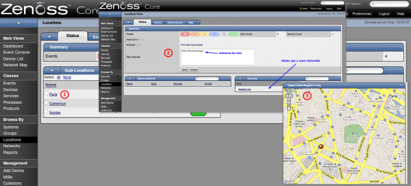](../_detail/supervision/zenoss_locations.png@id=zenoss%253Azenoss-interface.html "supervision:zenoss_locations.png")

### Reports {#reports .sectionedit15}

Dans cette vue, vous pouvez réaliser des rapports selon les modèles déjà
existants ou créer vos propres rapports. Ils sont exportables en fichier
CVS.

[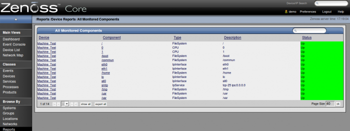](../_detail/supervision/zenoss_reports.png@id=zenoss%253Azenoss-interface.html "supervision:zenoss_reports.png")

Management {#management .sectionedit16}
----------

### Add Device {#add-device .sectionedit17}

Cette vue vous sert à ajouter vos hôtes manuellement. Vous n’êtes pas
obligé de tout remplir mais nous allons vous expliquer à quoi servent
les champs.

[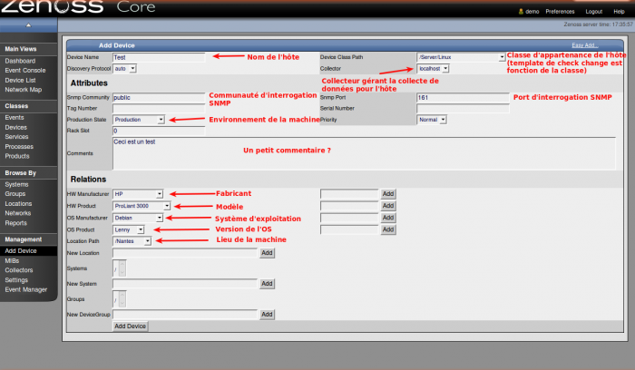](../_detail/supervision/zenoss_add_device.png@id=zenoss%253Azenoss-interface.html "supervision:zenoss_add_device.png")

### MIBs {#mibs .sectionedit18}

Dans cette vue, vous pouvez ajouter des interrogations SNMP en fonction
d’OIDs particuliers.

### Collectors {#collectors .sectionedit19}

Cette vue vous permet de gérer une architecture distribuée de Zenoss en
définissant plusieurs collecteurs. Vous voyez les machines rattachées au
collecteur ainsi que des graphs de performance de votre collecteur.

[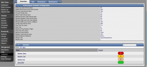](../_detail/supervision/zenoss_collectors1.png@id=zenoss%253Azenoss-interface.html "supervision:zenoss_collectors1.png")

### Settings {#settings .sectionedit20}

Dans cette vue, on retrouve plusieurs onglets de configurations de
Zenoss allant des paramètres principaux, à la création / rôles
utilisateurs ….

### EventManager {#eventmanager .sectionedit21}

Cette vue me fait penser à un paramétrage de la table d’évènements de la
base de Zenoss.